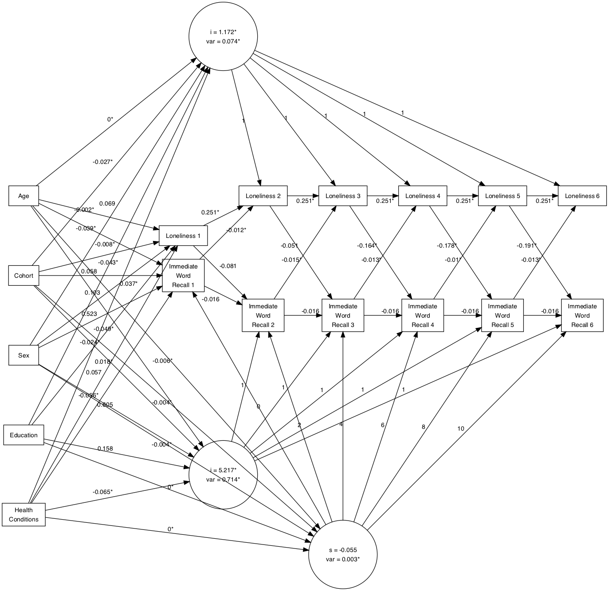
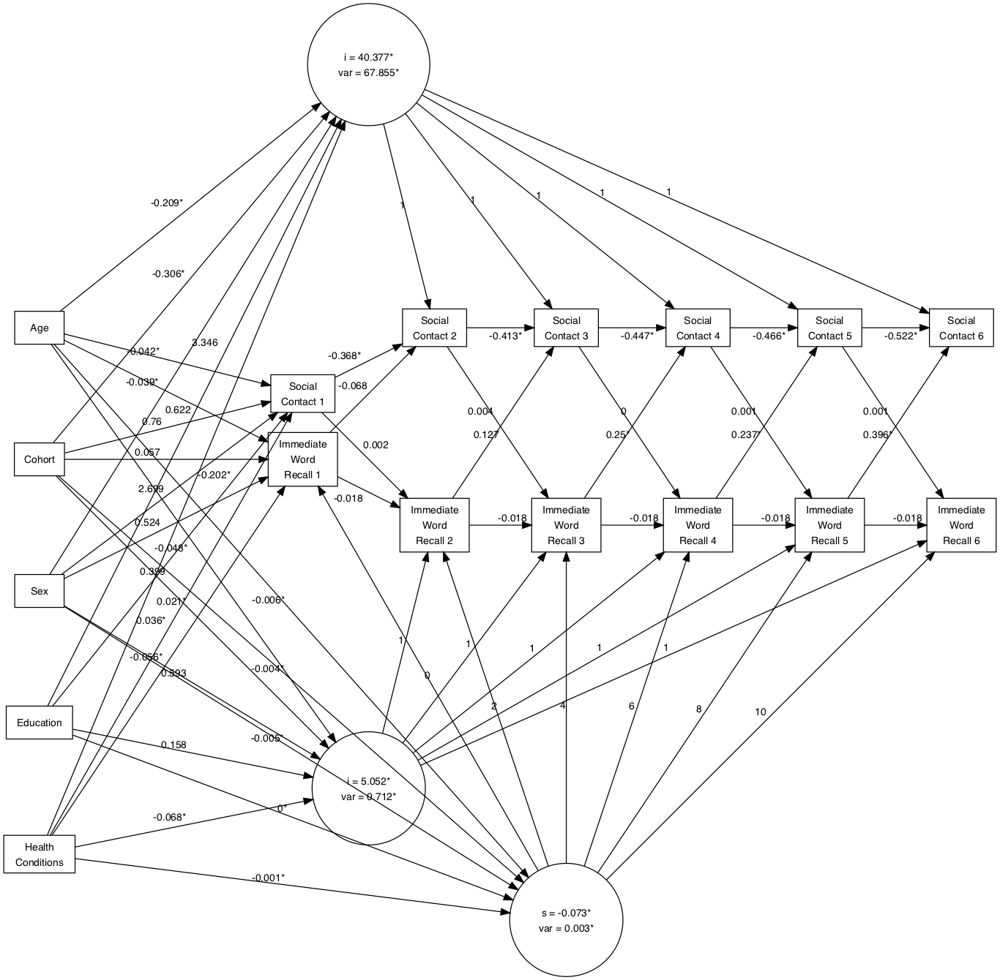
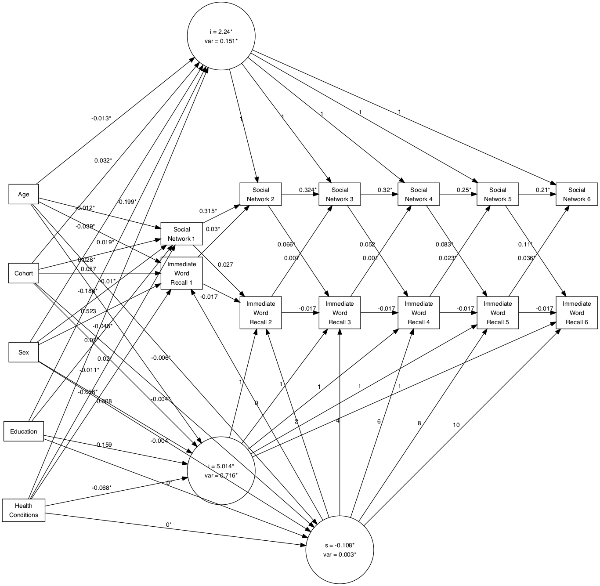
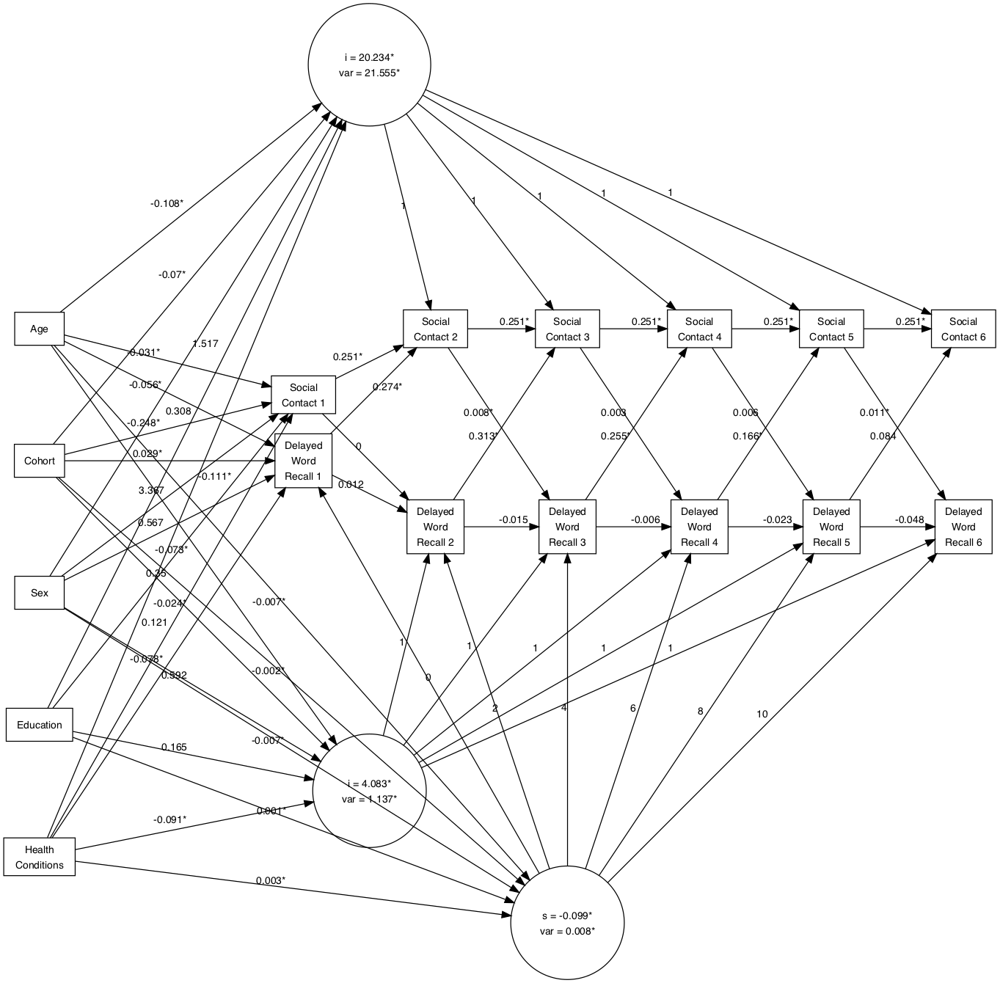
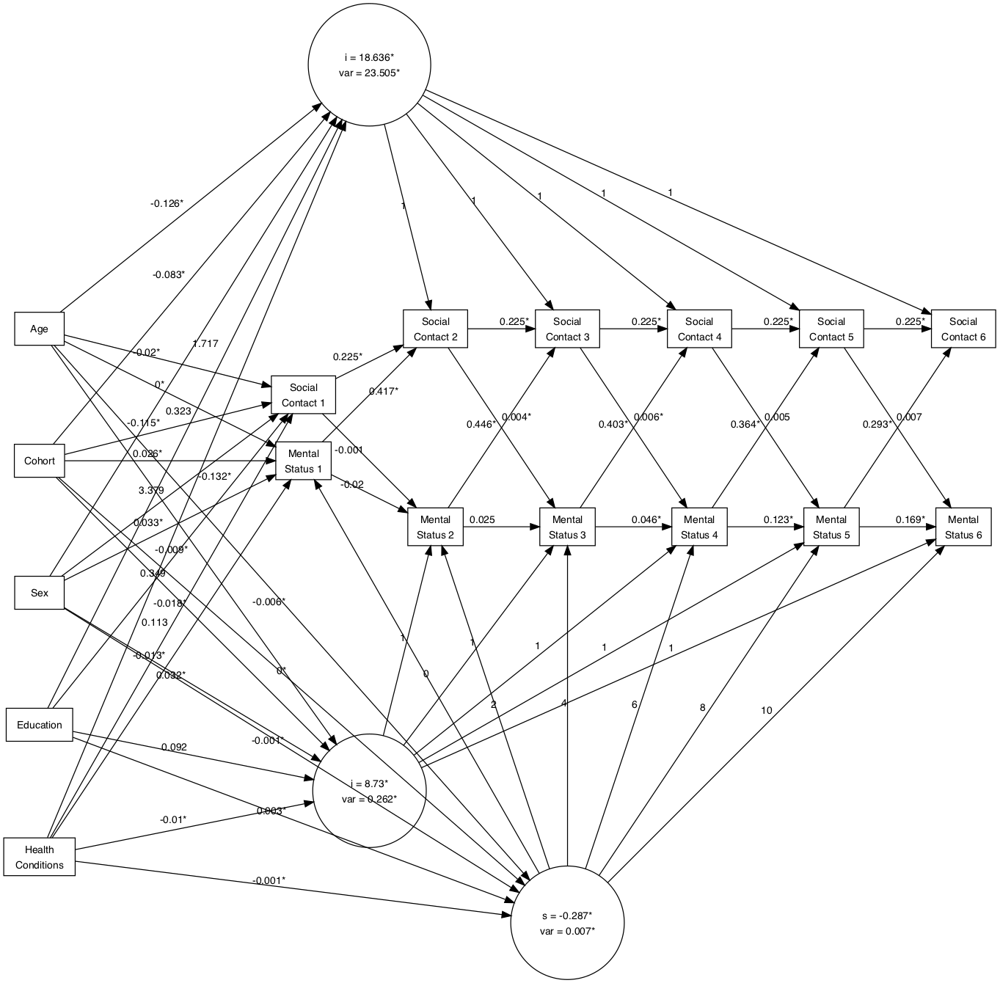

---
title             : "The title"
shorttitle        : "Title"

author: 
  - name          : "Cassandra Brown"
    affiliation   : "1"
    corresponding : yes    # Define only one corresponding author
    address       : "Postal address"
    email         : "clb@uvic.ca"
  - name          : "Andrea Piccinin"
    affiliation   : "1,2"

affiliation:
  - id            : "1"
    institution   : "University of Victoria"
  - id            : "2"
    institution   : ""

author_note: >
  Complete departmental affiliations for each author (note the indentation, if you start a new paragraph).

  Enter author note here.

abstract: >
  Enter abstract here (note the indentation, if you start a new paragraph).
  
keywords          : "keywords"
wordcount         : "X"

figsintext        : no
figurelist        : no
tablelist         : no
footnotelist      : no
lineno            : yes

lang              : "english"
class             : "man"
output            : papaja::apa6_word
---


<!--  The 2nd mandatory chunck  -->
<!-- Set the report-wide options, and point to the external code file. -->
```{r, cache = FALSE, include=FALSE}
library(knitr)
knitr::opts_knit$set(root.dir=normalizePath('../'))

inline_hook <- function (x) {
  if (is.numeric(x)) {
    # ifelse does a vectorized comparison
    # If integer, print without decimal; otherwise print two places
    res <- ifelse(x == round(x),
      sprintf("%d", x),
      sprintf("%.2f", x)
    )
    paste(res, collapse = ", ")
  }
}
knit_hooks$set(inline = inline_hook)

```


```{r setup, echo=FALSE}
opts_chunk$set(echo = FALSE, cache=FALSE)

# connect to the file with the underlying R script  
read_chunk("./reports/social-relations-cognition-paper/project1-predetermined-models-results.R") 

```

```{r include = FALSE}
library("papaja")
```

<!-- Load 'sourced' R files.  Suppress the output when loading packages. --> 
```{r load-packages}
```

```{r load-sources}
```

```{r load-data}
```

# Results

The descriptive statistics for all included variables are presented in Table 1. Model fit indices are presented for each model series in Tables 2 though X. Each process was investigating separately as a univariate model and then each cognitive-social combination was estimated. Univariate model results are presented in supplementary materials. A summary of the results for each process in bivariate models are described including the effects of covariates, followed by bivariate relations. In all bivariate models convergence issues limited the number of models included in the model building process. It is possible that this was due to model mis-specification or increased model complexity.    

## Immediate Word Recall 

```{r}
wrecti_sn_ATL <- read.csv("./output/bivariate-models-nodem-65plus/wrecti_social_network_model_parameters.csv")
wrecti_sn_par_list <- bivariateALT_parameter_extraction_function(wrecti_sn_ATL)

wrecti_sn_fullALT <- read.csv("./output/bivariate-models-nodem-65plus/wrecti_social_network_fullmodel_parameters.csv")
wrecti_sn_fullALT_par_list <- bivariateALT_parameter_extraction_function(wrecti_sn_fullALT)
```

```{r}
wrecti_socsup_ALT <- read.csv("./output/bivariate-models-nodem-65plus/wrecti_social_support_model_parameters.csv")
wrecti_socsup_par_list <- bivariateALT_parameter_extraction_function(wrecti_socsup_ALT)

wrecti_socsup_covALT <- read.csv("./output/bivariate-models-nodem-65plus/wrecti_social_support_cov_model_parameters.csv")
wrecti_socsup_covALT_par_list <- bivariateALT_parameter_extraction_function(wrecti_socsup_covALT)
```

```{r}
wrecti_social_contact_ALT <- read.csv("./output/bivariate-models-nodem-65plus/wrecti_social_contact_model_parameters.csv")
wrecti_social_contact_par_list <- bivariateALT_parameter_extraction_function(wrecti_social_contact_ALT)

wrecti_social_contact_fullALT <- read.csv("./output/bivariate-models-nodem-65plus/wrecti_social_contact_fullmodel_parameters.csv")
wrecti_social_contact_fullALT_par_list <- bivariateALT_parameter_extraction_function(wrecti_social_contact_fullALT)
```

```{r}
wrecti_loneliness_ALT <- read.csv("./output/bivariate-models-nodem-65plus/predetermined-models/wrecti_loneliness_model_parameters.csv")
wrecti_loneliness_par_list <- bivariateALT_parameter_extraction_function(wrecti_loneliness_ALT)

wrecti_loneliness_fullALT <- read.csv("./output/bivariate-models-nodem-65plus/wrecti_loneliness_fullmodel_parameters.csv")
wrecti_loneliness_fullALT_par_list <- bivariateALT_parameter_extraction_function(wrecti_loneliness_fullALT)
```


To evaluate the impact of objective and subjective social factors on immediate word recall performance, four separate bivariate model series were estimated. In all four model series parameter estimates indicated that immediate word recall had a significant negative slope with a small but significant variance, consistent with the univariate immediate word recall results (social network: 
$\beta$ = `r  wrecti_sn_par_list[["cog_slope"]]`, _p_ = `r wrecti_sn_par_list[["cog_slope_pval"]]`, 
$\psi$ = `r wrecti_sn_par_list[["cog_slope_variance"]]`, _p_ = `r wrecti_sn_par_list[["cog_slope_variance_pval"]]`; 
social support: $\beta$ = `r  wrecti_socsup_par_list[["cog_slope"]]`, _p_ = `r wrecti_socsup_par_list[["cog_slope_pval"]]`,
$\psi$ = `r wrecti_socsup_par_list[["cog_slope_variance"]]`, _p_ = `r wrecti_socsup_par_list[["cog_slope_variance_pval"]]`;
social contact: $\beta$ = `r  wrecti_social_contact_par_list[["cog_slope"]]`, _p_ = 
`r wrecti_social_contact_par_list[["cog_slope_pval"]]` $\psi$ = `r wrecti_social_contact_par_list[["cog_slope_variance"]]`, _p_ = 
`r wrecti_social_contact_par_list[["cog_slope_variance_pval"]]`; loneliness: $\beta$ = `r  wrecti_loneliness_par_list[["cog_slope"]]`, _p_ = 
`r wrecti_loneliness_par_list[["cog_slope_pval"]]`, $\psi$ = `r wrecti_loneliness_par_list[["cog_slope_variance"]]`, _p_ = 
`r wrecti_loneliness_par_list[["cog_slope_variance_pval"]]`). However, in the bivariate models, allowing the autoregressive parameters to vary over time did not significantly improve model fit compared to the less complex models with the autoregressive parameters constrained to equality over time (see tables X through Y). When the autoregressive parameters were constrained to equality over time, the ability of immediate recall performance to predict future immediate word recall performance was not significant (social network: $\rho_{65}$ = `r wrecti_sn_par_list[["cog_rho65"]]`, _p_ = `r wrecti_sn_par_list[["cog_rho65_pval"]]`, social support: $\rho_{43}$ = `r wrecti_socsup_par_list[["cog_rho43"]]`, _p_ = `r wrecti_socsup_par_list[["cog_rho43_pval"]]`, loneliness: $\rho_{43}$ = `r wrecti_loneliness_fullALT_par_list[["cog_rho43"]]`, _p_ = 
`r wrecti_loneliness_fullALT_par_list[["cog_rho43_pval"]]`).

Effect of Covariates on Immediate Word Recall
Women and those with more years of education had significantly higher initial immediate word recall scores and significantly higher immediate word recall scores overall, across all occasions. Those who were older and had more health conditions had lower initial immediate word recall scores and lower immediate word recall scores overall, across all occasions. Age was significantly related to slope such that those who were older showed greater decline in immediate recall performance over time.   


## Delayed Word Recall

```{r}
wrectd_parameters <- read.csv(file = "./output/univariate-models-nodem-65plus/wrectd_model_parameters.csv")
wrectd_par_list <- parameter_extraction_function(wrectd_parameters)
```

```{r}
wrectd_social_contact <- read.csv("./output/bivariate-models-nodem-65plus/wrectd_social_contact_model_parameters.csv")
wrectd_social_contact_ALT <- bivariateALT_parameter_extraction_function(wrectd_social_contact)

wrectd_social_contact_full <- read.csv("./output/bivariate-models-nodem-65plus/wrectd_social_contact_fullmodel_parameters.csv")
wrectd_social_contact_fullALT <- bivariateALT_parameter_extraction_function(wrectd_social_contact_full)
```

```{r}
wrectd_social_support <- read.csv("./output/bivariate-models-nodem-65plus/wrectd_social_support_model_parameters.csv")
wrectd_social_support_ALT <- bivariateALT_parameter_extraction_function(wrectd_social_support)

wrectd_social_support_full <- read.csv("./output/bivariate-models-nodem-65plus/wrectd_social_support_full_model_parameters.csv")
wrectd_social_support_fullALT <- bivariateALT_parameter_extraction_function(wrectd_social_support_full)
```

```{r}
wrectd_loneliness <- read.csv("./output/bivariate-models-nodem-65plus/wrectd_loneliness_model_parameters.csv")
wrectd_loneliness_ALT <- bivariateALT_parameter_extraction_function(wrectd_loneliness)

wrectd_loneliness_full <- read.csv("./output/univariate-models-nodem-65plus/wrectd_loneliness_fullmodel_parameters.csv")
wrectd_loneliness_fullALT <- bivariateALT_parameter_extraction_function(wrectd_loneliness_full)
```

```{r}
wrectd_social_network <- read.csv("./output/bivariate-models-nodem-65plus/wrectd_social_network_model_parameters.csv")
wrectd_social_network_ALT <- bivariateALT_parameter_extraction_function(wrectd_social_network)

wrectd_social_network_full <- read.csv("./output/bivariate-models-nodem-65plus/wrectd_social_network_full_model_parameters.csv")
wrectd_social_network_fullALT <- bivariateALT_parameter_extraction_function(wrectd_social_network_full)
```

When delayed word recall was examined in relation to the four social factors, the slope of delayed recall performance was consistently significant and negative with a small but significance variance parameter (social network: 
$\beta$ = `r  wrectd_social_network_ALT[["cog_slope"]]`, _p_ = `r wrectd_social_network_ALT[["cog_slope_pval"]]`, 
$\psi$ = `r wrectd_social_network_ALT[["cog_slope_variance"]]`, _p_ = `r wrectd_social_network_ALT[["cog_slope_variance_pval"]]`; 
social support: $\beta$ = `r  wrectd_social_support_ALT[["cog_slope"]]`, _p_ = `r wrectd_social_support_ALT[["cog_slope_pval"]]`,
$\psi$ = `r wrectd_social_support_ALT[["cog_slope_variance"]]`, _p_ = `r wrectd_social_support_ALT[["cog_slope_variance_pval"]]`;
social contact: $\beta$ = `r  wrectd_social_contact_ALT[["cog_slope"]]`, _p_ = 
`r wrectd_social_contact_ALT[["cog_slope_pval"]]` $\psi$ = `r wrectd_social_contact_ALT[["cog_slope_variance"]]`, _p_ = 
`r wrectd_social_contact_ALT[["cog_slope_variance_pval"]]`; loneliness: $\beta$ = `r  wrectd_loneliness_ALT[["cog_slope"]]`, _p_ = 
`r wrectd_loneliness_ALT[["cog_slope_pval"]]`, $\psi$ = `r wrectd_loneliness_ALT[["cog_slope_variance"]]`, _p_ = 
`r wrectd_loneliness_ALT[["cog_slope_variance_pval"]]`). Across all four bivariate models with delayed word recall performance, allowing the autoregressive parameters of delayed word recall to vary over time did not signficantly improve the model fit over the bivariate models with the equality constraint. Previous time-specific uniquenesses in delayed word recall performance did not predict time-specific uniqueness in delayed word recall performance two years laters (social network: $\rho_{t,t-1}$ = `r  wrectd_social_network_ALT[["cog_rho21"]]`, _p_ = `r wrectd_social_network_ALT[["cog_rho21_pval"]]`, 
social support: $\rho_{t,t-1}$  = `r  wrectd_social_support_ALT[["cog_rho21"]]`, _p_ = `r wrectd_social_support_ALT[["cog_rho21_pval"]]`,
social contact: $\rho_{t,t-1}$ = `r  wrectd_social_contact_ALT[["cog_rho21"]]`, _p_ = 
`r wrectd_social_contact_ALT[["cog_rho21_pval"]]` 
loneliness: $\rho_{t,t-1}$ = `r  wrectd_loneliness_ALT[["cog_rho21"]]`, _p_ = 
`r wrectd_loneliness_ALT[["cog_rho21_pval"]]`). In bivariate models where autoregressive components were freed to vary over time there was so significant relation thus constraining the autogressive parameter did not change the substantive interpretation. 


## Mental Status
```{r mental-status, echo=FALSE}
```


```{r}
ms_parameters <- read.csv(file = "./output/univariate-models-nodem-65plus/mental_status_model_parameters.csv")
ms_par_list <- parameter_extraction_function(ms_parameters)

ms_social_network <- read.csv("./output/bivariate-models-nodem-65plus/mentalstatus_socialnetwork_model_parameters.csv")
ms_social_network_ALT <- bivariateALT_parameter_extraction_function(ms_social_network)

ms_social_network_full <- read.csv("./output/bivariate-models-nodem-65plus/mentalstatus_socialnetwork_fullmodel_parameters.csv")
ms_social_network_fullALT <- bivariateALT_parameter_extraction_function(ms_social_network_full)
```  


```{r}
ms_social_support <- read.csv("./output/bivariate-models-nodem-65plus/mentalstatus_social_support_model_parameters.csv")
ms_social_support_ALT <- bivariateALT_parameter_extraction_function(ms_social_support)

ms_social_support_full <- read.csv("./output/bivariate-models-nodem-65plus/mentalstatus_social_support_fullmodel_parameters.csv")
ms_social_support_fullALT <- bivariateALT_parameter_extraction_function(ms_social_network_full)
```  

```{r}
ms_social_contact <- read.csv("./output/bivariate-models-nodem-65plus/mentalstatus_social_contact_model_parameters.csv")
ms_social_contact_ALT <- bivariateALT_parameter_extraction_function(ms_social_support)

ms_social_contact_full <- read.csv("./output/bivariate-models-nodem-65plus/mentalstatus_social_contact_fullmodel_parameters.csv")
ms_social_contact_fullALT <- bivariateALT_parameter_extraction_function(ms_social_network_full)
```  

```{r}
ms_loneliness <- read.csv("./output/bivariate-models-nodem-65plus/mentalstatus_loneliness_model_parameters.csv")
ms_loneliness_ALT <- bivariateALT_parameter_extraction_function(ms_loneliness)

ms_loneliness_full <- read.csv("./output/bivariate-models-nodem-65plus/mentalstatus_loneliness_fullmodel_parameters.csv")
ms_loneliness_fullALT <- bivariateALT_parameter_extraction_function(ms_loneliness_full)
```  

When mental status was examined in relation to the four social factors, the slope of mental status was consistently significant and negative with a small but significance variance parameter (social network: 
$\beta$ = `r  ms_social_network_ALT[["cog_slope"]]`, _p_ = `r ms_social_network_ALT[["cog_slope_pval"]]`, 
$\psi$ = `r ms_social_network_ALT[["cog_slope_variance"]]`, _p_ = `r ms_social_network_ALT[["cog_slope_variance_pval"]]`; 
social support: $\beta$ = `r  ms_social_support_ALT[["cog_slope"]]`, _p_ = `r ms_social_support_ALT[["cog_slope_pval"]]`,
$\psi$ = `r ms_social_support_ALT[["cog_slope_variance"]]`, _p_ = `r ms_social_support_ALT[["cog_slope_variance_pval"]]`;
social contact: $\beta$ = `r  ms_social_contact_ALT[["cog_slope"]]`, _p_ = 
`r ms_social_contact_ALT[["cog_slope_pval"]]` $\psi$ = `r ms_social_contact_ALT[["cog_slope_variance"]]`, _p_ = 
`r ms_social_contact_ALT[["cog_slope_variance_pval"]]`; loneliness: $\beta$ = `r  ms_loneliness_ALT[["cog_slope"]]`, _p_ = 
`r ms_loneliness_ALT[["cog_slope_pval"]]`, $\psi$ = `r ms_loneliness_ALT[["cog_slope_variance"]]`, _p_ = 
`r ms_loneliness_ALT[["cog_slope_variance_pval"]]`). Mental status significantly predicted mental status two years later, over and above the overall trajectory of change, with the autoregressive parameters getting larger over time (social network: $\rho_{21}$ = `r ms_social_network_ALT[["cog_rho21"]]`, _p_ = `r ms_social_network_ALT[["cog_rho21_pval"]]`,
$\rho_{32}$ = `r ms_social_network_ALT[["cog_rho32"]]`, _p_ = `r ms_social_network_ALT[["cog_rho32_pval"]]`;
$\rho_{43}$ = `r ms_social_network_ALT[["cog_rho43"]]`, _p_ = `r ms_social_network_ALT[["cog_rho43_pval"]]`;
$\rho_{54}$ = `r ms_social_network_ALT[["cog_rho54"]]`, _p_ = `r ms_social_network_ALT[["cog_rho54_pval"]]`;
$\rho_{65}$ = `r ms_social_network_ALT[["cog_rho65"]]`, _p_ = `r ms_social_network_ALT[["cog_rho65_pval"]]`;
social support: $\rho_{21}$ = `r ms_social_support_ALT[["cog_rho21"]]`, _p_ = `r ms_social_support_ALT[["cog_rho21_pval"]]`
$\rho_{32}$ = `r ms_social_support_ALT[["cog_rho32"]]`, _p_ = `r ms_social_support_ALT[["cog_rho32_pval"]]`;
$\rho_{43}$ = `r ms_social_support_ALT[["cog_rho43"]]`, _p_ = `r ms_social_support_ALT[["cog_rho43_pval"]]`;
$\rho_{54}$ = `r ms_social_support_ALT[["cog_rho54"]]`, _p_ = `r ms_social_support_ALT[["cog_rho54_pval"]]`;
$\rho_{65}$ = `r ms_social_support_ALT[["cog_rho65"]]`, _p_ = `r ms_social_support_ALT[["cog_rho65_pval"]]`;
social contact: $\rho_{21}$ = `r ms_social_contact_ALT[["cog_rho21"]]`, _p_ = `r ms_social_contact_ALT[["cog_rho21_pval"]]`,
$\rho_{32}$ = `r ms_social_contact_ALT[["cog_rho32"]]`, _p_ = `r ms_social_contact_ALT[["cog_rho32_pval"]]`;
$\rho_{43}$ = `r ms_social_contact_ALT[["cog_rho43"]]`, _p_ = `r ms_social_contact_ALT[["cog_rho43_pval"]]`;
$\rho_{54}$ = `r ms_social_contact_ALT[["cog_rho54"]]`, _p_ = `r ms_social_contact_ALT[["cog_rho54_pval"]]`;
$\rho_{65}$ = `r ms_social_contact_ALT[["cog_rho65"]]`, _p_ = `r ms_social_contact_ALT[["cog_rho65_pval"]]`;
loneliness: $\rho_{21}$ = `r ms_loneliness_ALT[["cog_rho21"]]`, _p_ = `r ms_loneliness_ALT[["cog_rho21_pval"]]`,
$\rho_{32}$ = `r ms_loneliness_ALT[["cog_rho32"]]`, _p_ = `r ms_loneliness_ALT[["cog_rho32_pval"]]`;
$\rho_{43}$ = `r ms_loneliness_ALT[["cog_rho43"]]`, _p_ = `r ms_loneliness_ALT[["cog_rho43_pval"]]`;
$\rho_{54}$ = `r ms_loneliness_ALT[["cog_rho54"]]`, _p_ = `r ms_loneliness_ALT[["cog_rho54_pval"]]`;
$\rho_{65}$ = `r ms_loneliness_ALT[["cog_rho65"]]`, _p_ = `r ms_loneliness_ALT[["cog_rho65_pval"]]`).


## Loneliness
```{r}
loneliness_parameters <- read.csv(file = "./output/univariate-models-nodem-65plus/predetermined-models/loneliness_model_parameters.csv")
lone_par_list <- parameter_extraction_function(loneliness_parameters)

fullALT_loneliness_parameters <- read.csv(file = "./output/univariate-models-nodem-65plus/predetermined-models/loneliness_fullALTmodel_parameters.csv")
fullALT_lone_par_list <- parameter_extraction_function(fullALT_loneliness_parameters)


```  

In some bivariate models examining the relations between loneliness and cognitive function, models including the slope of loneliness did not converge. Models did converge when the variance of loneliness was constrained to zero (e.g., the bivariate immediate word recall and loneliness model). In these models the mean slope was significant in some bivariate models the immediate word recall - loneliness model, and not significant in the delayed word recall - loneliness model, or the mental status - loneliness model. Across all models including loneliness models, model fit indices indicate models with autoregressive parameters constrained to equality over time were superior, time-specific uniqueness in loneliness significantly predicted time-specific uniquenesses two years later:
immediate word recall - loneliness: $\rho_{t,t-1}$ = `r wrecti_loneliness_fullALT_par_list[["cog_rho43"]]`, _p_ = 
`r wrecti_loneliness_fullALT_par_list[["cog_rho43_pval"]]`;
delayed word recall - loneliness: $\rho_{t,t-1}$ = `r  wrectd_loneliness_ALT[["cog_rho21"]]`, _p_ = 
`r wrectd_loneliness_ALT[["cog_rho21_pval"]]`; mental status - loneliness: $\rho_{t,t-1}$ = `r ms_loneliness_ALT[["soc_rho21"]]`, _p_ = `r ms_loneliness_ALT[["soc_rho21_pval"]]`)

## Social Contact
```{r}
social_contact_parameters <- read.csv(file = "./output/univariate-models-nodem-65plus/social_contact_model_parameters.csv")
sc_par_list <- parameter_extraction_function(social_contact_parameters)

```  

For two of the three bivariate models with social contact (mental status - social contact, delayed word recall - social contact) the full ALT model was not able to be estimated due to convergence problems. Additional constraints on social contact were needed for models to converge without issue. In all three bivariate models the best fitting model included the intercept only, with no slope estimated. Across all three bivariate models, social contact significantly predicted social contact two years later across all occassions (delayed word recall: $\rho_{t,t-1}$ = `r wrectd_social_contact_ALT[["soc_rho21"]]`, _p_ = `r wrectd_social_contact_ALT[["soc_rho21_pval"]]`; immediate word recall: $\rho_{t,t-1}$ = `r wrecti_social_contact_par_list[["soc_rho21"]]`, _p_ = `r wrecti_social_contact_par_list[["soc_rho21_pval"]]`; mental status: $\rho_{t,t-1}$ = `r ms_social_contact_ALT[["soc_rho21"]]`, _p_ = `r ms_social_contact_ALT[["soc_rho21_pval"]]`).

## Social Support  
```{r}
social_support_parameters <- read.csv(file = "./output/univariate-models-nodem-65plus/social_support_model_parameters.csv")
ss_par_list <- parameter_extraction_function(social_support_parameters)

```  

In the bivariate models investigating the relations between cognitive performance and social support, models including a slope of social support did not converge. Thus, all bivariate models were estimated with only overall level of social support (intercept) and autoregressive parameters. 
As in the univariate models, model fit was not significantly improved by allowing the autoregressive parameters of social support to vary over time in any of the bivariate models. Across all models, time-specific uniqueness in social support significantly predicted time-specific uniquenesses in social support two years later (immediate word recall - social support: $\rho_{t,t-1}$ = `r wrecti_socsup_par_list[["soc_rho21"]]`, _p_ = `r wrecti_socsup_par_list[["soc_rho21_pval"]]`), (delayed word recall - social support: $\rho_{t,t-1}$ = `r wrectd_social_support_ALT[["soc_rho21"]]`, _p_ = `r wrectd_social_support_ALT[["soc_rho21_pval"]]`), and (mental status - social support: $\rho_{t,t-1}$ = `r ms_social_support_ALT[["soc_rho21"]]`, _p_ = `r ms_social_support_ALT[["soc_rho21_pval"]]`). 

## Social Network

In the bivariate models investigating the relations between cognitive performance and social network, models including a slope of social network did not converge. 
In all models the autoregressive parameters were significant and positive such that time-specific uniquenesses in social network significantly predicted time-specific uniquenesses in social network two years later (immediate word recall: $\rho_{t,t-1}$ = `r wrecti_sn_par_list[["soc_rho21"]]`, _p_ = `r wrecti_sn_par_list[["soc_rho21_pval"]]`; delayed word recall: $\rho_{t,t-1}$ = 
`r wrectd_social_network_ALT[["soc_rho21"]]`, _p_ = `r wrectd_social_network_ALT[["soc_rho21_pval"]]`) and mental status $\rho_{t,t-1}$ = `r ms_social_network_ALT[["soc_rho21"]]`, _p_ = `r ms_social_network_ALT[["soc_rho21_pval"]]`). The intercepts were also significant with significant variability. 

_Role of Age, Cohort, Sex, Education, and Health Status_ 
The predictors were added directly to the final ALT. Fit indices for the final models are presented in the final rows of Tables 2 through 9. Bivariate model results are discussed below and presented in Figures 1 through 7. The results show that the relation of covariates to each process remained consistent across models and are thus presented in summary. 

Older individuals had significantly less social contact and smaller social networks overall across all occassions. Older individiuals also reported significantly higher initial levels of social support. With regards to cognitive function, older individuals had lower initial performance on all three cognitive measures, immediate recall, delayed recall and mental status. Older individuals also had lower performance overall on all three cognitive measures, and a greater rate of decline over time in all three measures. 

Women reported greater initial loneliness and greater levels of loneliness overall. However, women also reported more social contact and greater social support initially and overall across all occasions than men. However, men had larger social networks overall. Women had initially higher performance on immediate word recall, delayed word recall, and higher mental status scores. Women's immediate recall, delayed recall, and mental status was also higher overall across all occasions. Sex was not related to the trajectory of change in any cognitive function examined. 

Those with more education reported significantly lower levels of loneliness overall and lower initial levels of loneliness, larger social networks, more social contact initially and overall across time, but lower overall levels of social support. More years of education was related to better initial performance on all three cognitive measures, and better performance overall across all occasions. 

Individuals with more health conditions reported greater levels of loneliness overall, across occasions and greater initial levels of loneliness. Individuals with more health conditions reported lower levels social support at the first measurement point and across all occasions. Health conditions were not related to social network or social contact. Greater number of health conditions was associated with lower initial performance and lower performance overall on all three cognitive measures. 

Cohort was not significantly related to any of the social or cognitive variables. 


## Bivariate model results

### _Immediate Word Recall and Loneliness_  
Model comparison was limited to converged models. Model comparison results indicate that the slope of loneliness can be removed, time-specific correlations can be removed, and autoregressive parameters for both immediate word recall and loneliness can be constrained to equality over time without a significant reduction in model fit from the ALT model with the social slope fixed to 0 (see Table X). Looking at the results of this model in more detail, the correlation between the intercept factors was not signficant (corr. = 
`r wrecti_loneliness_par_list[["IB_WITH_IA"]]`, _p_ = `r wrecti_loneliness_par_list[["IB_WITH_IA_pval"]]`) nor was the correlation between time 1 loneliness and time 1 immediate word recall (corr. = 
`r wrecti_loneliness_par_list[["A_01_WITH_B_01"]]`, _p_ = `r wrecti_loneliness_par_list[["A_01_WITH_B_01_pval"]]`). Note that in these models the intercept represents the portion of the time 2 variable remaining unexplained by the time 1 variable. Further, that the time-specific correlations could be removed without changing the overall fit of the model indicates that the time-specific uniquenesses, after accounting for the slope of immediate word recall, were not related at any given time point. The cross-lagged regressions of loneliness on immediate word recall were all significant except state-like deviations in time 2 loneliness did not significantly predict state-like deviations in time 3 immediate word recall performance ($\rho_{3,2}$ = `r wrecti_loneliness_par_list[["A_03_B_02"]]`, _p_ = `r wrecti_loneliness_par_list[["A_03_B_02_pval"]]`). State like deviations in immediate word recall performance significantly predicted state like deviations in loneliness across all occasions indicating a reciprical relationship. 

The predictors age, sex, years of education, cohort, and number of health conditions, were added to the final unconditional bivariate ALT model (see Figure 1). The model fit indices appear in the last row of Table 2 and show adequate fit by all indices. When covariates were added to the model significant cross-lagged relations remained such that loneliness at time 3, 4, and 5 predicted immediate recall performance at time 4, 5, and 6, respectively and immediate recall performance at all occasions significantly predicted loneliness two years later (see Figure 1). The relation was negative indicating that lower immediate recall predicts greater loneliness. There was no significant relationship between the intercept terms or the first occasions of measurement. 
 

### _Immediate Word recall - Social Contact_      
Bivariate model results were compared among converged models estimated with level of social contact (intercept term) and autoregressive and cross-lagged components estimated only. The results of these bivariate models indicate that in addition to this restriction, time-specific correlations can be excluded, and the immediate word recall autoregressive components can be constrained to equality over time without a significant decrease in model fit according to the chi-square difference test (see Table ). The final model had excellent model fit according to all fit indices. Examining the results of this model in more detail, the correlation between inital immediate word recall performance and social contact was not significant (corr. = 
`r wrecti_social_contact_par_list[["A_01_WITH_B_01"]]`, _p_ = `r wrecti_social_contact_par_list[["A_01_WITH_B_01_pval"]]`). The correlation between the intercept factors was also not signficant (corr. = 
`r wrecti_social_contact_par_list[["IB_WITH_IA"]]`, _p_ = `r wrecti_social_contact_par_list[["IB_WITH_IA_pval"]]`). The cross-lagged parameters were allowed to vary over time. The social contact-on-immediate word recall regressions were consistently significant. The immediate word recall-on-social contact cross-lagged regressions were also consistently significant, indicating a reciprical relationship.  

The effect of predictors age, years of education, cohort, and number of health conditions were added directly to the final model. When the covariates were included the significant state-like deviations in social contact at time 3 were significantly related to state-like deviations in immediate word recall at time 4 as they were in the unconditional model.This relation is negative suggesting that those with greater than expected social contact show worse than expected immediate word recall performance two years later. However, the relation between state-like deviations in social contact at time 4 and state-like deviations in immediate recall at time 5 became just non-significant (p = .056) and the cross-lagged regression between time 5 social contact and time 6 immediate word recall also became non-signficant (p = .09). The significant relation between immediate word recall slope and social contact slope remained.

### _Immediate word recall - social support_  
The fit of all converged bivariate ALT models of immediate word recall performance and self-reported social support are reported in Table X. Estimating bivariate models with a series of constraints revealed that the following constraints could be applied without a significant change in model fit: the slope of social support can be excluded, the time-specific correlations between uniquenesses of immediate word recall performance and social support can be excluded, and the autoregressive parameters of both immediate word recall and social support can be constrained to equality over time without significantly changing model fit according to the ∆χ2. All other contraints significantly decreased model fit. Examining the results of this model more closely, the correlation between inital immediate word recall performance and social support was not significant (corr. = 
`r wrecti_socsup_par_list[["A_01_WITH_B_01"]]`, _p_ = `r wrecti_socsup_par_list[["A_01_WITH_B_01_pval"]]`). The correlation between the intercept factors was also not signficant (corr. = 
`r wrecti_socsup_par_list[["IB_WITH_IA"]]`, _p_ = `r wrecti_socsup_par_list[["IB_WITH_IA_pval"]]`). The cross-lagged immediate word recall-on-social support regressions could not be constrained to equality over time without a significant decrease in model fit. Examination of these parameters shows that only time-specific deviations in social support at time two predicted time-specific deviations in immediate word recall at time 3. All other cross-lagged associations were not significant. The association is positive indicating that, after accounting for level, higher reported social support at time two was associated with better immediate word recall two years later. 

The effect of predictors age, years of education, cohort, and number of health conditions were added directly to the final model. With the covariates added, non of the cross-lagged relationships were significant.  

### _Immmediate word recall - social network_  
Model fit indices and comparisons are presented in Table X. Examining model fit results revealed that the best fitting model was the ALT model with only level of social network modeled (intercept), without time specific correlations between immediate word recall and social network, and with the autoregressive parameters of immediate word recall constrained to be equal over time. This model showed good model fit according to all indices. Examining the results of this model more closely revealed that the correlation between inital immediate word recall performance and social network was not significant (corr. = 
`r wrecti_sn_par_list[["A_01_WITH_B_01"]]`, _p_ = `r wrecti_sn_par_list[["A_01_WITH_B_01_pval"]]`). The correlation between the intercept factors was also not signficant (corr. = 
`r wrecti_sn_par_list[["IB_WITH_IA"]]`, _p_ = `r wrecti_sn_par_list[["IB_WITH_IA_pval"]]`). State-like deviations in social network predicted state-like deviations in immediate word recall two years later for all occasions except the first. Deviations from the linear slope in immediate word recall performance significantly predicted deviations from predicted level social network of size two years later at the first measurement occasions but immediate word recall at time 2 and time 3 did not significantly predict deviations from the initial social network size at time 3 and time 4, respectively. Time specific deviations in immediate recall performance at time 4 did predicted deviations in social network size at time 5, and deviations in immediate recall performance at time 5 significantly and positively predicted deviations in social network size at time 6.

The effect of predictors age, years of education, cohort, and number of health conditions were added directly to the final model. When predictors were added state-like deviations in social network significantly predicted state-like deviations in immediate word recall two years later at all occasions except the first, as in the unconditional model. State-like deviations in immediate word recall still variably predicted state-like deviations in social network two years later. Thus, these associations were not accounted for by covariates. 
 
### delayed word recall - loneliness  
The model fit results of the bivariate ALT model of delayed word recall performance and self-reported loneliness are reported in Table 2. Model fit results show that the following constraints can be added without a reduction in model fit: the slope term for loneliness can be excluded, time specific correlations between delayed word recall performance and loneliness can be removed, and the autoregressive parameters for both processes can be fixed to equality over time. However, constraining the cross-lagged regression components to being stationary over time resulted in significantly poorer model fit. Thus, the the ALT model without the loneliness slope, time-specific correlations between delayed word recall and loneliness, and fixed autoregressions for both processes was retained. Examining the results of this model more closely revealed that the correlation between inital delayed word recall performance and loneliness was significant (corr. = 
`r wrectd_loneliness_ALT[["A_01_WITH_B_01"]]`, _p_ = `r wrectd_loneliness_ALT[["A_01_WITH_B_01_pval"]]`). However, correlation between the intercept factors was not signficant (corr. = 
`r wrectd_loneliness_ALT[["IB_WITH_IA"]]`, _p_ = `r wrectd_loneliness_ALT[["IB_WITH_IA_pval"]]`). There was a significant cross-lagged relationship such that state-like increases in loneliness, from overall level, predicted decreased delayed word recall performance two years later. Further, decreases in delayed word recall performance, over an above that predicted from overall linear change over time, predicted increases in loneliness two years later. The covariates were then added to this model.

When covariates were included, only time 1 and time 3 loneliness significantly predicted delayed word recall two years later. State-like deviations in delayed word recall predicted state-like deviations in loneliness two years later at time 1 and time 2. The negative correlation between intercept factors was also no longer significant.  

### _delayed word recall - social contact _  
The model fit results of the bivariate ALT model of delayed word recall performance and social contact are reported in Table X. The bivariate model results showed that several constraints can be added without a significant reduction in model fit. Specifically, the slope of social contact is excluded, the time-specific correlations between delayed word recall and social contact can be excluded, and the autoregressive parameters of delayed word recall can be constrained to equality over time. However, constraining the autoregressive parameters for social contact and cross-lagged associations to equality over time resulted in significantly poorer model fit. Model 11 is the best fitting model according the ∆χ2. The results of this model show that the correlation between initial delayed word recall performance and intital social contact was not significant (corr. = 
`r wrectd_social_contact_ALT[["A_01_WITH_B_01"]]`, _p_ = `r wrectd_social_contact_ALT[["A_01_WITH_B_01_pval"]]`). The correlation between the intercept terms of delayed word recall and social contact was also not significant (corr. = 
`r wrectd_social_contact_ALT[["IB_WITH_IA"]]`, _p_ = `r wrectd_social_contact_ALT[["IB_WITH_IA_pval"]]`). Time-specific deviations from level of social contact did not predict time-specific devations from the predicted trajectory of at time 2. Time-specific deviations from level of social contact at all other occasions significantly predicted deviations from the linear trajectory of delayed word recall two years later. At all occasions, deviations from in delayed word recall significantly predicted deviations from social contact two years later.   

The correlation between the intercept terms of delayed word recall and social contact was significant with the addition of covariates. Of note, this correlation was not significant when autoregressive components were restricted to equality over time. In the final covariate model, social contact did not predict delayed word recall performance two years later at any occasion. However, fluctuations in delayed word recall performance did significantly predict fluctuations in social contact two years later at time 3, time 4 and time 5. The cross-lagged predictions remained significant even when the autoregressive parameters of social contact were confined to equality over time. 

### _delayed word recall - social support _  
The model fit results of the bivariate models of delayed word recall and social supported that converged are presented in Table X. The progressive addition of further constraints showed that the slope of social support could be excluded, the correlations of time-specific uniquenesses of delayed word recall performance and social support could be excluded and the autoregressions of both delayed word recall and social support could be constrained to equality over time without a significant reduction in model fit (model 13b). Constraining the cross-lagged regressions of delayed word recall - on - social support and social support on delayed word recall resulted in a significant reduction in model fit (model 14b). Thus model 13b is the best fitting model according to most fit indices and the ∆χ2 test. The results of this model show that the correlation between inital delayed recall performance and initial self reported social support was not signicant `r wrectd_social_support_ALT[["A_01_WITH_B_01"]]`, _p_ = `r wrectd_social_support_ALT[["A_01_WITH_B_01_pval"]]`). The correlation between the intercept terms of delayed word recall and social contact was also not significant (corr. = 
`r wrectd_social_support_ALT[["IB_WITH_IA"]]`, _p_ = `r wrectd_social_support_ALT[["IB_WITH_IA_pval"]]`). State-like increases in social support at time 1 and time 2 significantly predicted state-like increases in delayed recall at time 2 and time 3 respectively. State-like deviations in delayed word recall did not significantly predict state like deviations two years later in social support at any occasion.     

As in the unconditional model, the correlation between linear slope factors of delayed word recall and social support remained not significant. As in the unconditional model, state-deviations in social support showed a consistently positive relationship with delayed recall but the only deviations from the linear trajectory of social support at time 2 significantly predicted deviations from the linear trajectory of delayed word recall at time 3. Whereas, in the unconditional model social support at time 1 also significantly predicted delayed word recall at time 2.

### _delayed word recall - social network _  
The model fit results of the bivariate models of delayed word recall are presented in Table X. Model fit comparison showed that, in addition to excluding the slope parameter of social network, the following model contraints did not reduce model fit: excluding time specific correlations between social network size and delayed word recall and constraining the autoregressive parameters for delayed word recall to equality over time and thus these were restrictions were retained in the final model. In the final model, the correlation between inital delayed recall performance and initial social network was not signicant 
`r wrectd_social_network_ALT[["A_01_WITH_B_01"]]`, _p_ = `r wrectd_social_network_ALT[["A_01_WITH_B_01_pval"]]`). The correlation between the intercept terms of delayed word recall and social network was also not significant (corr. = `r wrectd_social_network_ALT[["IB_WITH_IA"]]`, _p_ = `r wrectd_social_network_ALT[["IB_WITH_IA_pval"]]`). State-like deviations in social network size at time 1, time 2, and time 3 did not predict state-like deviations in delayed word recall performance at time 2, time 3, and time 4, respectively. However, state-like deviations at time 4 and time 5 in social network size did significantly predict state-like deviations in time 5 and time 6 delayed word recall performance. The cross-lagged regression parameters of social network on delayed word recall was significant at time 1, time 4, and time 5 such that state-like deviations in delayed word recall performance at time 1, time 4, and time 5 significantly predicted state-like deviations in social network size at time 2, time 5, and time 6, respectively.

Covariates were added to the final model. As in the unconditional model, there was no significant association between intercepts or the first occaions of measurement. State-like deviations in social network predicted state-like deviations in delayed recall two years later at time 5 only. State-like deviations in delayed recall performance at time 1, time 4, and time 5 predicted state-like deviations in social network at time 2, time 5, and time 6 respectively, as in the unconditional model. 


### _mental status - loneliness_  

The results of the bivariate models with mental status and loneliness are presented in Table. Progessively investigating model constraints showed that the following constraints could be added without a significant reduction in model fit: excluding the time specific correlations between loneliness and mental status, and constraining the loneliness autoregressive parameters to equality over time. The model with the slope of mental status constrained did not converge and constraining the cross-lagged regression parameters to be stationary over time resulted in a significantly poorer model fit. Examining the parameter estimates of this model reveals that the inital values of mental status and loneliness are not significantly correlated, (corr. = 
`r ms_loneliness_ALT[["A_01_WITH_B_01"]]`, _p_ = `r ms_loneliness_ALT[["A_01_WITH_B_01_pval"]]`. Intercept terms were not significantly correlated (corr. = 
`r ms_loneliness_ALT[["IB_WITH_IA"]]`, _p_ = `r ms_loneliness_ALT[["IB_WITH_IA_pval"]]`). The cross-lagged regressions indicated that loneliness at time 1 and time 2 did not mental status two years later (mental status - on - loneliness = `r  ms_loneliness_ALT[["A_02_B_01"]]`, _p_ = `r ms_loneliness_ALT[["A_02_B_01_pval"]]`) but loneliness did significantly predict mental status two years later at the third occasion and later (`r  ms_loneliness_ALT[["A_04_B_03"]]`, _p_ = `r ms_loneliness_ALT[["A_04_B_03_pval"]]`; `r  ms_loneliness_ALT[["A_05_B_04"]]`, _p_ = `r ms_loneliness_ALT[["A_05_B_04_pval"]]`; `r  ms_loneliness_ALT[["A_06_B_05"]]`, _p_ = `r ms_loneliness_ALT[["A_06_B_05_pval"]]`). The loneliness - on - mental status cross-lagged regressions were consistently significant and negative indicating that poorer mental status predicted greater loneliness two years later (loneliness-on-mental status = `r  ms_loneliness_ALT[["B_02_A_01"]]`, _p_ = `r ms_loneliness_ALT[["B_02_A_01_pval"]]`). The parameter estimates, and thus conclusions drawn from this final model differed from the full ALT model is several important aspects. First, in full ALT model, consistent with the univariate model of loneliness and the other bivariate models including loneliness, the slope of loneliness was not significant indicating that overall loneliness on average remains stable over time ($\beta$ = `r  ms_loneliness_fullALT[["soc_slope"]]`, _p_ = `r ms_loneliness_fullALT[["soc_slope_pval"]]`) the variance in the trajectories of loneliness was also not significant ($\psi$ = `r ms_loneliness_fullALT[["soc_slope_variance"]]`, _p_ = `r ms_loneliness_fullALT[["soc_slope_variance_pval"]]`). In the full ALT model, loneliness was not predictive of mental status two years later at any occasion. Mental status was also not predictive of loneliness two years later at any occasion.

The effects of covariates were investigated on the final model. There was a significant relationship between years of education and the first measurement occasion of mental status such that those with more years of education had a higher initial mental status. Cohort was also related to the first measurement occasion. Years of education was significantly related to the mental status intercept term. No other covariates were signficantly related to mental status intercept. Age and education were significantly related to the mental status linear slope factor such that those who were older at baseline showed greater decline over time while those with more education showed less decline over time. 

There was no significant relationship between any of the covariates and the first measurement occasion of loneliness. Years of education, number of health conditions, and sex were significantly related to the intercept factor of loneliness. Specifically those with more years of education reported less loneliness while those with more health conditions and women reported significantly more loneliness on average over time. Number of health conditions was significantly related to the linear slope of loneliness such that those with more health conditions showed a greater increase in loneliness over time. The other covariates were not significantly related to the linear slope of loneliness. 


### _mental status - social contact_  
The results of the bivariate mental status and social contact are presented in Table Y. The full ALT model did not properly converge, nor did the ALT model with mental status slope variance constrained to 0 or the ALT model with the mental status slope excluded. Subsequent models, with only level of social contact estimated, did converge without issue. In addition to excluding the slope parameter, according to the ∆χ2 the following constraints can be added without a significant reduction in model fit, excluding time-specific correlations between mental status and social contact and constraining autoregressive parameters of social contact constrained to equality over time. There was no significant relationship between level of mental status and level of social contact overall, (corr. = 
`r ms_social_contact_ALT[["IB_WITH_IA"]]`, _p_ = `r ms_social_contact_ALT[["IB_WITH_IA_pval"]]`), there was also no significant relation between the initial values of mental status and social contact (corr. = `r ms_social_contact_ALT[["A_01_WITH_B_01"]]`, _p_ = `r ms_social_contact_ALT[["A_01_WITH_B_01_pval"]]`). There was a significant cross-lagged relationship such that social contact at all occasions, except time 1, significantly and positively predicted mental status two years later, and occasion specific variations in mental status, after accounting for overall trajectory of mental status, significantly predicted occasion specific variations in social contact after accounting for mean level of social contact. 

When covariates were added to the final model, the correlation between intercepts of  mental status and social contact remained not significant. Correlation between the first occasion of measurement was also not significant. Time-specific deviations in social contact predicted time-specific deviations in mental status two years later at time 2 and time 3 but this association decreased to non-signficance over time. State-like deviations in mental status predicted social contact two years later at all occasions.   

### _mental status - social support_  
The results of the bivariate mental status and social support are presented in Table Y. Due to convergence issues, models without a slope term for social support were compared. The ALT model with only level of social support estimated, with the autoregressive parameters of social support contrained to be stationary over time, and time-specific correlations between mental status and social support excluded was the best fitting model according to χ2 difference testing. In this model, there was no significant relationship between the first occasions of mental status and social support (corr. = 
`r ms_social_support_ALT[["A_01_WITH_B_01"]]`, _p_ = `r ms_social_support_ALT[["A_01_WITH_B_01_pval"]]` or between intercept terms (corr. = 
`r ms_social_support_ALT[["IB_WITH_IA"]]`, _p_ = `r ms_social_support_ALT[["IB_WITH_IA_pval"]]`). There was a significant decline in mental status over time with significant variance in the slope. Social support at time 2 significantly predicted mental status at time 3 (`r ms_social_support_ALT[["A_03_B_02"]]`, _p_ = `r ms_social_support_ALT[["A_02_B_02_pval"]]`) but, time-specific uniquenesses in social support did not predict later time-specific uniquenesses in mental status at any other occasions. State-like deviations in mental status did not predict later state-like deviations in social support at any occasion.

As in the unconditional model, social support at time 2 significantly predicted mental status at time 3 only (`r ms_social_support_ALT[["A_03_B_02"]]`, _p_ = `r ms_social_support_ALT[["A_03_B_02_pval"]]`). State-like deviations in mental status did not predict social support at any occasion.  


### _mental status - social network_   
The results of the bivariate mental status and social network are presented in Table Z. As in other variable combinations models estimated with only level of social network converged without issue, but there were convergence issues with full ALT models. Conducting a model fit comparison of only converged models with progressively added model contraints showed that the following constraints could be added without a significant decrease in model fit: the correlations of time-specific uniquenesses can be excluded, the autoregressive parameters for social network can be constrained to equality over time, and both the social network - on - mental status and the mental status - on - social network cross-lagged regression parameters can be constrained to equality over time. Thus, the best fitting model according the the ∆χ2 test comparisons was model 12b. This model also showed good model fit by all other fit indices. In this model there was no significant correlation between the first included mental status and social network scores (corr. = `r ms_social_network_ALT[["A_01_WITH_B_01"]]`, _p_ = `r ms_social_network_ALT[["A_01_WITH_B_01_pval"]]`). There was also no significant correlation between intercept terms (corr. = `r ms_social_network_ALT[["IB_WITH_IA"]]`, _p_ = `r ms_social_network_ALT[["IB_WITH_IA_pval"]]`). Social network significantly predicted mental status two years later (`r ms_social_network_ALT[["A_02_B_01"]]`, _p_ = `r ms_social_network_ALT[["A_02_B_01_pval"]]`) such that higher time specific uniquenesses in social network predicted greater time specific uniquenesses in mental status for all occasions except social network at time 1 did not predict mental status at time 2. Mental status also significantly predicted greater social network size two years later at all occasions (`r ms_social_network_ALT[["B_02_A_01"]]`, _p_ = `r ms_social_network_ALT[["B_02_A_01_pval"]]`). 

Covariates were added directly to the final model. The inclusion of covariates did not alter the significant relations of state-like components such that social network significantly predicted mental status two years later (`r ms_social_network_ALT[["A_02_B_01"]]`, _p_ = `r ms_social_network_ALT[["A_02_B_01_pval"]]`) such that higher time specific uniquenesses in social network predicted greater time specific uniquenesses in mental status two years later at all occasions except the first.


# Discussion

_Immediate Recall Summary_  
In the predetermined ALT model used here were the first measurement occasion is the initial value, and the intercept term is a constant. In the unconditional bivariate ALT models there was no significant relationship between the inital values of immediate recall and any of the social relationship factors examined. Nor were there significant relationships between the intercept terms of immediate recall and loneliness, social support, social contact, and social network. Thus there was a relationship between overall levels of immediate recall performance and three of the four social domains examined. Interestingly this relationship became not significant in the immediate recall and social network model when covariates were included indicating that this relation is fully accounted for by age, education, health, sex, and cohort. The relation remained significant for overall immediate recall and overall social contact when covariates were included indicating that it was not accounted for by these covariates. 
The mean trajectory over time of immediate recall performance was not related to the mean trajectories of loneliness, social support, or social network size. However, there was a significant relationship between the linear slope terms of immediate recall and social contact. The positive relationship indicates that social contact and immediate recall seem to trend together over time. Interesting, in unconditional immediate recall - social contact model the time specific residual of social contact negatively predicted the time-specific residual of immediate recall two years later. However, when age, education, cohort, sex, and health were included in the model this relationship became none significant. It is possible that this indicates that although more frequent social contact is overall related to lower rates of decline in immediate recall a time specific effect is possible where bouts of increased social contact are related to a decline in immediate word recall. That this was no longer significant when covariates including health conditions were included in the model, raises the possibility that what is captured in this effect is a spike in social contact when the individual is in poorer physical health which may precipitate poorer immediate recall performance.  
Although correlations between trajectories were not common time-specific deviations in all four social domains significant predicted time-specific deviations in immediate recall performance two years later at some point over the study period. However, some of these relations were no longer significant once covariates were added. Even when age, education, sex, health conditions, and cohort were included in the model deviations from the linear trajectory in social support at time 1 and at time 2 significantly predicted deviations from the linear trajectory of immediate recall performance such that occasions of greater than usual social support predicted better than usual immediate recall performance two years later (time 2 immediate recall and time 3 immediate recall respectively). Further, time-specific deviations from the mean trajectory of social contact at time 3 continued to significantly and negatively predicted time-specific deviations from the mean trajectory of immediate recall at time 4 with all covariates included in the model.  


```{r descriptive-statistics, echo=FALSE, results='asis'}
```


```{r immediate-word-recall-loneliness-summary, echo=FALSE, results='asis'}
```


```{r delayed-word-recall-loneliness-summary, echo=FALSE, results='asis'}
```


```{r mental-status-loneliness, echo=FALSE, results='asis'}
```


```{r immediate-word-recall-social-network-summary, echo=FALSE, results='asis'}
```


```{r immediate-word-recall-social-network-summary, echo=FALSE, results='asis'}
```


\newpage
```{r mental-status-social-contact, echo=FALSE, results='asis'}
```

Covariate Table
```{r wrectd-lonely-covariate-model, echo=FALSE, results='asis'}
```















