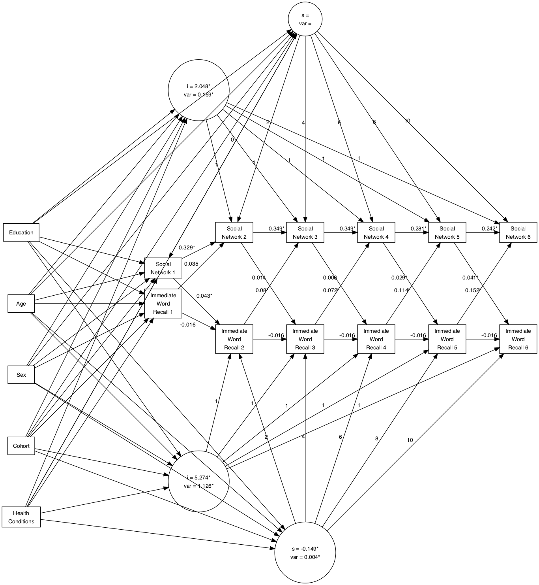

---
title             : "The title"
shorttitle        : "Title"

author: 
  - name          : "Cassandra Brown"
    affiliation   : "1"
    corresponding : yes    # Define only one corresponding author
    address       : "Postal address"
    email         : "clb@uvic.ca"
  - name          : "Andrea Piccinin"
    affiliation   : "1,2"

affiliation:
  - id            : "1"
    institution   : "University of Victoria"
  - id            : "2"
    institution   : ""

author_note: >
  Complete departmental affiliations for each author (note the indentation, if you start a new paragraph).

  Enter author note here.

abstract: >
  Enter abstract here (note the indentation, if you start a new paragraph).
  
keywords          : "keywords"
wordcount         : "X"

bibliography      : ["r-references.bib"]

figsintext        : no
figurelist        : no
tablelist         : no
footnotelist      : no
lineno            : yes

lang              : "english"
class             : "man"
output            : papaja::apa6_word
---


<!--  The 2nd mandatory chunck  -->
<!-- Set the report-wide options, and point to the external code file. -->
```{r, cache = FALSE, include=FALSE}
library(knitr)
knitr::opts_knit$set(root.dir=normalizePath('../'))

inline_hook <- function (x) {
  if (is.numeric(x)) {
    # ifelse does a vectorized comparison
    # If integer, print without decimal; otherwise print two places
    res <- ifelse(x == round(x),
      sprintf("%d", x),
      sprintf("%.2f", x)
    )
    paste(res, collapse = ", ")
  }
}
knit_hooks$set(inline = inline_hook)

```


```{r setup, echo=FALSE}
opts_chunk$set(echo = FALSE, cache=FALSE)

# connect to the file with the underlying R script  
read_chunk("./reports/social-relations-cognition-paper/project1-predetermined-models-results.R") 

```

```{r include = FALSE}
library("papaja")
```

<!-- Load 'sourced' R files.  Suppress the output when loading packages. --> 
```{r load-packages}
```

```{r load-sources}
```

```{r load-data}
```

# Introduction
Testing the reference citation (@power2017socialsupport).  
# Methods

## Participants
Participants were drawn from the 2004, 2006, 2008, 2010, 2012, and 2014 waves of the Health and Retirement Study (HRS). The HRS is a nationally representative longitudinal panel study of individuals over the age of 50 and their spouses of any age in the United States of America. Specifically, the RAND HRS data files (RAND Center for the Study of Aging, 2008) were used as many variables have been pre-cleaned and the files are more user-friendly. The HRS is supported by the National Institute on Aging (NIA U01AG009740) and the Social Security Administration. In 2004, the HRS piloted a self-completed psychosocial questionnaire administered to a random sample of respondents (n=3,262). Beginning in 2006, the HRS began enhanced face-to-face interviews on a rotating basis of 50% of the core panel. The respondent psychosocial questionnaire was left with participants to complete and return by mail at the end of this interview, every 2 years, resulting in longitudinal data for the same participants every 4 years. In the present analysis, participants were excluded if they were younger than 65 at their first wave included assessment wave, if they did not have at least one wave of response data for all cognitive and social variables of interest, and if they reported ever having received a diagnosis of  “memory-related disease”, Alzheimer’s disease, or dementia.

## Measures
  
## Analytical Strategy
A series of models were estimated, first to examine social and cognitive variables of interest individually, and then as bivariate models. Based on Bollen and Curran’s (2004, 2006) recommendations, models were estimated in a progressive series i) autoregressive model, ii) latent growth model, iii) the full ALT model, iv) a latent growth model nested within the ALT model, v) the ALT model without a slope, vi) the ALT model with the slope variance constrained to 0, and vii) the ALT model with autoregressive parameters constrained to equality over time. For ALT models, the first measurement point for all processes was included in the model as predetermined. These were run as univariate models for each variable of interest to understand each variable individually. Model fit was estimated with multiple fit indices: the chi-squared likelihood ratio test, the Comparative Fit Index (CFI), the Tucker-Lewis Index (TLI), the Standardized Root Mean Square Residual (SRMR) and the Root Mean Square Error of Approximation (RMSEA). Values greater than .95 indicate good fit for CFI with greater than .90 indicating adequate fit (Bollen, 2989; Hu & Bentler, 1999).  For RMSEA values smaller than .08 or .06 are considered acceptable and good, respectively. For SRMR .10 and .08 are considered acceptable and good fit respectively (Bollen, 2989; Hu & Bentler, 1999). Nested models were compared using the chi-square difference test (chi-square difference; Bollen, 1989). The estimation of bivariate models followed a similar strategy with bivariate models estimated for each social-cognitive variable pair. For bivariate models the full ALT model was specified with correlations between the first measurement points of the cognitive and social variable, with autoregressive, cross-lagged parameters, and with time-specific correlations between the two processes that were unrestricted across time. In the bivariate model series restrictions were progressively added to the full ALT: i) fixing the slope variance to zero; (ii) excluding the slope; (iii) excluding the time-specific uniqunesses’ correlations; (iv) constraining the time-specific uniquenesses’ correlations to equality over time; (iv) constraining the autoregressive parameters to equality over time; (v) constraining the cross-lagged parameters to equality over time. The constraints were added first to the cognitive processes and then to the social process one at a time. All models were estimated with the MLR option for maximum likelihood estimation with robust standard errors in Mplus 7.4 (Muthen & Muthen, 2012-2015). Maximum likelihood estimation can handle even large proportions of missing data assuming missing at random, by using all available information from all cases (Muthen, 1998-2004). Once a final model was identified for each bivariate combination, covariates were added to the model. The intercept and slope parameters of each processes (the cognitive and social) and the first measurement point (estimated as predetermined) were regressed on each covariate.

# Results

The descriptive statistics for all included variables are presented in Table 1. Model fit indices are presented for each model series in Tables 2 though X. Each processes was investigating separately as a univariate model and then each cognitive-social combination was estimated. Because in ALT models the slope term and autoregressive parameters are not independent it can be difficult to visualize the shape of the trajectory from parameter estimates alone. Thus, a plot of the mean predicted trajectory for each processes was also created. Results for each process are presented followed by bivariate relations.  

## Immediate Word Recall 
<br>
```{r}
wrecti_ATL <- read.csv("./output/univariate-models/wrecti_model_parameters.csv")
wrecti_par_list <- parameter_extraction_function(wrecti_ATL)


```

For immediate word recall, the full ALT model (model 3) evidenced the best model fit (see Table 2). The intercept of immediate word recall score was ($\mu_{t1}$ = `r wrecti_par_list[["ALT_intercept"]]`). Overall, immediate word recall performance decreased over time ($\beta$ = `r wrecti_par_list[["ALT_slope"]]` ,
_p_ = `r wrecti_par_list[["ALT_slope_pval"]]`) with significant variance in the slope ($\psi$ = 
`r wrecti_par_list[["ALT_slope_variance"]]`, _p_ = `r wrecti_par_list[["ALT_slope_variance_pval"]]`). The ability of immediate word recall preformance to predict immediate word recall performance two years later, once overall trajectories were taken into account, was small and not significant 
($\rho_{21}$ = `r wrecti_par_list[["ALT_rho21"]]`, _p_ = `r wrecti_par_list[["ALT_rho21_pval"]]`; $\rho_{32}$ = 
`r wrecti_par_list[["ALT_rho32"]]`, _p_ = `r wrecti_par_list[["ALT_rho32_pval"]]`; $\rho_{43}$ = `r wrecti_par_list[["ALT_rho43"]]`, 
_p_ = `r wrecti_par_list[["ALT_rho43_pval"]]`; $\rho_{54}$ = `r wrecti_par_list[["ALT_rho54"]]`, _p_ = `r wrecti_par_list[["ALT_rho54_pval"]]`; $\rho_{65}$ = `r wrecti_par_list[["ALT_rho65"]]`, _p_ = `r wrecti_par_list[["ALT_rho65_pval"]]`). Figure 1 shows the predicted mean trajectory for immediate word recall.


```{r}
wrecti_sn_ATL <- read.csv("./output/bivariate-models-nodem-65plus/wrecti_social_network_model_parameters.csv")
wrecti_sn_par_list <- bivariateALT_parameter_extraction_function(wrecti_sn_ATL)

wrecti_sn_fullALT <- read.csv("./output/bivariate-models-nodem-65plus/wrecti_social_network_fullmodel_parameters.csv")
wrecti_sn_fullALT_par_list <- bivariateALT_parameter_extraction_function(wrecti_sn_fullALT)
```

```{r}
wrecti_socsup_ALT <- read.csv("./output/bivariate-models-nodem-65plus/wrecti_social_support_model_parameters.csv")
wrecti_socsup_par_list <- bivariateALT_parameter_extraction_function(wrecti_socsup_ALT)

wrecti_socsup_fullALT <- read.csv("./output/bivariate-models-nodem-65plus/wrecti_social_suppport_fullmodel_parameters.csv")
wrecti_socsup_fullALT_par_list <- bivariateALT_parameter_extraction_function(wrecti_socsup_fullALT)
```

```{r}
wrecti_social_contact_ALT <- read.csv("./output/bivariate-models-nodem-65plus/wrecti_social_contact_model_parameters.csv")
wrecti_social_contact_par_list <- bivariateALT_parameter_extraction_function(wrecti_social_contact_ALT)

wrecti_social_contact_fullALT <- read.csv("./output/bivariate-models-nodem-65plus/wrecti_social_contact_fullmodel_parameters.csv")
wrecti_social_contact_fullALT_par_list <- bivariateALT_parameter_extraction_function(wrecti_social_contact_fullALT)
```

```{r}
wrecti_loneliness_ALT <- read.csv("./output/bivariate-models-nodem-65plus/predetermined-models/wrecti_loneliness_model_parameters.csv")
wrecti_loneliness_par_list <- bivariateALT_parameter_extraction_function(wrecti_loneliness_ALT)

wrecti_loneliness_fullALT <- read.csv("./output/bivariate-models-nodem-65plus/wrecti_loneliness_fullmodel_parameters.csv")
wrecti_loneliness_fullALT_par_list <- bivariateALT_parameter_extraction_function(wrecti_loneliness_fullALT)
```


To evaluate the impact of objective and subjective social factors on immediate word recall performance, four separate bivariate model series were estimated. In all four model series parameter estimates indicated that immediate word recall had a significant negative slope with a small but significant variance, consistent with the univariate immediate word recall results (social network: 
$\beta$ = `r  wrecti_sn_par_list[["cog_slope"]]`, _p_ = `r wrecti_sn_par_list[["cog_slope_pval"]]`, 
$\psi$ = `r wrecti_sn_par_list[["cog_slope_variance"]]`, _p_ = `r wrecti_sn_par_list[["cog_slope_variance_pval"]]`; 
social support: $\beta$ = `r  wrecti_socsup_par_list[["cog_slope"]]`, _p_ = `r wrecti_socsup_par_list[["cog_slope_pval"]]`,
$\psi$ = `r wrecti_socsup_par_list[["cog_slope_variance"]]`, _p_ = `r wrecti_socsup_par_list[["cog_slope_variance_pval"]]`;
social contact: $\beta$ = `r  wrecti_social_contact_par_list[["cog_slope"]]`, _p_ = 
`r wrecti_social_contact_par_list[["cog_slope_pval"]]` $\psi$ = `r wrecti_social_contact_par_list[["cog_slope_variance"]]`, _p_ = 
`r wrecti_social_contact_par_list[["cog_slope_variance_pval"]]`; loneliness: $\beta$ = `r  wrecti_loneliness_par_list[["cog_slope"]]`, _p_ = 
`r wrecti_loneliness_par_list[["cog_slope_pval"]]`, $\psi$ = `r wrecti_loneliness_par_list[["cog_slope_variance"]]`, _p_ = 
`r wrecti_loneliness_par_list[["cog_slope_variance_pval"]]`). However, in the bivariate models, allowing the autoregressive parameters to vary over time did not significantly improve model fit compared to the less complex models with the autoregressive parameters constrained to equality over time (see tables X through Y). When the autoregressive parameters were constrained to equality over time, the ability of immediate recall performance to predict future immediate word recall performance was not significant for three of the four models (it was significant in the immediate word recall - social network model). The autoregressive parameter values were similar in the full bivariate ALTs but reached significance in several cases: in the immediate word recall - social network model immediate recall performance the 5th wave significantly predicted immediate recall performance at the 6th wave ($\rho_{65}$ = `r wrecti_sn_fullALT_par_list[["cog_rho65"]]`, _p_ = `r wrecti_sn_fullALT_par_list[["cog_rho65_pval"]]`). In the bivariate immediate word recall - social support ALT model ($\rho_{43}$ = `r wrecti_socsup_fullALT_par_list[["cog_rho43"]]`, _p_ = `r wrecti_socsup_fullALT_par_list[["cog_rho43_pval"]]`) and bivariate immediate word recall - loneliness immediate word recall performance at time 3 significantly predicted immediate word recall preformance at time 4 ($\rho_{43}$ = `r wrecti_loneliness_fullALT_par_list[["cog_rho43"]]`, _p_ = 
`r wrecti_loneliness_fullALT_par_list[["cog_rho43_pval"]]`).  

## Delayed Word Recall

```{r}
wrectd_parameters <- read.csv(file = "./output/univariate-models-nodem-65plus/wrectd_model_parameters.csv")
wrectd_par_list <- parameter_extraction_function(wrectd_parameters)
```

```{r}
wrectd_social_contact <- read.csv("./output/bivariate-models-nodem-65plus/wrectd_social_contact_model_parameters.csv")
wrectd_social_contact_ALT <- bivariateALT_parameter_extraction_function(wrectd_social_contact)

wrectd_social_contact_full <- read.csv("./output/bivariate-models-nodem-65plus/wrectd_social_contact_fullmodel_parameters.csv")
wrectd_social_contact_fullALT <- bivariateALT_parameter_extraction_function(wrectd_social_contact_full)
```

```{r}
wrectd_social_support <- read.csv("./output/bivariate-models-nodem-65plus/wrectd_social_support_model_parameters.csv")
wrectd_social_support_ALT <- bivariateALT_parameter_extraction_function(wrectd_social_support)

wrectd_social_support_full <- read.csv("./output/bivariate-models-nodem-65plus/wrectd_social_support_full_model_parameters.csv")
wrectd_social_support_fullALT <- bivariateALT_parameter_extraction_function(wrectd_social_support_full)
```

```{r}
wrectd_loneliness <- read.csv("./output/bivariate-models-nodem-65plus/wrectd_loneliness_model_parameters.csv")
wrectd_loneliness_ALT <- bivariateALT_parameter_extraction_function(wrectd_loneliness)

wrectd_loneliness_full <- read.csv("./output/univariate-models-nodem-65plus/wrectd_loneliness_fullmodel_parameters.csv")
wrectd_loneliness_fullALT <- bivariateALT_parameter_extraction_function(wrectd_loneliness_full)
```

```{r}
wrectd_social_network <- read.csv("./output/bivariate-models-nodem-65plus/wrectd_social_network_model_parameters.csv")
wrectd_social_network_ALT <- bivariateALT_parameter_extraction_function(wrectd_social_network)

wrectd_social_network_full <- read.csv("./output/bivariate-models-nodem-65plus/wrectd_social_network_full_model_parameters.csv")
wrectd_social_network_fullALT <- bivariateALT_parameter_extraction_function(wrectd_social_network_full)
```


For delayed word recall, univariate model results indicate that the full ALT model (model 4) is the best model by fit indices (see Table 3). The intercept indicated that on average across all occasions participants recalled just under half of the ten words ($\mu_{\alpha}$ = `r wrectd_par_list[["ALT_intercept"]]`, _p_ = 
`r wrectd_par_list[["ALT_intercept_pval"]]`). Overall, delayed word recall performance decreased over time 
($\beta$ = `r wrectd_par_list[["ALT_slope"]]` ,
_p_ = `r wrectd_par_list[["ALT_slope_pval"]]`) with significant variance in the slope ($\psi$ = `r wrecti_par_list[["ALT_slope_variance"]]`, 
_p_ = `r wrectd_par_list[["ALT_slope_variance_pval"]]`). The ability of delayed word recall performance to predict later delayed word recall performance was not significant for the first to second wave
($\rho_{21}$ = `r wrectd_par_list[["ALT_rho21"]]`, _p_ = `r wrectd_par_list[["ALT_rho21_pval"]]`). Previous delayed word recall performance significantly predicted future performance for the next three waves $\rho_{32}$ = 
`r wrectd_par_list[["ALT_rho32"]]`, _p_ = `r wrectd_par_list[["ALT_rho32_pval"]]`; $\rho_{43}$ = `r wrectd_par_list[["ALT_rho43"]]`, 
_p_ = `r wrectd_par_list[["ALT_rho43_pval"]]`; $\rho_{54}$ = `r wrectd_par_list[["ALT_rho54"]]`, _p_ = `r wrectd_par_list[["ALT_rho54_pval"]]`) but delayed word recall performance at time 5 (2012) did not significantly predict performance at time 6 (2014) $\rho_{65}$ = 
`r wrectd_par_list[["ALT_rho65"]]`, _p_ = `r wrectd_par_list[["ALT_rho65_pval"]]` over and above the overall trajectory of change. A plot of the predicted mean trajectory is shown in Figure 2.

When delayed word recall was examined in relation to the four social factors, the slope of delayed recall performance was consistently significant and negative with a small but significance variance parameter (social network: 
$\beta$ = `r  wrectd_social_network_ALT[["cog_slope"]]`, _p_ = `r wrectd_social_network_ALT[["cog_slope_pval"]]`, 
$\psi$ = `r wrectd_social_network_ALT[["cog_slope_variance"]]`, _p_ = `r wrectd_social_network_ALT[["cog_slope_variance_pval"]]`; 
social support: $\beta$ = `r  wrectd_social_support_ALT[["cog_slope"]]`, _p_ = `r wrectd_social_support_ALT[["cog_slope_pval"]]`,
$\psi$ = `r wrectd_social_support_ALT[["cog_slope_variance"]]`, _p_ = `r wrectd_social_support_ALT[["cog_slope_variance_pval"]]`;
social contact: $\beta$ = `r  wrectd_social_contact_ALT[["cog_slope"]]`, _p_ = 
`r wrectd_social_contact_ALT[["cog_slope_pval"]]` $\psi$ = `r wrectd_social_contact_ALT[["cog_slope_variance"]]`, _p_ = 
`r wrectd_social_contact_ALT[["cog_slope_variance_pval"]]`; loneliness: $\beta$ = `r  wrectd_loneliness_ALT[["cog_slope"]]`, _p_ = 
`r wrectd_loneliness_ALT[["cog_slope_pval"]]`, $\psi$ = `r wrectd_loneliness_ALT[["cog_slope_variance"]]`, _p_ = 
`r wrectd_loneliness_ALT[["cog_slope_variance_pval"]]`). Across all four bivariate models with delayed word recall performance, allowing the autoregressive parameters of delayed word recall to vary over time did not signficantly improve the model fit over the bivariate models with the equality constraint (social network: $\rho_{t,t-1}$ = `r  wrectd_social_network_ALT[["cog_rho21"]]`, _p_ = `r wrectd_social_network_ALT[["cog_rho21_pval"]]`, 
social support: $\rho_{t,t-1}$  = `r  wrectd_social_support_ALT[["cog_rho21"]]`, _p_ = `r wrectd_social_support_ALT[["cog_rho21_pval"]]`,
social contact: $\rho_{t,t-1}$ = `r  wrectd_social_contact_ALT[["cog_rho21"]]`, _p_ = 
`r wrectd_social_contact_ALT[["cog_rho21_pval"]]` 
loneliness: $\rho_{t,t-1}$ = `r  wrectd_loneliness_ALT[["cog_rho21"]]`, _p_ = 
`r wrectd_loneliness_ALT[["cog_rho21_pval"]]`). In two of the four bivariate models, social contact and social network, with delayed word recall, previous delayed word recall performance did not significantly predict performance two years later at any occasion and thus constraining the autogressive parameter did not change the substantive interpretation. In the other two bivariate models, loneliness and social support, delayed word recall at time two significantly predicted delayed recall performance at time three when the autoregressive parameters were allowed to vary over time (social support: $\rho_{3,2}$  = `r  wrectd_social_support_fullALT[["cog_rho32"]]`, _p_ = `r wrectd_social_support_fullALT[["cog_rho32_pval"]]`,
loneliness: $\rho_{3,2}$ = `r  wrectd_loneliness_fullALT[["cog_rho32"]]`, _p_ = 
`r wrectd_loneliness_fullALT[["cog_rho32_pval"]]`). However the negative significance indicates that better performance in 2006 actually predicted worse performance in 2008.

## Mental Status
```{r mental-status, echo=FALSE}
```


```{r}
ms_parameters <- read.csv(file = "./output/univariate-models-nodem-65plus/mental_status_model_parameters.csv")
ms_par_list <- parameter_extraction_function(ms_parameters)

ms_social_network <- read.csv("./output/bivariate-models-nodem-65plus/mentalstatus_socialnetwork_model_parameters.csv")
ms_social_network_ALT <- bivariateALT_parameter_extraction_function(ms_social_network)

ms_social_network_full <- read.csv("./output/bivariate-models-nodem-65plus/mentalstatus_socialnetwork_fullmodel_parameters.csv")
ms_social_network_fullALT <- bivariateALT_parameter_extraction_function(ms_social_network_full)
```  


```{r}
ms_social_support <- read.csv("./output/bivariate-models-nodem-65plus/mentalstatus_social_support_model_parameters.csv")
ms_social_support_ALT <- bivariateALT_parameter_extraction_function(ms_social_support)

ms_social_support_full <- read.csv("./output/bivariate-models-nodem-65plus/mentalstatus_social_support_fullmodel_parameters.csv")
ms_social_support_fullALT <- bivariateALT_parameter_extraction_function(ms_social_network_full)
```  

```{r}
ms_social_contact <- read.csv("./output/bivariate-models-nodem-65plus/mentalstatus_social_contact_model_parameters.csv")
ms_social_contact_ALT <- bivariateALT_parameter_extraction_function(ms_social_support)

ms_social_contact_full <- read.csv("./output/bivariate-models-nodem-65plus/mentalstatus_social_contact_fullmodel_parameters.csv")
ms_social_contact_fullALT <- bivariateALT_parameter_extraction_function(ms_social_network_full)
```  

```{r}
ms_loneliness <- read.csv("./output/bivariate-models-nodem-65plus/mentalstatus_loneliness_model_parameters.csv")
ms_loneliness_ALT <- bivariateALT_parameter_extraction_function(ms_loneliness)

ms_loneliness_full <- read.csv("./output/bivariate-models-nodem-65plus/mentalstatus_loneliness_fullmodel_parameters.csv")
ms_loneliness_fullALT <- bivariateALT_parameter_extraction_function(ms_loneliness_full)
```  
  
For the univariate mental status models, the full ALT model (model 4) shows the best model fit according to fit indicies (see Table 4). The estimate mental status intercept is high ($\mu_{\alpha}$ = `r ms_par_list[["ALT_intercept"]]`, _p_ = `r ms_par_list[["ALT_intercept_pval"]]`). With significant variability. Overall, mental status decreased over time ($\beta$ = `r ms_par_list[["ALT_slope"]]` , _p_ = `r ms_par_list[["ALT_slope_pval"]]`) with significant variance in the slope ($\psi$ = `r ms_par_list[["ALT_slope_variance"]]`, 
_p_ = `r ms_par_list[["ALT_slope_variance_pval"]]`). The ability of earlier mental status to predict later mental status, over and above the overall trajectory of change was consistently significant ($\rho_{21}$ = `r ms_par_list[["ALT_rho21"]]`, _p_ = `r ms_par_list[["ALT_rho21_pval"]]`; $\rho_{32}$ = 
`r ms_par_list[["ALT_rho32"]]`, _p_ = `r ms_par_list[["ALT_rho32_pval"]]`; $\rho_{43}$ = `r ms_par_list[["ALT_rho43"]]`, _p_ = `r ms_par_list[["ALT_rho43_pval"]]`; 
$\rho_{54}$ = `r ms_par_list[["ALT_rho54"]]`, _p_ = `r ms_par_list[["ALT_rho54_pval"]]`; $\rho_{65}$ = `r ms_par_list[["ALT_rho65"]]`, _p_ = 
`r ms_par_list[["ALT_rho65_pval"]]`). A plot of the predicted mean trajectory of mental status performance is shown in Figure 3. 

When mental status was examined in relation to the four social factors, the slope of mental status was consistently significant and negative with a small but significance variance parameter (social network: 
$\beta$ = `r  ms_social_network_ALT[["cog_slope"]]`, _p_ = `r ms_social_network_ALT[["cog_slope_pval"]]`, 
$\psi$ = `r ms_social_network_ALT[["cog_slope_variance"]]`, _p_ = `r ms_social_network_ALT[["cog_slope_variance_pval"]]`; 
social support: $\beta$ = `r  ms_social_support_ALT[["cog_slope"]]`, _p_ = `r ms_social_support_ALT[["cog_slope_pval"]]`,
$\psi$ = `r ms_social_support_ALT[["cog_slope_variance"]]`, _p_ = `r ms_social_support_ALT[["cog_slope_variance_pval"]]`;
social contact: $\beta$ = `r  ms_social_contact_ALT[["cog_slope"]]`, _p_ = 
`r ms_social_contact_ALT[["cog_slope_pval"]]` $\psi$ = `r ms_social_contact_ALT[["cog_slope_variance"]]`, _p_ = 
`r ms_social_contact_ALT[["cog_slope_variance_pval"]]`; loneliness: $\beta$ = `r  ms_loneliness_ALT[["cog_slope"]]`, _p_ = 
`r ms_loneliness_ALT[["cog_slope_pval"]]`, $\psi$ = `r ms_loneliness_ALT[["cog_slope_variance"]]`, _p_ = 
`r ms_loneliness_ALT[["cog_slope_variance_pval"]]`). Mental status significantly predicted mental status two years later, over and above the overall trajectory of change, with the autoregressive parameters getting larger over time (social network: $\rho_{21}$ = `r ms_social_network_ALT[["cog_rho21"]]`, _p_ = `r ms_social_network_ALT[["cog_rho21_pval"]]`,
$\rho_{32}$ = `r ms_social_network_ALT[["cog_rho32"]]`, _p_ = `r ms_social_network_ALT[["cog_rho32_pval"]]`;
$\rho_{43}$ = `r ms_social_network_ALT[["cog_rho43"]]`, _p_ = `r ms_social_network_ALT[["cog_rho43_pval"]]`;
$\rho_{54}$ = `r ms_social_network_ALT[["cog_rho54"]]`, _p_ = `r ms_social_network_ALT[["cog_rho54_pval"]]`;
$\rho_{65}$ = `r ms_social_network_ALT[["cog_rho65"]]`, _p_ = `r ms_social_network_ALT[["cog_rho65_pval"]]`;
social support: $\rho_{21}$ = `r ms_social_support_ALT[["cog_rho21"]]`, _p_ = `r ms_social_support_ALT[["cog_rho21_pval"]]`
$\rho_{32}$ = `r ms_social_support_ALT[["cog_rho32"]]`, _p_ = `r ms_social_support_ALT[["cog_rho32_pval"]]`;
$\rho_{43}$ = `r ms_social_support_ALT[["cog_rho43"]]`, _p_ = `r ms_social_support_ALT[["cog_rho43_pval"]]`;
$\rho_{54}$ = `r ms_social_support_ALT[["cog_rho54"]]`, _p_ = `r ms_social_support_ALT[["cog_rho54_pval"]]`;
$\rho_{65}$ = `r ms_social_support_ALT[["cog_rho65"]]`, _p_ = `r ms_social_support_ALT[["cog_rho65_pval"]]`;
social contact: $\rho_{21}$ = `r ms_social_contact_ALT[["cog_rho21"]]`, _p_ = `r ms_social_contact_ALT[["cog_rho21_pval"]]`,
$\rho_{32}$ = `r ms_social_contact_ALT[["cog_rho32"]]`, _p_ = `r ms_social_contact_ALT[["cog_rho32_pval"]]`;
$\rho_{43}$ = `r ms_social_contact_ALT[["cog_rho43"]]`, _p_ = `r ms_social_contact_ALT[["cog_rho43_pval"]]`;
$\rho_{54}$ = `r ms_social_contact_ALT[["cog_rho54"]]`, _p_ = `r ms_social_contact_ALT[["cog_rho54_pval"]]`;
$\rho_{65}$ = `r ms_social_contact_ALT[["cog_rho65"]]`, _p_ = `r ms_social_contact_ALT[["cog_rho65_pval"]]`;
loneliness: $\rho_{21}$ = `r ms_loneliness_ALT[["cog_rho21"]]`, _p_ = `r ms_loneliness_ALT[["cog_rho21_pval"]]`,
$\rho_{32}$ = `r ms_loneliness_ALT[["cog_rho32"]]`, _p_ = `r ms_loneliness_ALT[["cog_rho32_pval"]]`;
$\rho_{43}$ = `r ms_loneliness_ALT[["cog_rho43"]]`, _p_ = `r ms_loneliness_ALT[["cog_rho43_pval"]]`;
$\rho_{54}$ = `r ms_loneliness_ALT[["cog_rho54"]]`, _p_ = `r ms_loneliness_ALT[["cog_rho54_pval"]]`;
$\rho_{65}$ = `r ms_loneliness_ALT[["cog_rho65"]]`, _p_ = `r ms_loneliness_ALT[["cog_rho65_pval"]]`).


## Loneliness
```{r}
loneliness_parameters <- read.csv(file = "./output/univariate-models-nodem-65plus/predetermined-models/loneliness_model_parameters.csv")
lone_par_list <- parameter_extraction_function(loneliness_parameters)

fullALT_loneliness_parameters <- read.csv(file = "./output/univariate-models-nodem-65plus/predetermined-models/loneliness_fullALTmodel_parameters.csv")
fullALT_lone_par_list <- parameter_extraction_function(fullALT_loneliness_parameters)


```  

For the univariate loneliness models, the ALT model with only the level of loneliness estimated (no slope) and autoregressive parameters constrained to equality over time was the best fitting most parsimonious model according to fit indices (see Table 5). The intercept was $\mu_{\alpha}$ = `r lone_par_list[["ALT_intercept"]]`, _p_ = `r lone_par_list[["ALT_intercept_pval"]]`, with significant variability. Previous loneliness scores significantly predicted later loneliness $\rho_{t,t-1}$ = `r lone_par_list[["ALT_rho21"]]`, _p_ = `r lone_par_list[["ALT_rho21_pval"]]`. Figure 4 shows the predicted mean trend of loneliness over time. Although, the ALT model with no slope for loneliness was indicated in the model comparison, when estimated in the full ALT model the slope term of loneliness was significant ($\beta$ = `r lone_par_list[["ALT_slope"]]` , _p_ = `r fullALT_lone_par_list[["ALT_slope_pval"]]`) with non-significant variance ($\psi$ = `r fullALT_lone_par_list[["ALT_slope_variance"]]`, _p_ = `r fullALT_lone_par_list[["ALT_slope_variance_pval"]]`).

When loneliness was included in bivariate models to examine the relations between loneliness and cognitive function, as in the univariate models, the slope term was small and significant in the immediate word recall - loneliness model 
( $\beta$ = `r  wrecti_loneliness_par_list[["soc_slope"]]`, _p_ = `r wrecti_loneliness_par_list[["soc_slope_pval"]]`, 
$\psi$ = `r wrecti_loneliness_par_list[["soc_slope_variance"]]`, _p_ = `r wrecti_loneliness_par_list[["soc_slope_variance_pval"]]`). 
However, in the delayed word recall - loneliness and mental status - loneliness models the mean slope term of loneliness was not significant but the variance of the loneliness slope was small but significant 
(delayed word recall: $\beta$ = `r  wrectd_loneliness_ALT[["soc_slope"]]`, _p_ = `r wrectd_loneliness_ALT[["soc_slope_pval"]]`,
$\psi$ = `r  wrectd_loneliness_ALT[["soc_slope_variance"]]`, _p_ = `r wrectd_loneliness_ALT[["soc_slope_variance_pval"]]`;
mental status: $\beta$ = `r  ms_loneliness_ALT[["soc_slope"]]`, _p_ = `r ms_loneliness_ALT[["soc_slope_pval"]]`,
$\psi$ = `r  ms_loneliness_ALT[["soc_slope_variance"]]`, _p_ = `r ms_loneliness_ALT[["soc_slope_variance_pval"]]`).
In the bivariate models constraining the autoregressive parameters of loneliness on loneliness two years later to be stable over time did not significantly decrease model fit and was the more parsimonious model. However, in these models there was a consistent significant effect, over and above the estimated trajectory, of loneliness on loneliness two years later (immediate word recall:
$\rho_{t,t-1}$ = `r wrecti_loneliness_par_list[["soc_rho21"]]`, _p_ = `r wrecti_loneliness_par_list[["soc_rho21_pval"]]`;
delayed word recall: $\rho_{t,t-1}$ = `r wrectd_loneliness_ALT[["soc_rho21"]]`, _p_ = `r wrectd_loneliness_ALT[["soc_rho21_pval"]]`;
mental status: $\rho_{t,t-1}$ = `r ms_loneliness_ALT[["soc_rho21"]]`, _p_ = `r ms_loneliness_ALT[["soc_rho21_pval"]]`).

There were some substantive differences when the autoregressive parameters for loneliness were constrained over time. In some of the bivariate models, when the autoregressive parameter of loneliness was allowed to vary over time there were occasions when the value was negative however, when constrained across time the loneliness autoregressive parameter was significantly positive as was the case in the unvariate models (see tables). This instability may be due to the fact that loneliness scores were only collected every four years as opposed to every two years like the cognitive data. Therefore, models with the autoregressive parameter constrained to equality were retained as the most parsimonious models with which the effects of covariates were investigated. 


## Social Contact
```{r}
social_contact_parameters <- read.csv(file = "./output/univariate-models-nodem-65plus/social_contact_model_parameters.csv")
sc_par_list <- parameter_extraction_function(social_contact_parameters)

```  


For social contact, the full ALT model was the best fitting model according to model fit indices (see Table 6). The estimated intercept was ($\mu_{\alpha}$ = `r sc_par_list[["ALT_intercept"]]`, _p_ = `r sc_par_list[["ALT_intercept_pval"]]`) with significant variability. 
Social contact increased over time ($\beta$ = `r sc_par_list[["ALT_slope"]]` , _p_ = `r sc_par_list[["ALT_slope_pval"]]`) and the variance in the slope was not significant ($\psi$ = `r sc_par_list[["ALT_slope_variance"]]`, 
_p_ = `r sc_par_list[["ALT_slope_variance_pval"]]`). The ability of earlier social contact to predict later social contact, over and above the overall trajectory of change was consistently significant but negative ($\rho_{21}$ = `r sc_par_list[["ALT_rho21"]]`, _p_ = `r sc_par_list[["ALT_rho21_pval"]]`; $\rho_{32}$ = `r sc_par_list[["ALT_rho32"]]`, _p_ = `r sc_par_list[["ALT_rho32_pval"]]`; $\rho_{43}$ = `r sc_par_list[["ALT_rho43"]]`, 
_p_ = `r sc_par_list[["ALT_rho43_pval"]]`; $\rho_{54}$ = `r sc_par_list[["ALT_rho54"]]`, _p_ = `r sc_par_list[["ALT_rho54_pval"]]`; $\rho_{65}$ = `r sc_par_list[["ALT_rho65"]]`, _p_ = `r sc_par_list[["ALT_rho65_pval"]]`). When the autoregressive parameters are fixed over time, the slope becomes significant and negative, this is consistent with the univariate LGM as well. This suggests that when the autoregressive parameters are allowed to vary over time the decline in social contact over time is accounted for by the autoregressive parameters rather than in in the linear slope term, however, examing trajectory plots reveals that in both cases the mean predicted trajectory of social contact shows a decrease over time in social contact (see Figure 5).

For two of the three bivariate models with social contact (mental status - social contact, delayed word recall - social contact) the full ALT model was not able to be estimated due to convergence problems. Additional constraints on social contact were needed for models to converge without issue. There was no significant decrease in model fit when autoregressive parameters of social contact were constrained over time. In bivariate models with the autoregressive parameters of social contact constrained over time, the slope of social contact was significant and negative indicating that overall there was a decrease in social contact over time in the delayed word recall - social contact model only (delayed word recall: $\beta$ = `r  wrectd_social_contact_ALT[["soc_slope"]]`, _p_ = `r wrectd_social_contact_ALT[["soc_slope_pval"]]`, $\psi$ = `r  wrectd_social_contact_ALT[["soc_slope_variance"]]`, _p_ = `r wrectd_social_contact_ALT[["soc_slope_variance_pval"]]`). Whereas in the bivariate models with immediate word recall and mental status, the slope term for social contact was not significant (immediate word recall: $\beta$ = `r  wrecti_social_contact_par_list[["soc_slope"]]`, _p_ = `r wrecti_social_contact_par_list[["soc_slope_pval"]]`, 
$\psi$ = `r wrecti_social_contact_par_list[["soc_slope_variance"]]`, _p_ = `r wrecti_social_contact_par_list[["soc_slope_variance_pval"]]`;
mental status: $\beta$ = `r  ms_social_contact_ALT[["soc_slope"]]`, _p_ = `r ms_social_contact_ALT[["soc_slope_pval"]]`,
$\psi$ = `r  ms_social_contact_ALT[["soc_slope_variance"]]`, _p_ = `r ms_social_contact_ALT[["soc_slope_variance_pval"]]`). In all three models there was significant variance in the slope term. Social contact did not significantly predict social contact two years later in any of the bivariate models (delayed word recall: $\rho_{t,t-1}$ = `r wrectd_social_contact_ALT[["soc_rho21"]]`, _p_ = `r wrectd_social_contact_ALT[["soc_rho21_pval"]]`; immediate word recall: $\rho_{t,t-1}$ = `r wrecti_social_contact_par_list[["soc_rho21"]]`, _p_ = `r wrecti_social_contact_par_list[["soc_rho21_pval"]]`; mental status: $\rho_{t,t-1}$ = `r ms_social_contact_ALT[["soc_rho21"]]`, _p_ = `r ms_social_contact_ALT[["soc_rho21_pval"]]`).


## Social Support  
```{r}
social_support_parameters <- read.csv(file = "./output/univariate-models-nodem-65plus/social_support_model_parameters.csv")
ss_par_list <- parameter_extraction_function(social_support_parameters)

```  
 
For univariate social support models, comparing model results showed that autoregressive parameters to equality over time did not result in significantly poorer model fit compared to the full ALT model and so is retained as the more parsimonious model. The intercept is ($\mu_{\alpha}$ = `r ss_par_list[["ALT_intercept"]]`, _p_ = `r ss_par_list[["ALT_intercept_pval"]]`) with significant variability. Social support did not show a significant mean trend over time ($\beta$ = `r ss_par_list[["ALT_slope"]]` , _p_ = `r ss_par_list[["ALT_slope_pval"]]`) but there was significant variance in the slope ($\psi$ = `r ss_par_list[["ALT_slope_variance"]]`, _p_ = `r ss_par_list[["ALT_slope_variance_pval"]]`). Previous social support scores significantly predicted later social support, over and above the overall trajectory of social support ($\rho_{21}$ = 
`r ss_par_list[["ALT_rho21"]]`, _p_ = `r ss_par_list[["ALT_rho21_pval"]]`). See Figure 7 for a plot of the mean predicted trajectory. 

```{r social-support, echo=FALSE, results='asis'}
```


In the bivariate models investigating the relations between cognitive performance and social support, consistent with the univariate model, the slope of social support was consistently not significant but the variance of the slope term was significant 
(immediate word recall: $\beta$ = `r  wrecti_socsup_par_list[["soc_slope"]]`, _p_ = `r wrecti_socsup_par_list[["soc_slope_pval"]]`, 
$\psi$ = `r wrecti_socsup_par_list[["soc_slope_variance"]]`, _p_ = `r wrecti_socsup_par_list[["soc_slope_variance_pval"]]`;
delayed word recall: $\beta$ = `r  wrectd_social_support_ALT[["soc_slope"]]`, _p_ = `r wrectd_social_support_ALT[["soc_slope_pval"]]`, 
$\psi$ = `r wrectd_social_support_ALT[["soc_slope_variance"]]`, _p_ = `r wrectd_social_support_ALT[["soc_slope_variance_pval"]]`;
mental status: $\beta$ =`r ms_social_support_ALT[["soc_slope"]]`, _p_ = `r ms_social_support_ALT[["soc_slope_pval"]]`
$\psi$ = `r ms_social_support_ALT[["soc_slope_variance"]]`, _p_ = `r ms_social_support_ALT[["soc_slope_variance_pval"]]`).
As in the univariate models, model fit was not significantly improved by allowing the autoregressive parameters of social support to vary over time in any of the bivariate models. For the mental status - social support bivariate model ($\rho_{t,t-1}$ = `r ms_social_support_ALT[["soc_rho21"]]`, _p_ = 
`r ms_social_support_ALT[["soc_rho21_pval"]]`) autoregressive parameters were not significant. However, the immediate word recall - social support model ($\rho_{t,t-1}$ = `r wrecti_socsup_par_list[["soc_rho21"]]`, _p_ = `r wrecti_socsup_par_list[["soc_rho21_pval"]]`) and delayed word recall - social support bivariate models ($\rho_{t,t-1}$ = `r wrectd_social_support_ALT[["soc_rho21"]]`, _p_ = `r wrectd_social_support_ALT[["soc_rho21_pval"]]`) the autoregressive parameters were significant and negative. 

## Social Network
```{r}
social_network_parameters <- read.csv(file = "./output/univariate-models-nodem-65plus/social_network_model_parameters.csv")
sn_par_list <- parameter_extraction_function(social_network_parameters)

```  
  
Among the univariate social network models, the full ALT model showed significantly better fit than all models except the model with autoregressive parameters constrained across time which is superior as the more parsimonious model. The intercept was ($\mu_{\alpha}$ = 
`r sn_par_list[["ALT_intercept"]]`, _p_ = `r sn_par_list[["ALT_intercept_pval"]]`) with significant variability. Social network size  significantly declined over time ($\beta$ = `r sn_par_list[["ALT_slope"]]` , _p_ = `r sn_par_list[["ALT_slope_pval"]]`) and there was significant variance in these trajectories ($\psi$ = `r sn_par_list[["ALT_slope_variance"]]`, _p_ = 
`r sn_par_list[["ALT_slope_variance_pval"]]`). Previous social network scores significantly predicted later social network size, over and above the overall trajectory of social network ($\rho_{t,t-1}$ = 
`r sn_par_list[["ALT_rho21"]]`, _p_ = `r sn_par_list[["ALT_rho21_pval"]]`). A plot of the predicted mean trajectory of social network is shown in Figure 7.


In the three bivariate models investigating the relations between cognitive performance and social network, the trajectory of social network was described somewhat differently depending on the cognitive variable in the bivariate model and the model constraints.  In the immediate word recall - social network model there was no significant mean slope in social network however the variance was significant ($\beta$ = `r  wrecti_sn_par_list[["soc_slope"]]`, _p_ = `r wrecti_sn_par_list[["soc_slope_pval"]]`, 
$\psi$ = `r wrecti_sn_par_list[["soc_slope_variance"]]`, _p_ = `r wrecti_sn_par_list[["soc_slope_variance_pval"]]`). In the bivariate models with delayed word recall and mental status there was a significant negative mean slope  with significant variance (delayed word recall: $\beta$ = `r  wrectd_social_network_ALT[["soc_slope"]]`, _p_ = `r wrectd_social_network_ALT[["soc_slope_pval"]]`, 
$\psi$ = `r wrectd_social_network_ALT[["soc_slope_variance"]]`, _p_ = `r wrectd_social_network_ALT[["soc_slope_variance_pval"]]`;
mental status: $\beta$ =`r ms_social_network_ALT[["soc_slope"]]`, _p_ = `r ms_social_network_ALT[["soc_slope_pval"]]`
$\psi$ = `r ms_social_network_ALT[["soc_slope_variance"]]`, _p_ = `r ms_social_network_ALT[["soc_slope_variance_pval"]]`).
For  delayed word recall - social network bivariate model ($\rho_{t,t-1}$ = 
`r wrectd_social_network_ALT[["soc_rho21"]]`, _p_ = `r wrectd_social_network_ALT[["soc_rho21_pval"]]`) the autoregressive parameters were significant and positive. However, for the mental status - social support bivariate model ($\rho_{t,t-1}$ = `r ms_social_network_ALT[["soc_rho21"]]`, _p_ = 
`r ms_social_network_ALT[["soc_rho21_pval"]]`) and the immediate word recall - social network model ($\rho_{t,t-1}$ = `r wrecti_sn_par_list[["soc_rho21"]]`, _p_ = `r wrecti_sn_par_list[["soc_rho21_pval"]]`) the autoregressive parameters were not significant. For all three of the bivariate models with cognitive performance where the social network autoregressive parameters were not constrained to equality over time the autoregressive parameters were consistently not significant. 


## Bivariate model results

```{r immediate-word-recall-loneliness-results, echo=FALSE, results='asis'}
```

### _Immediate word recall - Loneliness_  

Convergence problems arose in the estimation of the bivariate immediate word recall - loneliness model such that the full ALT model did not converge and thus could not be the comparison model. Examination of the model suggested that convergence issues may have been due to model miss-specification. Thus, model comparison was limited to converged models. The results of this model comparison indicate that the slope of loneliness can be removed, time specific correlations can be removed, and autoregressive parameters for both immediate word recall and loneliness can be constrained to equality over time without a significant reduction in model fit from the ALT model with the social slope fixed to 0 (see Table X). Looking at the results of this model in more detail, the correlation between the intercept factors was not signficant (corr. = 
`r wrecti_loneliness_par_list[["IB_WITH_IA"]]`, _p_ = `r wrecti_loneliness_par_list[["IB_WITH_IA_pval"]]`) nor was the correlation between time 1 loneliness and time 1 immediate word recall (corr. = 
`r wrecti_loneliness_par_list[["A_01_WITH_B_01"]]`, _p_ = `r wrecti_loneliness_par_list[["A_01_WITH_B_01_pval"]]`). Note that in these models the intercept represents the portion of the time 2 variable remaining unexplained by the time 1 variable. Further, that the time-specific correlations could be removed without changing the overall fit of the model indicates that the time-specific uniquenesses, after accounting for the slope of immediate word recall, are not related. The cross-lagged regressions of loneliness-on-immediate word recall were all signficant except for time 2 loneliness predicting time 3 immediate word recall performance and state like deviations immediate word recall performance significantly predicted state like deviations in loneliness across all occasions indicating a reciprical relationship. Specifically, state-like deviations in loneliness at time 1 significantly predicted state-like deviations in immediate word recall performance at time 2 (`r wrecti_loneliness_par_list[["A_02_B_01"]]`, _p_ = 
`r wrecti_loneliness_par_list[["A_02_B_01_pval"]]`), state-like deviations in loneliness at time 2 
(`r wrecti_loneliness_par_list[["A_03_B_02"]]`, _p_ = `r wrecti_loneliness_par_list[["A_03_B_02_pval"]]`) did not significantly predict state-like deviations in immediate word recall performance at time 3 but state-like deviations in loneliness did predict immediate word recall performance at time 3 (`r wrecti_loneliness_par_list[["A_04_B_03"]]`, _p_ = `r wrecti_loneliness_par_list[["A_04_B_03_pval"]]`), 4 (`r wrecti_loneliness_par_list[["A_05_B_04"]]`, _p_ = `r wrecti_loneliness_par_list[["A_05_B_04_pval"]]`), or 5 
(`r wrecti_loneliness_par_list[["A_06_B_05"]]`, _p_ = `r wrecti_loneliness_par_list[["A_06_B_05_pval"]]`).  

Effect of covariates on immediate word recall (from immediate word recall loneliness)
The predictors age, years of education, cohort, and number of health conditions, were added to the final ALT model. The model fit indices appear in the last row of Table 2 and show adequate fit by all indices.  
The results show that none of the covariates influenced the first measurement point of immediate word recall. All of the covariates were significantly related to the immediate word recall slope factor. Specifically, age was negatively related to the intercept indicating that those who were older had significantly lower average immediate word recall preformance across the measurement period. Years of education was positively related to the intercept factor for immediate word recall indicating that those with more years of education had significantly higher average immediate word recall performance. Number of health conditions was negatively related to the immediate word recall intercept factor indicating that those with a greater number of health conditions overall also had lower average immediate word recall performance. Sex was also positively related to immediate word recall intercept, because sex was coded as 0 for men and 1 for women, this indicates that women had significantly higher average immediate word recall performance across all occasions. The only covariate that was significantly related to the immediate word recall slope was age with participants who were older at baseline showed a greater decline in immediate word recall over time. 

_Effect of covariates on loneliness._
None of the covariates were significantly related to the first measurement point of loneliness. Years of education, number of health conditions, and sex were significantly related to the loneliness intercept factor indicating that those with more years of education were also significantly less lonely on average over time. Those who had a greater number of health conditions were more lonely on average over time and women were more lonely than men on average over time. Only years of education was significantly and positively related to the slope factor for loneliness such that individuals with more years of education also had a slightly greater increase in loneliness over time. 


When covariates were added to the model the significant cross-lagged relations were no longer significant indicating that these relations were accounted for by the included covariates. 

### _immediate word recall - social contact_      
A series of models were run to investigate the relations between immediate word recall performance and social contact. Convergence problems arose in the estimation of models that included a linear trajectory term (slope) for social contact including the full ALT model. Thus, bivariate model results were compared among models estimated with level of social contact (intercept term) and autoregressive and cross-lagged components estimated only. The results of these bivariate models indicate that in addition to this restriction, time-specific correlations can be excluded, and the immediate word recall autoregressive components can be constrained to equality over time without a significant decrease in model fit according to the chi-square difference test (see Table ). The final model had excellent model fit according to all fit indices. Examining the results of this model in more detail, the correlation between inital immediate word recall performance and social contact was not significant (corr. = 
`r wrecti_social_contact_par_list[["A_01_WITH_B_01"]]`, _p_ = `r wrecti_social_contact_par_list[["A_01_WITH_B_01_pval"]]`). The correlation between the intercept factors was also not signficant (corr. = 
`r wrecti_social_contact_par_list[["SB_WITH_SA"]]`, _p_ = `r wrecti_social_contact_par_list[["SB_WITH_SA_pval"]]`). The autoregressive parameters of immediate word recall were constrained across time and not significant indicating that deviations from the linear slope trajectory were not significantly related to deviations from that trajectory at the next occasion. The cross-lagged parameters were allowed to vary over time. The social contact-on-immediate word recall regressions were consistently significant. The immediate word recall-on-social contact cross-lagged regressions were also consistently significant, indicating a reciprical relationship.  

The effect of predictors age, years of education, cohort, and number of health conditions were added directly to the final model.

Age and sex were the only covariates that were significantly related to the first measurement point of immediate word recall. Age, education, health and sex were all significantly related to the immediate word recall intercept factor, cohort was not. Specifically individuals who were older had lower immediate word recall on average across all occasions,  while those with more years of education had higher immediate word recall overall, across all occasions. Greater numbers of health conditions was associated with a lower immedate word recall intercept. Being female was associated with a higher immediate word recall intercept. Age was negatively related to the immediate word recall slope factor indicating that older individuals had a significantly greater decrease in immediate word recall performance over time. No other covariate was significantly related to immediate word recall slope. 

None of the included covariates significantly predicted the first measurement point of social contact. Years of education and sex were both positively related to the social contact intercept factor indicating that those with more years of education and women had higher social contact across all occasions. None of the predictors were related to the linear slope term for social contact. When the covariates were included the significant state-like deviations in social contact at time 3 were significantly related to state-like deviations in immediate word recall at time 4 as they were in the unconditional model.This relation is negative suggesting that those with greater than expected social contact show worse than expected immediate word recall performance two years later. However, the relation between state-like deviations in social contact at time 4 and state-like deviations in immediate recall at time 5 became just non-significant (p = .056) and the cross-lagged regression between time 5 social contact and time 6 immediate word recall also became non-signficant (p = .09). The significant relation between immediate word recall slope and social contact slope remained.

### _Immediate word recall - social support_  
Convergence problems arose with some of the models, including the full ALT model. The fit of all properly converged bivariate ALT models of immediate word recall performance and self-reported social support are reported in Table X. Estimating bivariate models with a series of constraints revealed that the following constraints could be applied without a significant change in model fit: the slope of social support can be excluded, the time-specific correlations between uniquenesses of immediate word recall performance and social support can be excluded, and the autoregressive parameters of both immediate word recall and social support can be constrained to equality over time without significantly changing model fit according to the ∆χ2. All other contraints significantly decreased model fit. Examining the results of this model more closely, the correlation between inital immediate word recall performance and social support was not significant (corr. = 
`r wrecti_socsup_par_list[["A_01_WITH_B_01"]]`, _p_ = `r wrecti_socsup_par_list[["A_01_WITH_B_01_pval"]]`). The correlation between the intercept factors was also not signficant (corr. = 
`r wrecti_socsup_par_list[["IB_WITH_IA"]]`, _p_ = `r wrecti_socsup_par_list[["IB_WITH_IA_pval"]]`). The cross-lagged immediate word recall-on-social support regressions could not be constrained to equality over time without a significant decrease in model fit. Examination of these parameters shows that only time-specific deviations in social support at time two predicted time-specific deviations in immediate word recall at time 3. All other cross-lagged associations were not significant. The association is positive indicating that, after accounting for linear trajectory, higher reported social support at time two was associated with better immediate word recall two years later. 

The effect of predictors age, years of education, cohort, and number of health conditions were added directly to the final model.

None of the predictors were related to the first point of measurment of immediate word recall. Age, education, health and sex were all significantly related to the immediate word recall intercept factor, cohort was not. Specifically individuals who were older had lower immediate word recall on average across all occasions, those with more years of education had higher immediate word recall overall, across all occasions. Greater numbers of health conditions was associated with a lower immedate word recall intercept. Being female was associated with a higher immediate word recall intercept. Age was negatively related to the immediate word recall slope factor indicating that older individuals had a significantly greater decrease in immediate word recall performance over time. No other covariate was significantly related to immediate word recall slope.

None of the included covariates were related to the first measurement point of social support. Health and sex were significantly related to the social support intercept factor. Specifically those with a greater number of health conditions reported less social support overall, while women reported more social support overall, across all occasions. There was no significant relation between the included covariates and social support linear slope. As in the unconditional model, time-specific deviations in social support initally predicted time-specific deviations in immediate word recall (time 1 and time 2) but although the parameter value remained relatively constant, it was no longer significant after time 2. Thus, the positive relationship between deviations in social support predicting deviations from immediate word recall at times 1 and 2 were not explained by the covariates. 

### _Immmediate word recall - social network_  
Model fit indices and comparisons are presented in Table X. There were convergence problems with some models including the full ALT model, thus only models that converged where compared. Examining model fit results revealed that the best fitting model was the ALT model with only level of social network modeled (intercept), without time specific correlations between immediate word recall and social network, and with the autoregressive parameters of immediate word recall constrained to be equal over time. This model showed good model fit according to all indices. Examining the results of this model more closely revealed that the correlation between inital immediate word recall performance and social network was not significant (corr. = 
`r wrecti_sn_par_list[["A_01_WITH_B_01"]]`, _p_ = `r wrecti_sn_par_list[["A_01_WITH_B_01_pval"]]`). The correlation between the intercept factors was also not signficant (corr. = 
`r wrecti_sn_par_list[["IB_WITH_IA"]]`, _p_ = `r wrecti_sn_par_list[["IB_WITH_IA_pval"]]`). The immediate word recall-on-social network cross-lagged regression of time 1 social network predicting time 2 immediate word recall was not significant but at all other occasions deviations from social network level significantly predicted deviations from the predicted trajectory of immediate word recall performance two years later. The social network-on-immediate word recall cross-lagged regressions showed a variable effect over time (see Figure 16). Deviations from the linear slope in immediate word recall performance significantly predicted deviations from predicted level social network of size two years later at the first measurement occasions but immediate word recall at time 2 and time 3 did not significantly predict deviations from the initial social network size at time 3 and time 4 respectively. Time specific deviations in immediate recall performance at time 4 did predicted deviations in social network size at time 5, and deviations in immediate recall performance at time 5 significantly and positively predicted deviations in social network size at time 6.

The effect of predictors age, years of education, cohort, and number of health conditions were added directly to the final model.

Age and sex were related to the first point of measurment of immediate word recall such that those who were younger had a higher initial immediate word recall score, and men had a higher inital immediate word recall score. Age, education, health and sex were all significantly related to the immediate word recall intercept factor, cohort was not. Specifically individuals who were older had lower immediate word recall on average across all occasions, those with more years of education had higher immediate word recall overall, across all occasions. Greater numbers of health conditions was associated with a lower immedate word recall intercept. Being female was associated with a higher immediate word recall intercept. Age was negatively related to the immediate word recall slope factor indicating that older individuals had a significantly greater decrease in immediate word recall performance over time. No other covariate was significantly related to immediate word recall slope.

Examining the relationship between the covariates and social network there were several significant relationships. Sex was significantly related to initial social network score such that women had higher inital social network scores. Age, education, and sex were all significantly related to the social network intercept factor such that those who were younger, had more years of educations, and were male had a larger social network overall, across all timepoints. Only cohort had a significant relationship with the social network linear slope. When covariates were added to the model none of the cross-lagged associations were significant. 


### delayed word recall - loneliness  
The model fit results of the bivariate ALT model of delayed word recall performance and self-reported loneliness are reported in Table 2. Some of the models, including the full ALT model did not converge, likely due to model misspecification. Although the first ALT model in the series that converged was the model with fixed cognitive slope the model fit of this was inferior to models without the loneliness slope, this is consistent with the results of the univariate loneliness models and other bivariate loneliness - cognitive function pairs. Model fit results show that the following constraints can be added without a reduction in model fit: the slope term for loneliness can be excluded, time specific correlations between delayed word recall performance and loneliness can be removed, and the autoregressive parameters for both processes can be fixed to equality over time. However, constraining the cross-lagged regression components to being stationary over time resulted in significantly poorer model fit. Thus, the the ALT model without the loneliness slope, time-specific correlations between delayed word recall and loneliness, and fixed autoregressions for both processes was retained. Results reveal that deviations from the predicted trajectory in delayed word recall performance did not predict later delayed word recall performance. Deviations from the the predicted level of loneliness did significantly predict later deviations ($\rho_{t,t-1}$ = `r wrectd_loneliness_ALT[["soc_rho54"]]`, _p_ = `r wrectd_loneliness_ALT[["soc_rho54_pval"]]`) with increased loneliness predicting increased loneliness two years later.  Examining the results of this model more closely revealed that the correlation between inital delayed word recall performance and social network was significant (corr. = 
`r wrectd_loneliness_ALT[["A_01_WITH_B_01"]]`, _p_ = `r wrectd_loneliness_ALT[["A_01_WITH_B_01_pval"]]`). However, correlation between the intercept factors was not signficant (corr. = 
`r wrectd_loneliness_ALT[["IB_WITH_IA"]]`, _p_ = `r wrectd_loneliness_ALT[["IB_WITH_IA_pval"]]`). The cross-lagged regression terms both delayed word recall - on - loneliness and loneliness - on - delayed word recall could not be contrained over time without a significant decrease in model fit. Both cross-lagged regressions were significant indicating that each occasion time-specific increases in loneliness, from overall level, predicted decreased delayed word recall performance two years later. Further, decreases in delayed word recall performance, over an above that predicted from overall linear change over time, predicted increases in loneliness two years later. The covariates were then added to this model.

There is no significant relationship between age, education, cohort, number of health conditions, or sex and the first measurement occasion of delayed word recall. All covariates expect cohort were significantly related to the intercept factor of delayed word recall such that older individuals and those with more health conditions showed poorer delayed word recall performance on average over all occasions while those with more years of education and women showed better delayed word recall performance overall. Age was significantly related to the linear slope term such that those who were older showed greater decline over time.

There was no significant relationship between any of the covariates and the first measurement occasion of loneliness. Years of education, number of health conditions, and sex were significantly related to the intercept factor of loneliness. Specifically those with more years of education reported less loneliness while those with more health conditions and women reported significantly more loneliness on average over time. Education was significantly related to the linear slope of loneliness such that those with more education showed a greater increase in loneliness over time. The other covariates were not significantly related to the linear slope of loneliness. When covariates were included, as in the unconditional model, there was only one significant cross-lagged regressions, specifically time-specific deviations in loneliness at time 2 no longer significantly predicted deviations in delayed word recall performance at time 3 although this was a slight change in p value. The negative correlation between intercept factors remained significant.  

### _delayed word recall - social contact _  
The model fit results of the bivariate ALT model of delayed word recall performance and social contact are reported in Table X. Some models did not converge and so model comparison is limited to converged models. The bivariate model results showed that several constraints can be added without a significant reduction in model fit. Specifically, the slope of social contact is excluded, the time-specific correlations between delayed word recall and social contact can be excluded, and the autoregressive parameters of delayed word recall can be constrained to equality over time. However, constraining the autoregressive parameters for social contact and cross-lagged parameters of delayed word recall - on - social contact and social contact - on - cognitive resulted in significantly poorer model fit. Model 11 is the best fitting model according the ∆χ2. The results of this model show that the correlation between initial delayed word recall performance and intital social contact was not significant (corr. = 
`r wrectd_social_contact_ALT[["A_01_WITH_B_01"]]`, _p_ = `r wrectd_social_contact_ALT[["A_01_WITH_B_01_pval"]]`). The correlation between the intercept terms of delayed word recall and social contact was also not significant (corr. = 
`r wrectd_social_contact_ALT[["IB_WITH_IA"]]`, _p_ = `r wrectd_social_contact_ALT[["IB_WITH_IA_pval"]]`). Time-specific deviations from level of social contact did not predict time-specific devations from the predicted trajectory of at time 2. Time-specific deviations from level of social contact at all other occasions significantly predicted deviations from the linear trajectory of delayed word recall two years later. At all occasions, deviations from in delayed word recall significantly predicted deviations from social contact two years later.   

There is no significant relationship between age, education, cohort, number of health conditions, or sex and the first measurement occasion of delayed word recall. All covariates expect cohort were significantly related to the intercept factor of delayed word recall such that older individuals and those with more health conditions showed poorer delayed word recall performance on average over all occasions while those with more years of education and women showed better delayed word recall performance overall. Age was significantly related to the linear slope term such that those who were older showed greater decline over time.

There was no significant relationship between any of the covariates and the first measurement occasion of social contact. Education and sex were significantly related to the intercept factor of social contact such that those with more education and women had greater average social contact over time. There was no significant relationship between any of the covariates and the linear slope term for social contact. The correlation between the intercept terms of delayed word recall and social contact remained significant with the addition of covariates. The correlation between linear slope factors also remained significant.


### _delayed word recall - social support _  
Model convergence issues arose for some of the models including the full ALT model. The model fit results of the bivariate models of delayed word recall and social supported that converged are presented in Table X. The progressive addition of further constraints showed that the slope of social support could be excluded, the correlations of time-specific uniquenesses of delayed word recall performance and social support could be excluded and the autoregressions of both delayed word recall and social support could be constrained to equality over time without a significant reduction in model fit (model 13b). Constraining the cross-lagged regressions of delayed word recall - on - social support and social support on delayed word recall resulted in a significant reduction in model fit (model 14b). Thus model 13b is the best fitting model according to most fit indices and the ∆χ2 test. The results of this model show that the correlation between inital delayed recall performance and initial self reported social support was not signicant `r wrectd_social_support_ALT[["A_01_WITH_B_01"]]`, _p_ = `r wrectd_social_support_ALT[["A_01_WITH_B_01_pval"]]`). The correlation between the intercept terms of delayed word recall and social contact was also not significant (corr. = 
`r wrectd_social_support_ALT[["IB_WITH_IA"]]`, _p_ = `r wrectd_social_support_ALT[["IB_WITH_IA_pval"]]`). The social support - on - delayed word recall cross-lagged regressions were not significant across all occasions. The cross-lagged regression terms of delayed word recall performance - on - social support was significant and positive for the first two occasions and decreased to non-significance over time. Meaning that social support at time 1 predicted delayed word recall at time 2 such that those with more social support at time 1 had better delayed word recall scores at time 2. Social support at time 2 also significantly and positively predicted delayed word recall performance at time 3.    

There is no significant relationship between age, education, cohort, number of health conditions, or sex and the first measurement occasion of delayed word recall. All covariates except cohort membership were significantly related to the intercept factor of delayed word recall such that older individuals and those with more health conditions showed poorer delayed word recall performance on average over all occasions while those with more years of education and women showed better delayed word recall performance overall. Age was significantly related to the linear slope term such that those who were older showed greater decline over time.  

Education was significantly related to the first social support measurement. None of the other covariates were significantly related to the initial value of social support. Health and sex were related to the intercept factor such that those with a greater number of health conditions had lower delayed word recall scores while women had better delayed word recall scores. There was no significant relationship between any of the covariates and the linear slope term for social support.   

As in the univariate model, the correlation between linear slope factors of delayed word recall and social support remained not significant. Similar to the univariate model, the cross-lagged regression terms of delayed word recall performance - on - social support showed a consistently positive relationship that ranged from 0.028 to 0.044 and although the parameter estimate was consistently within this range but the only significant cross-lagged regression was deviations from the linear trajectory of social support at time 2 significantly predicting deviations from the linear trajectory of delayed word recall at time 3. In the univariate model the relations between social support at time 1 and delayed word recall at time 2 was also significant.

### _delayed word recall - social network _  
The model fit results of the bivariate models of delayed word recall are presented in Table X. In this model series, like the other model series, convergence problems limited the number of models for comparison. Models with only the intercept term from social network modeled all converged without issue. Further, in models that did converge with the slope term showed that there was no significant mean change in social network size over time and there was no significant variance in the trajectory of social networks indicating that social network is consisent across time with little variation. Thus the slope parameter was excluded. Further, the time specific correlations between social network size and delayed word recall could be excluded and the autoregressive parameters for delayed word recall could be constrained to equality over time without a significant reduction in model fit thus these were restrictions were retained in the final model. In final model, the correlation between inital delayed recall performance and initial social network was not signicant 
`r wrectd_social_network_ALT[["A_01_WITH_B_01"]]`, _p_ = `r wrectd_social_network_ALT[["A_01_WITH_B_01_pval"]]`). The correlation between the intercept terms of delayed word recall and social network was also not significant (corr. = `r wrectd_social_network_ALT[["IB_WITH_IA"]]`, _p_ = `r wrectd_social_network_ALT[["IB_WITH_IA_pval"]]`). The cross-lagged regression of delayed word recall performance on social network was initially not significant (social network size at time 1, time 2, and time 3 did not predict delayed word recall performance at time 2, time 3, and time 4 respectively). However, time 4 and time 5 social network size did significantly predict time 5 and time 6 delayed word recall performance. The cross-lagged regression parameters of social network on delayed word recall was significant at time 1, time 4, and time 5 such that delayed word recall performance at time 1, time 4, and time 5 significantly predicted social network size at time 2, time 5, and time 6 respectively.


### _mental status - loneliness_  

The results of the bivariate models with mental status and loneliness are presented in Table. Progessively investigating model constraints showed that the following constraints could be added without a significant reduction in model fit: excluding the time specific correlations between loneliness and mental status, and constraining the loneliness autoregressive parameters to equality over time. The model with the slope of mental status constrained did not converge and constraining the cross-lagged regression parameters to be stationary over time resulted in a significantly poorer model fit. Examining the parameter estimates of this model reveals that the inital values of mental status and loneliness are not significantly correlated, (corr. = 
`r ms_loneliness_ALT[["A_01_WITH_B_01"]]`, _p_ = `r ms_loneliness_ALT[["A_01_WITH_B_01_pval"]]`. Intercept terms were not significantly correlated (corr. = 
`r ms_loneliness_ALT[["IB_WITH_IA"]]`, _p_ = `r ms_loneliness_ALT[["IB_WITH_IA_pval"]]`). As described above mental status showed a significant mean linear decline over time with significant autoregressive parameters, meaning that previous mental status performance significantly predicted mental status two years later after accounting for the overall decline over time except for the first and second occcasions. The autoregressive parameters of loneliness were also positive and significant while the linear slope term could be excluded indicating that loneliness was best explained by previous loneliness performance. The cross-lagged regressions for mental status - on - loneliness indicating that loneliness at one occasion did not mental status two years later initially (mental status - on - loneliness = `r  ms_loneliness_ALT[["A_02_B_01"]]`, _p_ = `r ms_loneliness_ALT[["A_02_B_01_pval"]]`) but loneliness did significantly predict mental status two years later at the third occasion and later (mental status - on - loneliness = `r  ms_loneliness_ALT[["A_04_B_03"]]`, _p_ = `r ms_loneliness_ALT[["A_04_B_03_pval"]]`; `r  ms_loneliness_ALT[["A_05_B_04"]]`, _p_ = `r ms_loneliness_ALT[["A_05_B_04_pval"]]`; `r  ms_loneliness_ALT[["A_06_B_05"]]`, _p_ = `r ms_loneliness_ALT[["A_06_B_05_pval"]]`). The loneliness - on - mental status cross-lagged regressions were consistently significant and negative indicating that poorer mental status predicted greater loneliness two years later (loneliness-on-mental status = `r  ms_loneliness_ALT[["B_02_A_01"]]`, _p_ = `r ms_loneliness_ALT[["B_02_A_01_pval"]]`). The parameter estimates, and thus conclusions drawn from this final model differed from the full ALT model is several important aspects. First, in full ALT model, consistent with the univariate model of loneliness and the other bivariate models including loneliness, the slope of loneliness was not significant indicating that overall loneliness on average remains stable over time ($\beta$ = `r  ms_loneliness_fullALT[["soc_slope"]]`, _p_ = `r ms_loneliness_fullALT[["soc_slope_pval"]]`) the variance in the trajectories of loneliness was also not significant ($\psi$ = `r ms_loneliness_fullALT[["soc_slope_variance"]]`, _p_ = `r ms_loneliness_fullALT[["soc_slope_variance_pval"]]`). In the full ALT model, loneliness was not predictive of mental status two years later at any occasion. Mental status was also not predictive of loneliness two years later at any occasion.

The effects of covariates were investigated on the final model. There was a significant relationship between years of education and the first measurement occasion of mental status such that those with more years of education had a higher initial mental status. Cohort was also related to the first measurement occasion. Years of education was significantly related to the mental status intercept term. No other covariates were signficantly related to mental status intercept. Age and education were significantly related to the mental status linear slope factor such that those who were older at baseline showed greater decline over time while those with more education showed less decline over time. 

There was no significant relationship between any of the covariates and the first measurement occasion of loneliness. Years of education, number of health conditions, and sex were significantly related to the intercept factor of loneliness. Specifically those with more years of education reported less loneliness while those with more health conditions and women reported significantly more loneliness on average over time. Number of health conditions was significantly related to the linear slope of loneliness such that those with more health conditions showed a greater increase in loneliness over time. The other covariates were not significantly related to the linear slope of loneliness. 


### _mental status - social contact_  
The results of the bivariate mental status and social contact are presented in Table Y. The mental status - social contact full ALT model did not properly converge, nor did the ALT model with mental status slope variance constrained to 0 or the ALT model with the mental status slope excluded. Subsequent models, with only level of social contact estimated, did converge without issue. According to the ∆χ2 the model with intercept only for social contact, no time-specific correlations between mental status and social contact, and the autoregressive parameters of social contact constrained to equality over time was the best fitting model. In this model, as in other models including mental status, mental status showed a significant decline over time, with significant variance in slope, meaning that individuals on average decline in mental status over time but there is significant individual variability in trajectories of change. The autoregressive parameters of mental status were initially not significant but increased reaching signifance by time 3. The autoregressive parameter of social contact was significant overtime meaning that social contact at each occasion significantly predicting social contact two years later, after accounting for the individuals mean level of social contact overall. There was no significant relationship between level of mental status and level of social contact overall, (corr. = 
`r ms_social_contact_ALT[["IB_WITH_IA"]]`, _p_ = `r ms_social_contact_ALT[["IB_WITH_IA_pval"]]`), there was also no significant relation between the initial values of mental status and social contact (corr. = `r ms_social_contact_ALT[["A_01_WITH_B_01"]]`, _p_ = `r ms_social_contact_ALT[["A_01_WITH_B_01_pval"]]`). There was a significant cross-lagged relationship such that social contact at all occasions, except time 1, significantly and positively predicted mental status two years later, and occasion specific variations in mental status, after accounting for overall trajectory of mental status, significantly predicted occasion specific variations in social contact after accounting for mean level of social contact. 

### _mental status - social support_  
The results of the bivariate mental status and social support are presented in Table Y. The full ALT model did not converge and model contraints needed to be added. ALT models without time-specific correlations between mental status and social support and models without a slope term for social support all converged and were compared for model fit. The ALT model with only level of social support estimated, with the autoregressive parameters of social support contrained to be stationary over time, and time-specific correlations between mental status and social support excluded was the best fitting model according to χ2 difference testing . In this model, there was no significant relationship between the first occasions of mental status and social support (corr. = 
`r ms_social_support_ALT[["A_01_WITH_B_01"]]`, _p_ = `r ms_social_support_ALT[["A_01_WITH_B_01_pval"]]` or between intercept terms (corr. = 
`r ms_social_support_ALT[["IB_WITH_IA"]]`, _p_ = `r ms_social_support_ALT[["IB_WITH_IA_pval"]]`). There was a significant decline in mental status over time with significant variance in the slope. Only one of the cross-lagged associations was significant with social support at time 2 significantly predicted mental status at time 3 (`r ms_social_support_ALT[["A_03_B_02"]]`, _p_ = `r ms_social_support_ALT[["A_02_B_02_pval"]]`) however, time-specific uniquenesses in social support did not predict time-specific uniquenesses in mental status at other occasions. The cross-lagged regressions of social support - on - mental status were were all not significant. 

The effects of age, years of education, cohort, health, and sex were investigated on the first measurement points, intercept factors, and linear slope factors of mental status and social support. There was a significant relationship between years of education and the first measurement occasion of mental status such that those with more years of education had a higher initial mental status. Age was also related to the first measurement occasion such that those who are older had lower mental status. Age was also significantly related to the intercept term of mental status such that those who are older actually had a higher intercept factor. Years of education was significantly related to the mental status intercept term such that more years of education was related to a higher mental status constant. No other covariates were signficantly related to mental status intercept. Age and education were significantly related to the mental status linear slope factor such that those who were older at baseline showed greater decline over time while those with more education showed less decline over time.

None of the covariates were significantly related to the first measurement occasion of social support. Health and sex were related to the intercept factor such that those with a greater number of health conditions had lower social support while women had more social support. There was no significant relationship between any of the covariates and the linear slope term for social support. As in the univariate model, social support at time 1 significantly predicted mental status at time 2 (`r ms_social_support_ALT[["A_02_B_01"]]`, _p_ = `r ms_social_support_ALT[["A_02_B_01_pval"]]`) and  social support at time 2 significantly predicted mental status at time 3 (`r ms_social_support_ALT[["A_03_B_02"]]`, _p_ = `r ms_social_support_ALT[["A_03_B_02_pval"]]`) however, time-specific uniquenesses in social support did not predict time-specific uniquenesses in mental status at other occasions. As in the univariate model, there was no sigificant relationship between the linear slope terms.  


### _mental status - social network_   
The results of the bivariate mental status and social network are presented in Table Z. Some models did not converge likely because of model misspecification. As in other variable combinations models estimated with only level of social network converged without issue. Conducting a model fit comparison of only converged models with progressively added model contraints showed that the following constraints could be added without a significant decrease in model fit: the correlations of time-specific uniquenesses can be excluded, the autoregressive parameters for social network can be constrained to equality over time, and both the social network - on - mental status and the mental status - on - social network cross-lagged regression parameters can be constrained to equality over time. Thus, the best fitting model according the the ∆χ2 test comparisons was model 12b. This model also showed good model fit by all other fit indices. In this model there was no significant correlation between the first included mental status and social network scores (corr. = `r ms_social_network_ALT[["A_01_WITH_B_01"]]`, _p_ = `r ms_social_network_ALT[["A_01_WITH_B_01_pval"]]`). There was also no significant correlation between intercept terms (corr. = `r ms_social_network_ALT[["IB_WITH_IA"]]`, _p_ = `r ms_social_network_ALT[["IB_WITH_IA_pval"]]`). Social network significantly predicted mental status two years later (`r ms_social_network_ALT[["A_02_B_01"]]`, _p_ = `r ms_social_network_ALT[["A_02_B_01_pval"]]`) such that higher time specific uniquenesses in social network predicted greater time specific uniquenesses in mental status for all occasions except social network at time 1 did not predict mental status at time 2. Mental status also significantly predicted greater social network size two years later at all occasions (`r ms_social_network_ALT[["B_02_A_01"]]`, _p_ = `r ms_social_network_ALT[["B_02_A_01_pval"]]`). 

Covariates were added directly to the final model (model 15). Specifically, the effects of age, years of education, cohort, health, and sex were investigated on the first measurement points, intercept factors, and linear slope factors of mental status and social support. Age, education, and cohort were significantly related to the first measurement occasion of mental status. Specifically older participants at the first included occasion also had significantly lower mental status at baseline while those with more years of education had significantly higher initial mental status. Age and education were also significantly related to the mental status intercept factor such that older age was associated with lower mental status intercept and more education was associated with higher mental status intercept. Both age and cohort were negatively related to the linear slope term for mental status indicating that older participants showed greater decline while education was postively related to the mental status linear slope term such that individuals with more education showed lower rates of decline.  

Age and cohort were significantly related to the first measurement occasion of social network indicating that those who are older endorsed having individuals in more social network categories. Further, women had higher social network scores at the first measurement occasion. Age, education, and sex were significantly related to the intercept factor of social network indicating that the social network constant was lower for older individuals and women but higher for those with more years of education. Cohort and sex were significantly related to the linear slope term for social network indicating that those in later cohorts (also younger) and women showed less decline over time in social network. The inclusion of covariates did not alter the significant mental status - on - social network cross-lagged regression terms such that social network significantly predicted mental status two years later (`r ms_social_network_ALT[["A_02_B_01"]]`, _p_ = `r ms_social_network_ALT[["A_02_B_01_pval"]]`) such that higher time specific uniquenesses in social network predicted greater time specific uniquenesses in mental status.


## Bivariate models with covariates

Covariates were added to the model identified as the best fitting bivariate model for each social variable - cognitive variable pair. The effects of age, sex, education, cohort, and number of health conditions were estimated on the inital values for each variable, on the intercept, and on the slope terms. 

# Discussion

_Immediate Recall Summary_  
In the predetermined ALT model used here were the first measurement occasion is the initial value, and the intercept term is a constant. In the unconditional bivariate ALT models there was no significant relationship between the inital values of immediate recall and any of the social relationship factors examined. However, there was a significant relationship between the intercept terms of immediate recall and loneliness, social contact, and social network. The correlation between immediate recall and social support intercept terms was not significant. Thus there was a relationship between overall levels of immediate recall performance and three of the four social domains examined. Interestingly this relationship became not significant in the immediate recall and social network model when covariates were included indicating that this relation is fully accounted for by age, education, health, sex, and cohort. The relation remained significant for overall immediate recall and overall social contact when covariates were included indicating that it was not accounted for by these covariates. 
The mean trajectory over time of immediate recall performance was not related to the mean trajectories of loneliness, social support, or social network size. However, there was a significant relationship between the linear slope terms of immediate recall and social contact. The positive relationship indicates that social contact and immediate recall seem to trend together over time. Interesting, in unconditional immediate recall - social contact model the time specific residual of social contact negatively predicted the time-specific residual of immediate recall two years later. However, when age, education, cohort, sex, and health were included in the model this relationship became none significant. It is possible that this indicates that although more frequent social contact is overall related to lower rates of decline in immediate recall a time specific effect is possible where bouts of increased social contact are related to a decline in immediate word recall. That this was no longer significant when covariates including health conditions were included in the model, raises the possibility that what is captured in this effect is a spike in social contact when the individual is in poorer physical health which may precipitate poorer immediate recall performance.  
Although correlations between trajectories were not common time-specific deviations in all four social domains significant predicted time-specific deviations in immediate recall performance two years later at some point over the study period. However, some of these relations were no longer significant once covariates were added. Even when age, education, sex, health conditions, and cohort were included in the model deviations from the linear trajectory in social support at time 1 and at time 2 significantly predicted deviations from the linear trajectory of immediate recall performance such that occasions of greater than usual social support predicted better than usual immediate recall performance two years later (time 2 immediate recall and time 3 immediate recall respectively). Further, time-specific deviations from the mean trajectory of social contact at time 3 continued to significantly and negatively predicted time-specific deviations from the mean trajectory of immediate recall at time 4 with all covariates included in the model.  

_Delayed Word Recall Summary_  


\newpage

# References
```{r create_r-references}
r_refs(file = "r-references.bib")
```
<div id="refs"></div>
\setlength{\parindent}{-0.5in}
\setlength{\leftskip}{0.5in}


\newpage


```{r word-recall-delayed, echo=FALSE}
```


```{r descriptive-statistics, echo=FALSE, results='asis'}
```


\newpage

```{r immediate-word-recall-model-summaries, echo=FALSE, results='asis'}
```


\newpage
```{r mental-status-model-summaries, echo=FALSE, results='asis'}
```
  

```{r loneliness-summaries, echo=FALSE, results='asis'}
```
  
  
```{r social-contact-summaries, echo=FALSE, results='asis'}
```
  

```{r social-support-summaries, echo=FALSE, results='asis'}
```
  

```{r social-network-summaries, echo=FALSE, results='asis'}
```  

  
```{r delayed-word-recall-loneliness-summary, echo=FALSE, results='asis'}
```

Covariate Table
```{r wrectd-lonely-covariate-model, echo=FALSE, results='asis'}
```


Figure 1
```{r immediate-word-recall-plot, echo=FALSE}
```


Figure 2
```{r delayed-word-recall-plot, echo=FALSE}
```

\newpage
Figure 3
```{r mental-status-plot, echo=FALSE}
```

\newpage
Figure 4
```{r loneliness, echo=FALSE}
```

```{r loneliness-plot, echo=FALSE}
```

\newpage
Figure 5
```{r social-contact, echo=FALSE}
```

```{r social-contact-plot, echo=FALSE}
```

\newpage
Figure 6
```{r social-support, echo=FALSE}
```

```{r social-support-plot, echo=FALSE}
```

\newpage
Figure 7
```{r social-network, echo=FALSE}
```



