# Review of relevant variables
Date: `r Sys.Date()`  

<!-- These two chunks should be added in the beginning of every .Rmd that you want to source an .R script -->
<!--  The 1st mandatory chunck  -->
<!--  Set the working directory to the repository's base directory -->


<!--  The 2nd mandatory chunck  -->
<!-- Set the report-wide options, and point to the external code file. -->


<!-- Load 'sourced' R files.  Suppress the output when loading packages. --> 

```r
# Attach these packages so their functions don't need to be qualified: http://r-pkgs.had.co.nz/namespace.html#search-path
library(magrittr) # enables piping : %>% 
library(dplyr)
library(TabularManifest)
```


<!-- Load the sources.  Suppress the output when loading sources. --> 

```r
# Call `base::source()` on any repo file that defines functions needed below.  Ideally, no real operations are performed.
source("./scripts/common-functions.R") # used in multiple reports
source("./scripts/graphing/graph-presets.R") # fonts, colors, themes 
source("./scripts/graphing/graph-elemental.R") # graphs to be used in dipslays
source("./scripts/graphing/graph-complex.R") # info displays

# Verify these packages are available on the machine, but their functions need to be qualified: http://r-pkgs.had.co.nz/namespace.html#search-path
requireNamespace("ggplot2") # graphing
# requireNamespace("readr") # data input
requireNamespace("tidyr") # data manipulation
requireNamespace("dplyr") # Avoid attaching dplyr, b/c its function names conflict with a lot of packages (esp base, stats, and plyr).
requireNamespace("testit")# For asserting conditions meet expected patterns.
# requireNamespace("car") # For it's `recode()` function.
```

# Exposition
<!-- Load any Global functions and variables declared in the R file.  Suppress the output. --> 

```r
path_input  <- "./data-unshared/derived/1-dto.rds" # product of ./manipulation/1-groom-augment.R
# path_output <- ""
```

<!-- Declare any global functions specific to a Rmd output.  Suppress the output. --> 

```r
#Put code in here.  It doesn't call a chunk in the codebehind file.
```


```r
# list variables to keep separated for long to wide conversion
variables_static <- c(
   "id"                        #    
  ,"male"                      # Gender 
  ,"birth_year"                # Birth year from RAND longitudinal file
  ,"birth_month"               # Month of birth
  ,"race"                      # Race
  ,"hispanic"                  # Whether Hispanic
  ,"cohort"                    # Cohort based on birth yr
  ,"edu_years"                 # Years of Education
  ,"highest_degree"            # Highest Degree
) # static

variables_longitudinal <- c(
  "lb_wave"                    # Leave-behind wave
  ,"year"                      # Year
  ,"lb_65_wave"                # Leave-behind wave at age 65 or older
  ,"hrs_tscore" 
  ,"interview_date"            # Interview data year and   month
  ,"responded"                 # 
  ,"proxy"                     #
  ,"hhres"                     #
  ,"countb20r"                 #
  ,"shhidpnr"                  #
  ,"rmaritalst"                #
  ,"intage_r"                  #
  ,"rpartst"                   #
  ,"score_loneliness_3"        #
  ,"score_loneliness_11"       #
  ,"snspouse"                  #
  ,"snchild"                   #
  ,"snfamily"                  #
  ,"snfriends"                 #
  ,"socialnetwork_total"       #
  ,"close_social_network"      #
  ,"social_support_mean"       #
  ,"social_strain_mean"        #
  ,"social_contact_total"      #
  ,"activity_mean"             #
  ,"activity_sum"              #
  ,"srmemory"                  #
  ,"srmemoryp"                 #
  ,"wrectoti"                  #
  ,"wrectotd"                  #
  ,"listassi"
  ,"mentalstatus_tot"          #
  ,"vocab_total"               #
  ,"dep_total"                 #
  ,"healthcond"                #
  ,"exercise"                  #
)  # not static
```
## Data
<!-- Load the datasets.   -->

```r
# load the product of 0-ellis-island.R,  a list object containing data and metadata
dto <- readRDS(path_input)
ds_wide <- readRDS("./data-unshared/derived/lb65-data-wide.rds")
```

<!-- Inspect the datasets.   -->

```r
# dto %>% glimpse()
class(dto)
```

```
[1] "tbl_df"     "tbl"        "data.frame"
```

```r
#str(dto)
```

<!-- Tweak the datasets.   -->

```r
# rename variables for graphing convenience, Cassandra, please move upstream when stable
ds <- dto %>% 
  dplyr::rename_(
      "id"             = "id"                         
    , "male"           = "male"                      
    , "birth_year"     = "birthyr_rand"              
    , "birth_month"    = "birthmo_rand"              
    , "race"           = "race_rand"                 
    , "hispanic"       = "hispanic_rand"             
    , "cohort"         = "cohort"                    
    , "edu_years"      = "raedyrs"                   
    , "highest_degree" = "raedegrm"                  
  ) 

# subset variables of relevance for this project
ds <- ds %>% 
  dplyr::select_(.dots = c(variables_static, variables_longitudinal)) %>% 
  as.data.frame() %>% 
  dplyr::mutate(
     male         = factor(male, levels = c(1,2), labels = c("Men", "Women"))
    ,race         = factor(race, levels = c(1, 2, 3), labels = c("White","Black","Other") )
    ,cohort       = factor(cohort, levels = c(0, 1, 2, 3, 4, 5, 6), labels = c("Not in any cohort", "Ahead", "Coda", "Hrs", "WarBabies", "Early BabyBoomers", "Mid BabyBoomers") )
    ,age_at_visit = intage_r
    ,date_at_visit = interview_date
  ) %>% 
  tibble::as_tibble() 
  

ds %>% glimpse(width = 105)
```

```
Observations: 224,970
Variables: 47
$ id                   <dbl> 1010, 1010, 1010, 1010, 1010, 1010, 2010, 2010, 2010, 2010, 2010, 2010,...
$ male                 <fctr> Men, Men, Men, Men, Men, Men, Women, Women, Women, Women, Women, Women...
$ birth_year           <dbl> 1938, 1938, 1938, 1938, 1938, 1938, 1934, 1934, 1934, 1934, 1934, 1934,...
$ birth_month          <dbl> 2, 2, 2, 2, 2, 2, 10, 10, 10, 10, 10, 10, 1, 1, 1, 1, 1, 1, 9, 9, 9, 9,...
$ race                 <fctr> White, White, White, White, White, White, White, White, White, White, ...
$ hispanic             <dbl> 0, 0, 0, 0, 0, 0, 0, 0, 0, 0, 0, 0, 0, 0, 0, 0, 0, 0, 0, 0, 0, 0, 0, 0,...
$ cohort               <fctr> Hrs, Hrs, Hrs, Hrs, Hrs, Hrs, Hrs, Hrs, Hrs, Hrs, Hrs, Hrs, Hrs, Hrs, ...
$ edu_years            <dbl> 16, 16, 16, 16, 16, 16, 8, 8, 8, 8, 8, 8, 12, 12, 12, 12, 12, 12, 16, 1...
$ highest_degree       <dbl> 5, 5, 5, 5, 5, 5, 0, 0, 0, 0, 0, 0, 2, 2, 2, 2, 2, 2, 5, 5, 5, 5, 5, 5,...
$ lb_wave              <int> NA, NA, NA, NA, NA, NA, NA, NA, NA, NA, NA, NA, NA, 1, NA, 2, NA, NA, N...
$ year                 <fctr> 2004, 2006, 2008, 2010, 2012, 2014, 2004, 2006, 2008, 2010, 2012, 2014...
$ lb_65_wave           <int> NA, NA, NA, NA, NA, NA, NA, NA, NA, NA, NA, NA, NA, 1, NA, 2, NA, NA, N...
$ hrs_tscore           <dbl> NA, NA, NA, NA, NA, NA, NA, NA, NA, NA, NA, NA, NA, 1.666667, 1.916667,...
$ interview_date       <S3: yearmon> NA, NA, NA, NA, NA, NA, NA, NA, NA, NA, NA, NA, 2004.500, 2006....
$ responded            <S3: labelled> 0, 0, 0, 0, 0, 0, 0, 0, 0, 0, 0, 0, 1, 1, 1, 1, 1, 0, 1, 1, 1,...
$ proxy                <S3: labelled> NaN, NaN, NaN, NaN, NaN, NaN, NaN, NaN, NaN, NaN, NaN, NaN, 0,...
$ hhres                <dbl> NaN, NaN, NaN, NaN, NaN, NaN, NaN, NaN, NaN, NaN, NaN, NaN, 2, 2, 2, 2,...
$ countb20r            <S3: labelled> NaN, NaN, NaN, NaN, NaN, NA, NaN, NaN, NaN, NaN, NaN, NA, 2, 2...
$ shhidpnr             <dbl> NaN, NaN, NaN, NaN, NaN, NaN, NaN, NaN, NaN, NaN, NaN, NaN, 3020, 3020,...
$ rmaritalst           <S3: labelled> NaN, NaN, NaN, NaN, NaN, NaN, NaN, NaN, NaN, NaN, NaN, NaN, 1,...
$ intage_r             <dbl> NaN, NaN, NaN, NaN, NaN, NaN, NaN, NaN, NaN, NaN, NaN, NaN, 68, 70, 72,...
$ rpartst              <S3: labelled> NaN, NaN, NaN, NaN, NaN, NaN, NaN, NaN, NaN, NaN, NaN, NaN, 0,...
$ score_loneliness_3   <dbl> NA, NA, NA, NA, NA, NA, NA, NA, NA, NA, NA, NA, NaN, 2.000000, NaN, 2.0...
$ score_loneliness_11  <dbl> NA, NA, NA, NA, NA, NA, NA, NA, NA, NA, NA, NA, NA, NA, NA, 1.909091, N...
$ snspouse             <dbl> NA, NA, NA, NA, NA, NA, NA, NA, NA, NA, NA, NA, NaN, 1, NaN, 1, NaN, NA...
$ snchild              <dbl> NA, NA, NA, NA, NA, NA, NA, NA, NA, NA, NA, NA, NaN, 1, NaN, 1, NaN, NA...
$ snfamily             <dbl> NA, NA, NA, NA, NA, NA, NA, NA, NA, NA, NA, NA, NaN, 1, NaN, 1, NaN, NA...
$ snfriends            <dbl> NA, NA, NA, NA, NA, NA, NA, NA, NA, NA, NA, NA, NaN, 1, NaN, 1, NaN, NA...
$ socialnetwork_total  <dbl> NA, NA, NA, NA, NA, NA, NA, NA, NA, NA, NA, NA, NA, 4, NA, 4, NA, NA, N...
$ close_social_network <dbl> 0, 0, 0, 0, 0, 0, 0, 0, 0, 0, 0, 0, 0, 12, 0, 19, 0, 0, 0, 11, 0, 12, 0...
$ social_support_mean  <dbl> NaN, NaN, NaN, NaN, NaN, NaN, NaN, NaN, NaN, NaN, NaN, NaN, NaN, 11.750...
$ social_strain_mean   <dbl> NaN, NaN, NaN, NaN, NaN, NaN, NaN, NaN, NaN, NaN, NaN, NaN, NaN, 4.0000...
$ social_contact_total <dbl> NA, NA, NA, NA, NA, NA, NA, NA, NA, NA, NA, NA, NA, 28, NA, 27, NA, NA,...
$ activity_mean        <dbl> NA, NA, NA, NA, NA, NA, NA, NA, NA, NA, NA, NA, NA, NA, NaN, 2.65, NaN,...
$ activity_sum         <dbl> NA, NA, NA, NA, NA, NA, NA, NA, NA, NA, NA, NA, NA, NA, NaN, 53, NaN, N...
$ srmemory             <dbl> NA, NA, NA, NA, NA, NA, NA, NA, NA, NA, NA, NA, 3, 2, 3, 2, 2, NA, 2, 2...
$ srmemoryp            <dbl> NA, NA, NA, NA, NA, NA, NA, NA, NA, NA, NA, NA, 2, 2, 2, 1, 2, NA, 2, 1...
$ wrectoti             <dbl> NA, NA, NA, NA, NA, NA, NA, NA, NA, NA, NA, NA, 4, 3, 5, 4, 2, NA, 6, 5...
$ wrectotd             <dbl> NA, NA, NA, NA, NA, NA, NA, NA, NA, NA, NA, NA, 3, 3, 7, 3, 2, NA, 6, 6...
$ listassi             <dbl> NA, NA, NA, NA, NA, NA, NA, NA, NA, NA, NA, NA, 1, 31, 21, 11, 1, NA, 2...
$ mentalstatus_tot     <dbl> NA, NA, NA, NA, NA, NA, NA, NA, NA, NA, NA, NA, 8, 9, 9, 7, 6, NA, 9, 9...
$ vocab_total          <dbl> NA, NA, NA, NA, NA, NA, NA, NA, NA, NA, NA, NA, NaN, 5, NaN, 6, NaN, NA...
$ dep_total            <dbl> NA, NA, NA, NA, NA, NA, NA, NA, NA, NA, NA, NA, 0, 0, 0, 0, 0, NA, 0, 0...
$ healthcond           <dbl> NA, NA, NA, NA, NA, NA, NA, NA, NA, NA, NA, NA, 1, 1, 1, 1, 1, NA, 2, 2...
$ exercise             <dbl> NA, NA, NA, NA, NA, NA, NA, NA, NA, NA, NA, NA, 9, 10, 12, 11, 6, NA, 1...
$ age_at_visit         <dbl> NaN, NaN, NaN, NaN, NaN, NaN, NaN, NaN, NaN, NaN, NaN, NaN, 68, 70, 72,...
$ date_at_visit        <S3: yearmon> NA, NA, NA, NA, NA, NA, NA, NA, NA, NA, NA, NA, 2004.500, 2006....
```

```r
ds %>% names_labels()
```

```
                   name                                   label
1                    id   hhidpn: hhold id + person number /num
2                  male                                    <NA>
3            birth_year                                    <NA>
4           birth_month                                    <NA>
5                  race                                    <NA>
6              hispanic                                    <NA>
7                cohort                                    <NA>
8             edu_years                                    <NA>
9        highest_degree                                    <NA>
10              lb_wave                                    <NA>
11                 year                                    <NA>
12           lb_65_wave                                    <NA>
13           hrs_tscore                                    <NA>
14       interview_date                                    <NA>
15            responded               inw7: =1 if respondent w7
16                proxy      r7proxy:w7 whether proxy interview
17                hhres       h7hhres:w7 number of people in hh
18            countb20r     r7bwc20: w7 backwards count from 20
19             shhidpnr               s7hhidpn:w7 spouse hhidpn
20           rmaritalst             r7mstat:w7 r marital status
21             intage_r r7agey_e:w7 r age (years) at ivw endmon
22              rpartst                  r7mpart:w7 r partnered
23   score_loneliness_3                                    <NA>
24  score_loneliness_11                                    <NA>
25             snspouse         Q7. LIVE WITH SPOUSE OR PARTNER
26              snchild                  Q10. HAVE ANY CHILDREN
27             snfamily    Q14. HAVE ANY OTHER IMMEDIATE FAMILY
28            snfriends                   Q18. HAVE ANY FRIENDS
29  socialnetwork_total                                    <NA>
30 close_social_network                                    <NA>
31  social_support_mean                                    <NA>
32   social_strain_mean                                    <NA>
33 social_contact_total                                    <NA>
34        activity_mean                                    <NA>
35         activity_sum                                    <NA>
36             srmemory                             RATE MEMORY
37            srmemoryp                        RATE MEMORY PAST
38             wrectoti                 NUMBER GOOD - IMMEDIATE
39             wrectotd                   NUMBER GOOD - DELAYED
40             listassi               D104 WORD LIST ASSIGNMENT
41     mentalstatus_tot                                    <NA>
42          vocab_total                                    <NA>
43            dep_total                                    <NA>
44           healthcond                                    <NA>
45             exercise                                    <NA>
46         age_at_visit r7agey_e:w7 r age (years) at ivw endmon
47        date_at_visit                                    <NA>
```

```r
# replace static variables with NA for those interview_dates that are NA
# this means that the person did not have any observation in that wave
# However, this is a temp fix. Address it upstream (possibly during elongation)
# these rows are the ones we've created, so we remove them now

ds %>% distinct(id) %>% count() # n = 37495
```

```
# A tibble: 1 x 1
      n
  <int>
1 37495
```

```r
ds <- ds %>%  dplyr::filter(!is.na(interview_date))
ds %>% distinct(id) %>% count() # n = 28225
```

```
# A tibble: 1 x 1
      n
  <int>
1 28225
```

```r
# # select a single case for inspection 
# ids <- sample(unique(ds$id),1)
# 
```


<!-- Basic table view.   -->


<!-- Basic graph view.   -->


```r
#What does data look like for variables that do not change with time?
ds %>% select_(.dots = variables_static) 
```

```
# A tibble: 117,151 x 9
      id   male birth_year birth_month   race hispanic cohort edu_years highest_degree
   <dbl> <fctr>      <dbl>       <dbl> <fctr>    <dbl> <fctr>     <dbl>          <dbl>
 1  3010    Men       1936           1  White        0    Hrs        12              2
 2  3010    Men       1936           1  White        0    Hrs        12              2
 3  3010    Men       1936           1  White        0    Hrs        12              2
 4  3010    Men       1936           1  White        0    Hrs        12              2
 5  3010    Men       1936           1  White        0    Hrs        12              2
 6  3020  Women       1938           9  White        0    Hrs        16              5
 7  3020  Women       1938           9  White        0    Hrs        16              5
 8  3020  Women       1938           9  White        0    Hrs        16              5
 9  3020  Women       1938           9  White        0    Hrs        16              5
10  3020  Women       1938           9  White        0    Hrs        16              5
# ... with 117,141 more rows
```

```r
#How many distinct values are there for each static variable?
set.seed(42)
ds %>%
  select_(.dots = variables_static) %>% 
  # filter(id %in% sample(unique(id),100)) %>%
  summarize_all(n_distinct)  %>% 
  t()
```

```
                [,1]
id             28225
male               3
birth_year        91
birth_month       12
race               4
hispanic           3
cohort             7
edu_years         19
highest_degree     9
```

```r
#How many distinct values are there for variables that change over time?
ds %>%
  select_(.dots = variables_longitudinal) %>% 
  summarize_all(n_distinct)  %>% 
  t()
```

```
                      [,1]
lb_wave                  6
year                     6
lb_65_wave               5
hrs_tscore              51
interview_date          87
responded                1
proxy                    2
hhres                   15
countb20r                5
shhidpnr             19805
rmaritalst               9
intage_r                87
rpartst                  2
score_loneliness_3      10
score_loneliness_11     83
snspouse                 3
snchild                  3
snfamily                 3
snfriends                4
socialnetwork_total      6
close_social_network    58
social_support_mean     56
social_strain_mean     241
social_contact_total    55
activity_mean           90
activity_sum            90
srmemory                 7
srmemoryp                5
wrectoti                12
wrectotd                12
listassi                 5
mentalstatus_tot        12
vocab_total             13
dep_total               11
healthcond               9
exercise                15
```

# Development
This section will contain a close up examination of relevant variables, one by one.

## Static
This section focuses on variables with values that do not change with time.

### id

```r
# How many respondents are in the sample?
ds %>% distinct(id) %>% count()
```

```
# A tibble: 1 x 1
      n
  <int>
1 28225
```

```r
ds %>% group_by(id) %>% summarize(n=n())
```

```
# A tibble: 28,225 x 2
         id     n
      <dbl> <int>
 1     3010     5
 2     3020     6
 3 10001010     6
 4 10003030     6
 5 10004010     4
 6 10004040     6
 7 10013010     6
 8 10013040     6
 9 10038010     6
10 10038040     6
# ... with 28,215 more rows
```

### male

```r
# what is the gender composion of the sample?
ds %>% group_by(male) %>% summarize(n=n())
```

```
# A tibble: 3 x 2
    male     n
  <fctr> <int>
1    Men 48415
2  Women 68729
3     NA     7
```

```r
ds %>% histogram_discrete("male")
```

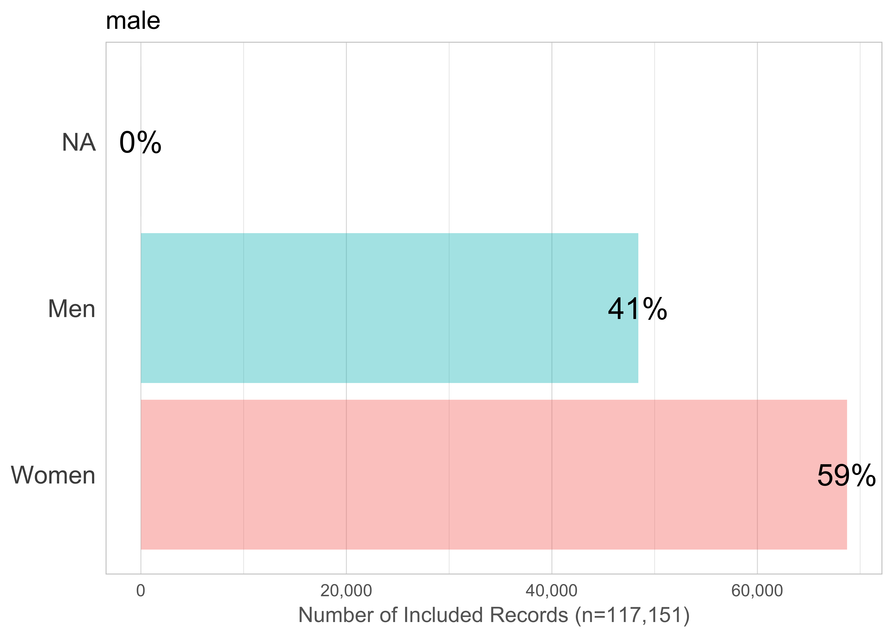

```r
# what is gender composition over time?
ds %>% count_over_time("year","male")
```

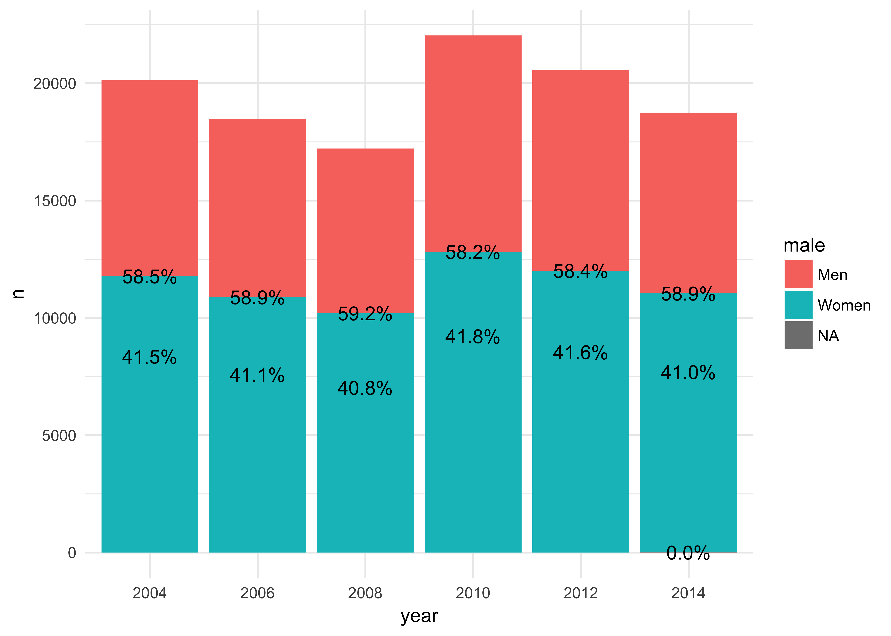

```r
ds %>% count_over_time("lb_wave","male")
```

```
Warning: Removed 3 rows containing missing values (position_stack).
```

```
Warning: Removed 3 rows containing missing values (geom_text).
```

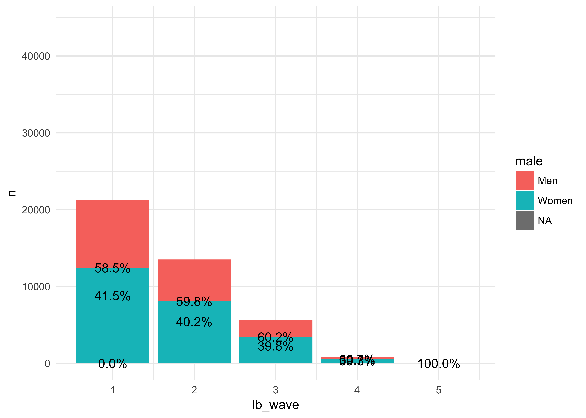

### race

```r
# what is the race compositon of the sample
ds %>% group_by(male) %>% summarize(n=n()) %>% neat("pandoc")
```


male         n
------  ------
Men      48415
Women    68729
NA           7

```r
ds %>% histogram_discrete("male")
```


```r
# what is race composition over time?
ds %>% count_over_time("year","race")
```

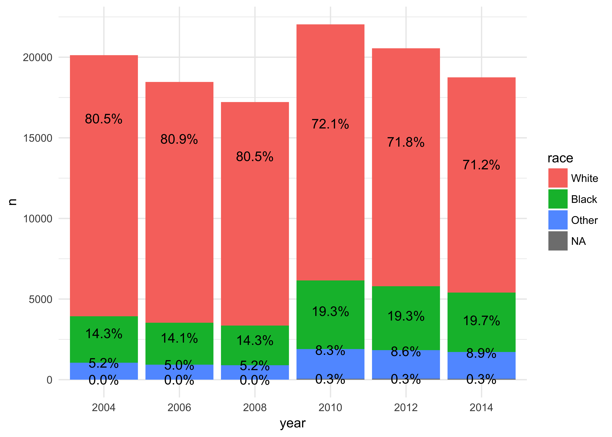

```r
ds %>% count_over_time("lb_wave","race")
```

```
Warning: Removed 4 rows containing missing values (position_stack).
```

```
Warning: Removed 4 rows containing missing values (geom_text).
```

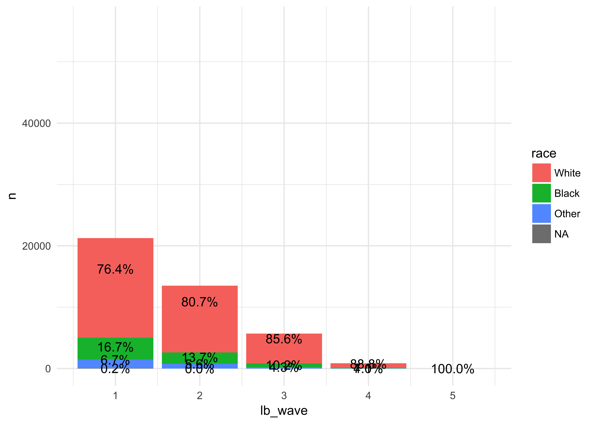

```r
# there may not be enough sample size if split by race
ds %>% 
  dplyr::filter(lb_wave == 4) %>% 
  group_by(race) %>% 
  distinct(id ) %>% count()
```

```
# A tibble: 3 x 2
    race     n
  <fctr> <int>
1  White   771
2  Black    62
3  Other    35
```

## Dynamic
### lb Wave

```r
# examine hrs time
ds %>% over_time("year", "hrs_tscore")
```

```
Measure : hrs_tscore
                   
                    2004  2006 2008 2010 2012 2014 <NA>
  0.75              .     .    .    .    1    .    .   
  0.833333333333485 .     .    .    .    .    4    .   
  0.916666666666515 .     .    .    .    6    .    .   
  0.916666666666742 .     .    .    .    1    12   .   
  1                 .     .    .    .    18   21   .   
  1.08333333333326  .     .    .    .    394  32   .   
  1.08333333333348  .     .    4    2    172  17   .   
  1.16666666666652  .     .    .    .    258  24   .   
  1.16666666666674  .     5    32   3    367  74   .   
  1.25              .     26   73   9    656  173  .   
  1.33333333333326  .     41   78   26   654  180  .   
  1.33333333333348  .     23   72   16   267  98   .   
  1.41666666666652  .     25   39   7    674  122  .   
  1.41666666666674  .     142  275  51   621  386  .   
  1.5               .     325  511  122  1725 781  .   
  1.58333333333326  .     392  407  123  1012 661  .   
  1.58333333333348  .     233  308  63   666  357  .   
  1.66666666666652  .     268  179  68   536  401  .   
  1.66666666666674  .     834  744  246  949  1206 .   
  1.75              .     1634 1414 414  1437 2261 .   
  1.83333333333326  .     1227 1070 304  906  1888 .   
  1.83333333333348  .     759  694  194  392  1029 .   
  1.91666666666652  .     690  493  160  500  832  .   
  1.91666666666674  .     1512 1629 592  791  2029 .   
  2                 .     2185 2174 991  1346 1921 .   
  2.08333333333326  .     1337 1495 902  1055 638  .   
  2.08333333333348  .     734  408  254  439  643  .   
  2.16666666666652  .     596  660  476  456  205  .   
  2.16666666666674  .     1081 884  574  863  583  .   
  2.25              .     1223 1121 1077 1014 544  .   
  2.33333333333326  .     628  591  931  415  223  .   
  2.33333333333348  .     341  155  322  144  152  .   
  2.41666666666652  .     220  197  470  123  65   .   
  2.41666666666674  .     425  248  833  235  165  .   
  2.5               .     383  285  1371 245  147  .   
  2.58333333333326  .     180  113  942  102  60   .   
  2.58333333333348  .     82   26   456  54   37   .   
  2.66666666666652  .     52   20   492  24   20   .   
  2.66666666666674  .     104  45   782  89   30   .   
  2.75              .     74   40   805  80   42   .   
  2.83333333333326  .     19   8    379  48   2    .   
  2.83333333333348  .     9    .    91   12   11   .   
  2.91666666666652  .     1    1    117  12   .    .   
  2.91666666666674  .     13   .    154  8    .    .   
  3                 .     .    .    122  10   .    .   
  3.08333333333326  .     .    .    56   5    .    .   
  3.08333333333348  .     .    .    6    .    .    .   
  3.16666666666652  .     .    .    19   1    .    .   
  3.16666666666674  .     .    .    7    .    .    .   
  3.25              .     .    .    2    .    .    .   
  <NA>              20129 646  724  7003 771  672  .   
```

```
  year mean    sd count
1 2006 2.00 0.267 17823
2 2008 1.96 0.268 16493
3 2010 2.32 0.344 15031
4 2012 1.78 0.374 19783
5 2014 1.86 0.261 18076
```

```r
# examine lb wave over time
ds %>% over_time("year", "lb_wave")
```

```
Measure : lb_wave
      
       2004  2006  2008  2010  2012  2014  <NA>
  1    3269  6337  5721  2587  2484  862   .   
  2    .     1390  1347  4663  3924  2189  .   
  3    .     .     1     1075  1001  3620  .   
  4    .     .     .     1     1     866   .   
  5    .     .     .     .     .     1     .   
  <NA> 16860 10742 10148 13708 13144 11210 .   
```

```
  year mean    sd count
1 2004 1.00 0.000  3269
2 2006 1.18 0.384  7727
3 2008 1.19 0.393  7069
4 2010 1.82 0.638  8326
5 2012 1.80 0.656  7410
6 2014 2.60 0.837  7538
```

```r
# examine lb wave time
psych::describe(ds_wide$lbtime_1)
```

```
   vars     n mean sd median trimmed mad min max range skew kurtosis se
X1    1 12604    0  0      0       0   0   0   0     0  NaN      NaN  0
```

```r
table(ds_wide$lbtime_1)
```

```

    0 
12604 
```

```r
psych::describe(ds_wide$lbtime_2)
```

```
   vars    n mean   sd median trimmed  mad  min max range skew kurtosis   se
X1    1 7616 3.99 0.92   4.08    4.05 0.37 1.33  10  8.67 0.83     7.57 0.01
```

```r
table(ds_wide$lbtime_2)
```

```

1.33333333333326 1.33333333333348 1.41666666666674              1.5 1.58333333333326 1.58333333333348 1.66666666666652 
               2                1                1                9               19               12               15 
1.66666666666674             1.75 1.83333333333326 1.83333333333348 1.91666666666652 1.91666666666674                2 
              50               75               59               39               38               62              103 
2.08333333333326 2.08333333333348 2.16666666666652 2.16666666666674             2.25 2.33333333333326 2.33333333333348 
              49               30               13               36               25               12                9 
2.41666666666652 2.41666666666674              2.5 2.58333333333326 2.58333333333348 2.66666666666652 2.66666666666674 
               6               13                4                2                2                1                2 
            2.75 2.83333333333326 2.83333333333348 2.91666666666674                3 3.08333333333326 3.08333333333348 
               1                2                3                4                9                9                2 
3.16666666666652 3.16666666666674             3.25 3.33333333333326 3.33333333333348 3.41666666666652 3.41666666666674 
               4               20               44               74               26               27               53 
             3.5 3.58333333333326 3.58333333333348 3.66666666666652 3.66666666666674             3.75 3.83333333333326 
              82               86               59               55              167              295              314 
3.83333333333348 3.91666666666652 3.91666666666674                4 4.08333333333326 4.08333333333348 4.16666666666652 
             133              253              383              800              526              241              314 
4.16666666666674             4.25 4.33333333333326 4.33333333333348 4.41666666666652 4.41666666666674              4.5 
             415              557              297              124              145              188              315 
4.58333333333326 4.58333333333348 4.66666666666652 4.66666666666674             4.75 4.83333333333326 4.83333333333348 
             185               84               72              146              113               49               12 
4.91666666666652 4.91666666666674                5 5.08333333333326 5.16666666666674             5.75 5.91666666666652 
              17               17               11                9                1                3                2 
               6 6.08333333333326 6.08333333333348 6.16666666666652 6.16666666666674             6.25 6.41666666666652 
               2                2                1                3                1                4                1 
6.41666666666674              6.5 6.58333333333326 6.58333333333348 6.66666666666674 6.83333333333348 7.33333333333348 
               2                2                2                3                3                1                1 
7.41666666666674              7.5 7.58333333333326 7.66666666666674             7.75 7.83333333333326 7.83333333333348 
               2                7                4                8                8                9                2 
7.91666666666652 7.91666666666674                8 8.08333333333326 8.08333333333348 8.16666666666652 8.16666666666674 
               8               13               20                8                8                3                7 
            8.25 8.33333333333326 8.33333333333348 8.41666666666652 8.41666666666674              8.5 8.58333333333326 
               9                7                6                1                3                7                1 
8.58333333333348 8.66666666666652 8.66666666666674             8.75 8.83333333333326 9.33333333333326 9.83333333333326 
               1                1                1                3                1                1                1 
              10 
               1 
```

```r
psych::describe(ds_wide$lbtime_3)
```

```
   vars    n mean   sd median trimmed  mad min   max range  skew kurtosis   se
X1    1 2861 7.67 0.78   7.92    7.78 0.25   4 10.58  6.58 -1.09     2.08 0.01
```

```r
table(ds_wide$lbtime_3)
```

```

               4 4.08333333333326 4.08333333333348              4.5 5.33333333333326              5.5 5.58333333333326 
               1                2                1                2                1                5                4 
5.58333333333348 5.66666666666652 5.66666666666674             5.75 5.83333333333326 5.83333333333348 5.91666666666652 
               3                4               22               22               30               11                8 
5.91666666666674                6 6.08333333333326 6.08333333333348 6.16666666666652 6.16666666666674             6.25 
              32               38               17               21               14               26               43 
6.33333333333326 6.33333333333348 6.41666666666652 6.41666666666674              6.5 6.58333333333326 6.58333333333348 
              29                7               14               25               47               24               17 
6.66666666666652 6.66666666666674             6.75 6.83333333333348 6.91666666666652             7.25 7.33333333333326 
               3                7                4                2                2                1                1 
7.33333333333348 7.41666666666652 7.41666666666674              7.5 7.58333333333326 7.58333333333348 7.66666666666652 
               6                2               27               56               50               29               37 
7.66666666666674             7.75 7.83333333333326 7.83333333333348 7.91666666666652 7.91666666666674                8 
              79              200              182              105              126              270              408 
8.08333333333326 8.08333333333348 8.16666666666652 8.16666666666674             8.25 8.33333333333326 8.33333333333348 
             226               95               71              120               85               35               16 
8.41666666666652 8.41666666666674              8.5 8.58333333333326 8.58333333333348 8.66666666666652 8.66666666666674 
              15               27               29               18                4                3                6 
            8.75 8.83333333333326 8.91666666666652                9 9.58333333333326 9.66666666666674             9.75 
               4                1                2                1                1                2                4 
9.83333333333326 9.83333333333348 9.91666666666652 9.91666666666674               10 10.0833333333333 10.0833333333335 
               2                3                2                3                3                2                3 
10.1666666666665 10.1666666666667            10.25 10.4166666666665 10.4166666666667 10.5833333333335 
               1                2                3                2                1                2 
```

```r
psych::describe(ds_wide$lbtime_4)
```

```
   vars   n mean  sd median trimmed  mad min   max range  skew kurtosis   se
X1    1 358 9.87 0.3   9.83    9.87 0.12 7.5 10.67  3.17 -3.24    23.59 0.02
```

```r
table(ds_wide$lbtime_4)
```

```

             7.5 7.83333333333326 7.91666666666674                8 9.41666666666652              9.5 9.58333333333326 
               1                1                1                1                1                4                5 
9.58333333333348 9.66666666666652 9.66666666666674             9.75 9.83333333333326 9.83333333333348 9.91666666666652 
               9                5               29               63               52               20               26 
9.91666666666674               10 10.0833333333333 10.0833333333335 10.1666666666665 10.1666666666667            10.25 
              40               38                2                6               12               10               11 
10.3333333333333 10.3333333333335 10.4166666666667 10.5833333333333 10.5833333333335 10.6666666666667 
               7                3                7                1                2                1 
```

### Mental Status

```r
# examine mental status over time
ds %>% over_time("year", "mentalstatus_tot")
```

```
Measure : mentalstatus_tot
      
       2004 2006 2008 2010 2012  2014 <NA>
  0    5    8    13   4    5     9    .   
  1    17   22   20   18   24    26   .   
  2    30   48   50   46   41    58   .   
  3    60   61   63   75   68    76   .   
  4    109  90   112  131  120   110  .   
  5    185  181  159  265  216   172  .   
  6    407  365  357  752  477   450  .   
  7    1192 962  1006 2238 1355  1283 .   
  8    3260 2755 2774 5902 3183  2989 .   
  9    7715 5937 5884 6507 4680  4439 .   
  NaN  7055 7952 6699 6003 10304 9056 .   
  <NA> 94   88   80   93   81    80   .   
```

```
  year mean    sd count
1 2004 8.31 1.124 12980
2 2006 8.24 1.225 10429
3 2008 8.23 1.245 10438
4 2010 8.04 1.145 15938
5 2012 8.04 1.272 10169
6 2014 8.03 1.316  9612
```

```r
ds %>% over_time("lb_wave", "mentalstatus_tot")
```

```
Measure : mentalstatus_tot
      
       1    2    3    4   5 <NA> 
  0    8    .    2    .   . 34   
  1    13   14   8    .   . 92   
  2    24   28   13   1   . 207  
  3    42   38   22   3   . 298  
  4    88   65   29   3   . 487  
  5    137  143  52   7   . 839  
  6    409  321  153  19  . 1906 
  7    1272 1023 487  73  . 5181 
  8    3722 2619 1316 196 . 13010
  9    7092 4116 2154 325 . 21475
  NaN  8375 5110 1443 240 1 31900
  <NA> 78   36   18   1   . 383  
```

```
  lb_wave mean    sd count
1       1 8.29 1.068 12807
2       2 8.16 1.157  8367
3       3 8.20 1.146  4236
4       4 8.26 1.023   627
```

```r
set.seed(42)
# ids_1000 <- sample(unique(ds$id), 

d <- ds %>% 
  mutate(
    age_at_visit  = intage_r,
    date_at_visit = interview_date
  ) %>% 
  select(
    id, year,  lb_wave, age_at_visit, date_at_visit, mentalstatus_tot
  ) %>% 
  filter(id %in% sample(unique(id),200)) 

# assemble various single graphs in a integrated information display
d %>% complex_line(
  variable_name  = "mentalstatus_tot", 
  line_size = 1, 
  line_alpha = .5 
)
```

```
Warning in simpleLoess(y, x, w, span, degree = degree, parametric = parametric, : pseudoinverse used at 0.985
```

```
Warning in simpleLoess(y, x, w, span, degree = degree, parametric = parametric, : neighborhood radius 1.015
```

```
Warning in simpleLoess(y, x, w, span, degree = degree, parametric = parametric, : reciprocal condition number 0
```

```
Warning in simpleLoess(y, x, w, span, degree = degree, parametric = parametric, : There are other near singularities as
well. 1
```

```
Warning in predLoess(object$y, object$x, newx = if (is.null(newdata)) object$x else if (is.data.frame(newdata))
as.matrix(model.frame(delete.response(terms(object)), : pseudoinverse used at 0.985
```

```
Warning in predLoess(object$y, object$x, newx = if (is.null(newdata)) object$x else if (is.data.frame(newdata))
as.matrix(model.frame(delete.response(terms(object)), : neighborhood radius 1.015
```

```
Warning in predLoess(object$y, object$x, newx = if (is.null(newdata)) object$x else if (is.data.frame(newdata))
as.matrix(model.frame(delete.response(terms(object)), : reciprocal condition number 0
```

```
Warning in predLoess(object$y, object$x, newx = if (is.null(newdata)) object$x else if (is.data.frame(newdata))
as.matrix(model.frame(delete.response(terms(object)), : There are other near singularities as well. 1
```

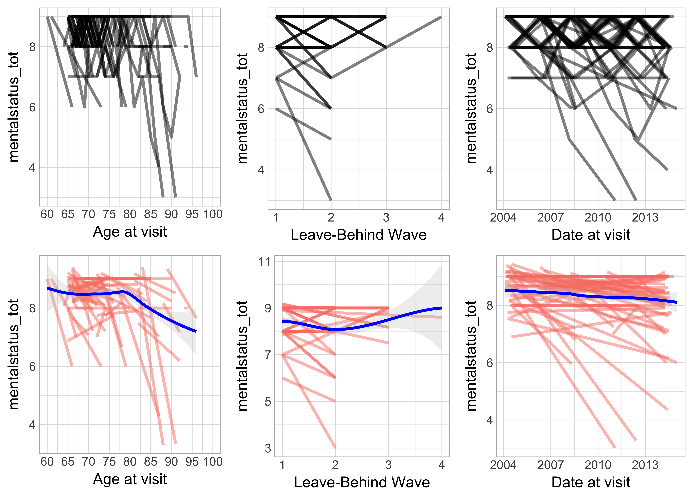

### Word List Recall 

```r
# examine the assignment of word lists over time
ds %>% over_time("year", "listassi")
```

```
Measure : listassi
      
       2004 2006 2008 2010 2012 2014 <NA>
  1    4642 5869 4055 4612 3844 6006 .   
  11   4614 5255 4071 4621 4868 4961 .   
  21   4533 3955 4051 4617 5743 3911 .   
  31   4502 3390 3900 6701 4951 2820 .   
  NaN  1838 .    1140 1483 1148 1050 .   
  <NA> .    .    .    .    .    .    .   
```

```
  year  mean     sd count
1 2004 15.86 11.179 18291
2 2006 13.63 10.940 18469
3 2008 15.85 11.133 16077
4 2010 17.52 11.523 20551
5 2012 17.08 10.699 19406
6 2014 13.00 10.759 17698
```

```r
ds %>% over_time("lb_wave", "listassi")
```

```
Measure : listassi
      
       1    2    3    4   5 <NA> 
  1    5386 3303 1638 299 1 18401
  11   5385 3273 1484 272 . 17976
  21   4957 3187 1264 155 . 17247
  31   4996 3431 1183 128 . 16526
  NaN  536  319  128  14  . 5662 
  <NA> .    .    .    .   . .    
```

```
  lb_wave  mean     sd count
1       1 15.61 11.183 20724
2       2 16.11 11.273 13194
3       3 14.58 11.149  5569
4       4 12.31 10.561   854
5       5  1.00     NA     1
```

```r
set.seed(42)
# ids_1000 <- sample(unique(ds$id), 

d <- ds %>% 
  mutate(
    age_at_visit  = intage_r,
    date_at_visit = interview_date
  ) %>% 
  select(
    id, year,  lb_wave, age_at_visit, date_at_visit, wrectoti, wrectotd, listassi
  ) %>% 
  filter(id %in% sample(unique(id),100)) 

# A single, elemental graph
d %>% elemental_line(
  variable_name  = "wrectoti", 
  time_metric    = "age_at_visit", 
  color_name     = "black", 
  line_alpha     = .5, 
  line_size      = 1,
  smoothed       = T
)
```

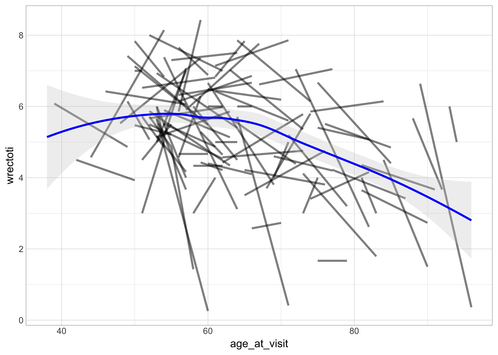

```r
# assemble various single graphs in a integrated information display
d %>% complex_line(
  variable_name  = "wrectoti", 
  line_size = 1, 
  line_alpha = .5 
)
```

```
Warning in simpleLoess(y, x, w, span, degree = degree, parametric = parametric, : pseudoinverse used at 0.985
```

```
Warning in simpleLoess(y, x, w, span, degree = degree, parametric = parametric, : neighborhood radius 1.015
```

```
Warning in simpleLoess(y, x, w, span, degree = degree, parametric = parametric, : reciprocal condition number 0
```

```
Warning in simpleLoess(y, x, w, span, degree = degree, parametric = parametric, : There are other near singularities as
well. 1
```

```
Warning in predLoess(object$y, object$x, newx = if (is.null(newdata)) object$x else if (is.data.frame(newdata))
as.matrix(model.frame(delete.response(terms(object)), : pseudoinverse used at 0.985
```

```
Warning in predLoess(object$y, object$x, newx = if (is.null(newdata)) object$x else if (is.data.frame(newdata))
as.matrix(model.frame(delete.response(terms(object)), : neighborhood radius 1.015
```

```
Warning in predLoess(object$y, object$x, newx = if (is.null(newdata)) object$x else if (is.data.frame(newdata))
as.matrix(model.frame(delete.response(terms(object)), : reciprocal condition number 0
```

```
Warning in predLoess(object$y, object$x, newx = if (is.null(newdata)) object$x else if (is.data.frame(newdata))
as.matrix(model.frame(delete.response(terms(object)), : There are other near singularities as well. 1
```

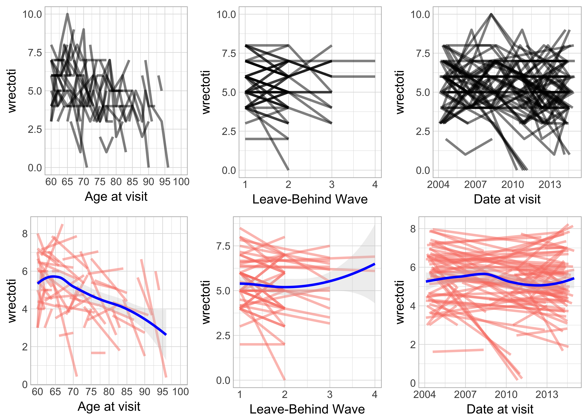

```r
# assemble various single graphs in a integrated information display
d %>% complex_line(
  variable_name  = "wrectotd", 
  line_size = 1, 
  line_alpha = .5 
)
```

```
Warning in simpleLoess(y, x, w, span, degree = degree, parametric = parametric, : pseudoinverse used at 0.985
```

```
Warning in simpleLoess(y, x, w, span, degree = degree, parametric = parametric, : neighborhood radius 1.015
```

```
Warning in simpleLoess(y, x, w, span, degree = degree, parametric = parametric, : reciprocal condition number 0
```

```
Warning in simpleLoess(y, x, w, span, degree = degree, parametric = parametric, : There are other near singularities as
well. 1
```

```
Warning in predLoess(object$y, object$x, newx = if (is.null(newdata)) object$x else if (is.data.frame(newdata))
as.matrix(model.frame(delete.response(terms(object)), : pseudoinverse used at 0.985
```

```
Warning in predLoess(object$y, object$x, newx = if (is.null(newdata)) object$x else if (is.data.frame(newdata))
as.matrix(model.frame(delete.response(terms(object)), : neighborhood radius 1.015
```

```
Warning in predLoess(object$y, object$x, newx = if (is.null(newdata)) object$x else if (is.data.frame(newdata))
as.matrix(model.frame(delete.response(terms(object)), : reciprocal condition number 0
```

```
Warning in predLoess(object$y, object$x, newx = if (is.null(newdata)) object$x else if (is.data.frame(newdata))
as.matrix(model.frame(delete.response(terms(object)), : There are other near singularities as well. 1
```

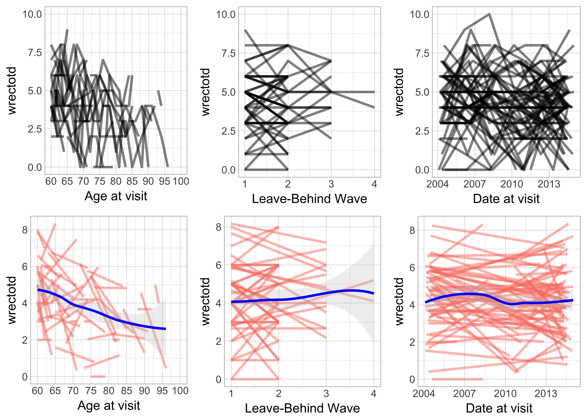

### Social Support


### Social Strain

```r
ds %>% summarize_over_time("year", "social_strain_mean")
```

```
  year mean    sd count
1 2006 5.35 1.658  7655
2 2008 5.24 1.671  6999
3 2010 5.29 1.652  8276
4 2012 5.24 1.699  7351
5 2014 5.20 1.670  7490
```

```r
ds %>% summarize_over_time("lb_wave", "social_strain_mean")
```

```
  lb_wave mean    sd count
1       1 5.38 1.697 17815
2       2 5.21 1.659 13422
3       3 5.06 1.603  5668
4       4 5.01 1.535   865
5       5 3.31    NA     1
```

```r
set.seed(42)
# ids_1000 <- sample(unique(ds$id), 

d <- ds %>% 
  mutate(
    age_at_visit  = intage_r,
    date_at_visit = interview_date
  ) %>% 
  select(
    id, year,  lb_wave, age_at_visit, date_at_visit, social_strain_mean
  ) %>% 
  filter(id %in% sample(unique(id),100)) 

# A single, elemental graph
d %>% elemental_line(
  variable_name  = "social_strain_mean", 
  time_metric    = "age_at_visit", 
  color_name     = "black", 
  line_alpha     = .5, 
  line_size      = 1,
  smoothed       = T
)
```

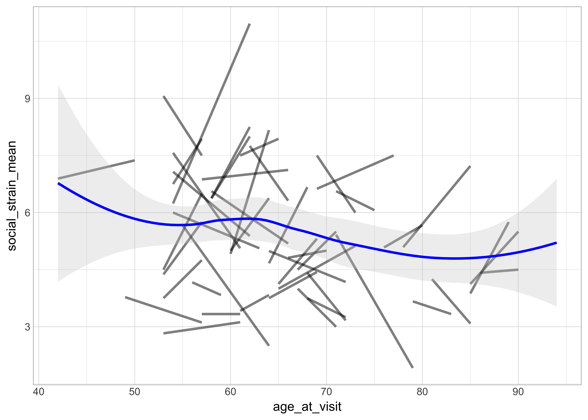

```r
# assemble various sinle graphs in a integrated information display
d %>% complex_line(
  variable_name  = "social_strain_mean", 
  line_size = 1, 
  line_alpha = .5 
)
```

```
Warning in simpleLoess(y, x, w, span, degree = degree, parametric = parametric, : pseudoinverse used at 0.985
```

```
Warning in simpleLoess(y, x, w, span, degree = degree, parametric = parametric, : neighborhood radius 1.015
```

```
Warning in simpleLoess(y, x, w, span, degree = degree, parametric = parametric, : reciprocal condition number 0
```

```
Warning in simpleLoess(y, x, w, span, degree = degree, parametric = parametric, : There are other near singularities as
well. 1
```

```
Warning in predLoess(object$y, object$x, newx = if (is.null(newdata)) object$x else if (is.data.frame(newdata))
as.matrix(model.frame(delete.response(terms(object)), : pseudoinverse used at 0.985
```

```
Warning in predLoess(object$y, object$x, newx = if (is.null(newdata)) object$x else if (is.data.frame(newdata))
as.matrix(model.frame(delete.response(terms(object)), : neighborhood radius 1.015
```

```
Warning in predLoess(object$y, object$x, newx = if (is.null(newdata)) object$x else if (is.data.frame(newdata))
as.matrix(model.frame(delete.response(terms(object)), : reciprocal condition number 0
```

```
Warning in predLoess(object$y, object$x, newx = if (is.null(newdata)) object$x else if (is.data.frame(newdata))
as.matrix(model.frame(delete.response(terms(object)), : There are other near singularities as well. 1
```

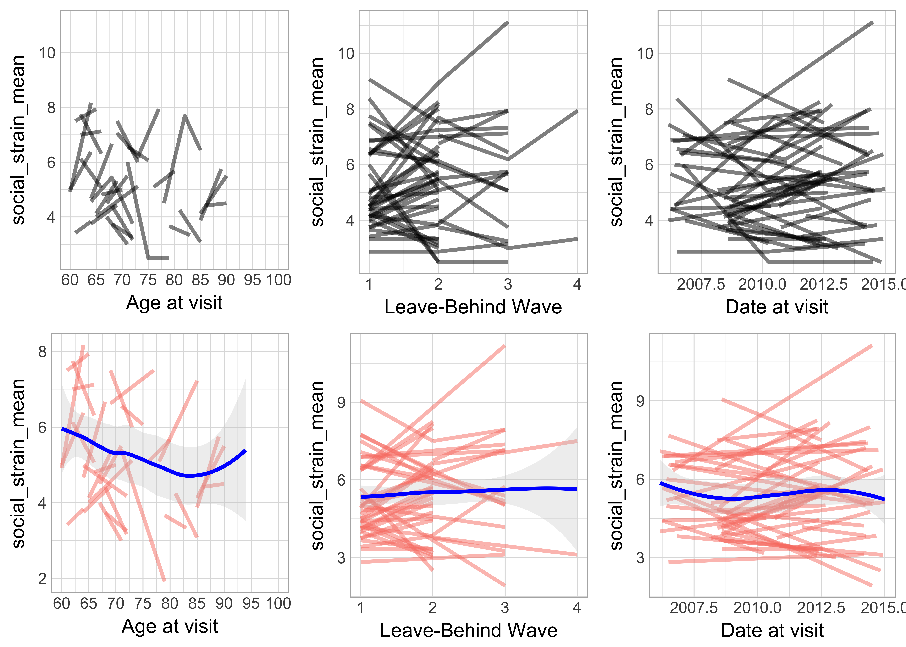

### Loneliness Three Item Short

```r
ds %>% summarize_over_time("year", "score_loneliness_3")
```

```
  year mean    sd count
1 2004 1.44 0.529  3220
2 2006 1.49 0.548  7622
3 2008 1.49 0.545  6957
4 2010 1.48 0.544  8213
5 2012 1.49 0.548  7318
6 2014 1.48 0.546  7452
```

```r
ds %>% summarize_over_time("lb_wave", "score_loneliness_3")
```

```
  lb_wave mean    sd count
1       1 1.50 0.553 20950
2       2 1.48 0.542 13342
3       3 1.45 0.524  5628
4       4 1.43 0.514   861
5       5 1.00    NA     1
```

```r
set.seed(42)
# ids_1000 <- sample(unique(ds$id), 

d <- ds %>% 
  mutate(
    age_at_visit  = intage_r,
    date_at_visit = interview_date
  ) %>% 
  select(
    id, year,  lb_wave, age_at_visit, date_at_visit, score_loneliness_3
  ) %>% 
  filter(id %in% sample(unique(id),100)) 

# A single, elemental graph
d %>% elemental_line(
  variable_name  = "score_loneliness_3", 
  time_metric    = "age_at_visit", 
  color_name     = "black", 
  line_alpha     = .5, 
  line_size      = 1,
  smoothed       = T
)
```

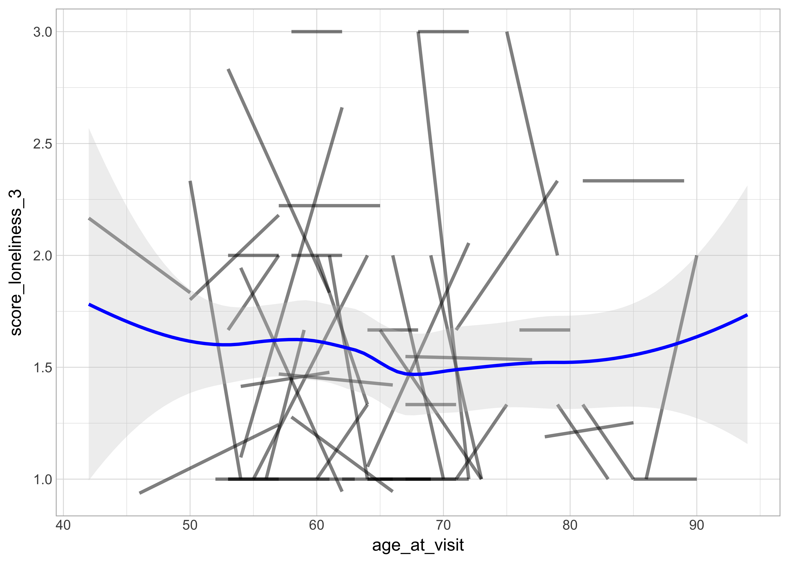

```r
# assemble various sinle graphs in a integrated information display
d %>% complex_line(
  variable_name  = "score_loneliness_3", 
  line_size = 1, 
  line_alpha = .5 
)
```

```
Warning in simpleLoess(y, x, w, span, degree = degree, parametric = parametric, : pseudoinverse used at 0.985
```

```
Warning in simpleLoess(y, x, w, span, degree = degree, parametric = parametric, : neighborhood radius 1.015
```

```
Warning in simpleLoess(y, x, w, span, degree = degree, parametric = parametric, : reciprocal condition number 0
```

```
Warning in simpleLoess(y, x, w, span, degree = degree, parametric = parametric, : There are other near singularities as
well. 1
```

```
Warning in predLoess(object$y, object$x, newx = if (is.null(newdata)) object$x else if (is.data.frame(newdata))
as.matrix(model.frame(delete.response(terms(object)), : pseudoinverse used at 0.985
```

```
Warning in predLoess(object$y, object$x, newx = if (is.null(newdata)) object$x else if (is.data.frame(newdata))
as.matrix(model.frame(delete.response(terms(object)), : neighborhood radius 1.015
```

```
Warning in predLoess(object$y, object$x, newx = if (is.null(newdata)) object$x else if (is.data.frame(newdata))
as.matrix(model.frame(delete.response(terms(object)), : reciprocal condition number 0
```

```
Warning in predLoess(object$y, object$x, newx = if (is.null(newdata)) object$x else if (is.data.frame(newdata))
as.matrix(model.frame(delete.response(terms(object)), : There are other near singularities as well. 1
```

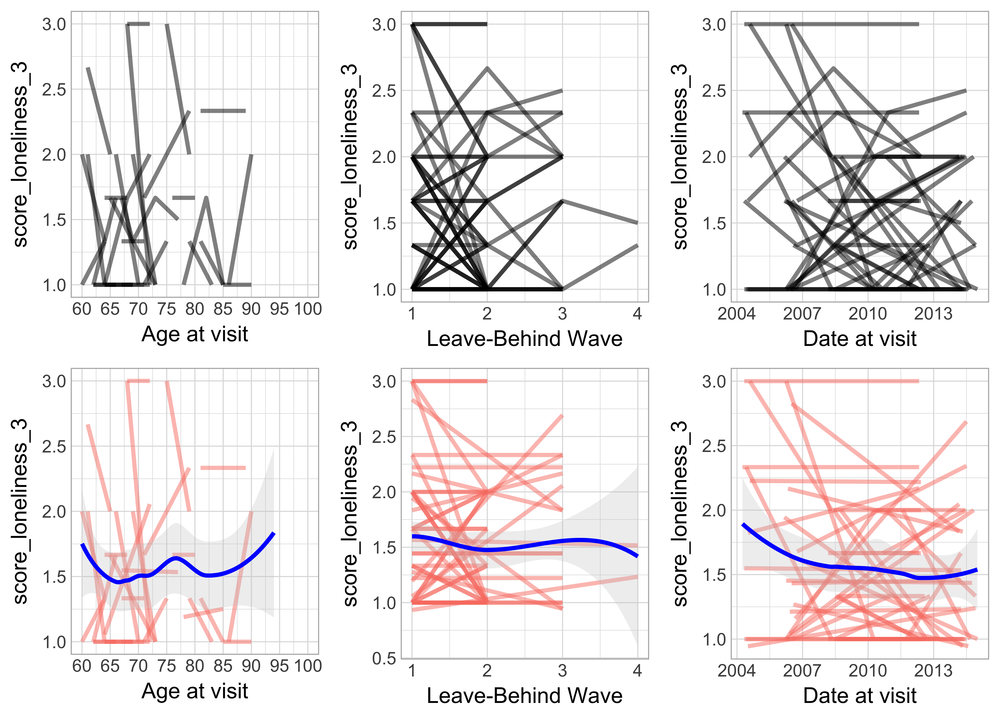

### Loneliness Full Scale

```r
# examine the assignment of word lists over time
ds %>% summarize_over_time("year", "score_loneliness_11")
```

```
  year mean    sd count
1 2008 1.52 0.430  6942
2 2010 1.53 0.437  8205
3 2012 1.53 0.437  7309
4 2014 1.54 0.443  7451
```

```r
ds %>% summarize_over_time("lb_wave", "score_loneliness_11")
```

```
  lb_wave mean    sd count
1       1 1.55 0.448 11463
2       2 1.52 0.431 11960
3       3 1.51 0.427  5624
4       4 1.50 0.429   859
5       5 1.55    NA     1
```

```r
set.seed(42)
# ids_1000 <- sample(unique(ds$id), 

d <- ds %>% 
  mutate(
    age_at_visit  = intage_r,
    date_at_visit = interview_date
  ) %>% 
  select(
    id, year,  lb_wave, age_at_visit, date_at_visit, score_loneliness_11
  ) %>% 
  filter(id %in% sample(unique(id),100)) 

# assemble various sinle graphs in a integrated information display
d %>% complex_line(
  variable_name  = "score_loneliness_11", 
  line_size = 1, 
  line_alpha = .5 
)
```

```
Warning in simpleLoess(y, x, w, span, degree = degree, parametric = parametric, : pseudoinverse used at 0.985
```

```
Warning in simpleLoess(y, x, w, span, degree = degree, parametric = parametric, : neighborhood radius 1.015
```

```
Warning in simpleLoess(y, x, w, span, degree = degree, parametric = parametric, : reciprocal condition number 0
```

```
Warning in simpleLoess(y, x, w, span, degree = degree, parametric = parametric, : There are other near singularities as
well. 1
```

```
Warning in predLoess(object$y, object$x, newx = if (is.null(newdata)) object$x else if (is.data.frame(newdata))
as.matrix(model.frame(delete.response(terms(object)), : pseudoinverse used at 0.985
```

```
Warning in predLoess(object$y, object$x, newx = if (is.null(newdata)) object$x else if (is.data.frame(newdata))
as.matrix(model.frame(delete.response(terms(object)), : neighborhood radius 1.015
```

```
Warning in predLoess(object$y, object$x, newx = if (is.null(newdata)) object$x else if (is.data.frame(newdata))
as.matrix(model.frame(delete.response(terms(object)), : reciprocal condition number 0
```

```
Warning in predLoess(object$y, object$x, newx = if (is.null(newdata)) object$x else if (is.data.frame(newdata))
as.matrix(model.frame(delete.response(terms(object)), : There are other near singularities as well. 1
```

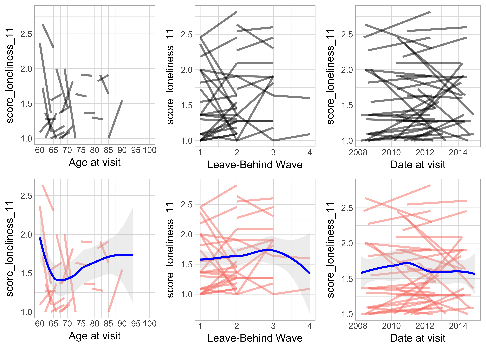

### Social Network 

```r
ds %>% summarize_over_time("year", "socialnetwork_total")
```

```
  year mean    sd count
1 2004 3.38 0.811  3231
2 2006 3.40 0.754  7713
3 2008 3.32 0.800  7058
4 2010 3.33 0.784  8293
5 2012 3.18 0.859  7359
6 2014 3.14 0.882  7488
```

```r
ds %>% summarize_over_time("lb_wave", "socialnetwork_total")
```

```
  lb_wave mean    sd count
1       1 3.31 0.814 21152
2       2 3.27 0.817 13459
3       3 3.21 0.851  5664
4       4 3.22 0.827   866
5       5 4.00    NA     1
```

```r
set.seed(42)
# ids_1000 <- sample(unique(ds$id), 

d <- ds %>% 
  mutate(
    age_at_visit  = intage_r,
    date_at_visit = interview_date
  ) %>% 
  select(
    id, year,  lb_wave, age_at_visit, date_at_visit, socialnetwork_total
  ) %>% 
  filter(id %in% sample(unique(id),100)) 

# assemble various sinle graphs in a integrated information display
d %>% complex_line(
  variable_name  = "socialnetwork_total", 
  line_size = 1, 
  line_alpha = .5 
)
```

```
Warning in simpleLoess(y, x, w, span, degree = degree, parametric = parametric, : pseudoinverse used at 0.985
```

```
Warning in simpleLoess(y, x, w, span, degree = degree, parametric = parametric, : neighborhood radius 1.015
```

```
Warning in simpleLoess(y, x, w, span, degree = degree, parametric = parametric, : reciprocal condition number 7.8661e-31
```

```
Warning in simpleLoess(y, x, w, span, degree = degree, parametric = parametric, : There are other near singularities as
well. 1
```

```
Warning in predLoess(object$y, object$x, newx = if (is.null(newdata)) object$x else if (is.data.frame(newdata))
as.matrix(model.frame(delete.response(terms(object)), : pseudoinverse used at 0.985
```

```
Warning in predLoess(object$y, object$x, newx = if (is.null(newdata)) object$x else if (is.data.frame(newdata))
as.matrix(model.frame(delete.response(terms(object)), : neighborhood radius 1.015
```

```
Warning in predLoess(object$y, object$x, newx = if (is.null(newdata)) object$x else if (is.data.frame(newdata))
as.matrix(model.frame(delete.response(terms(object)), : reciprocal condition number 7.8661e-31
```

```
Warning in predLoess(object$y, object$x, newx = if (is.null(newdata)) object$x else if (is.data.frame(newdata))
as.matrix(model.frame(delete.response(terms(object)), : There are other near singularities as well. 1
```

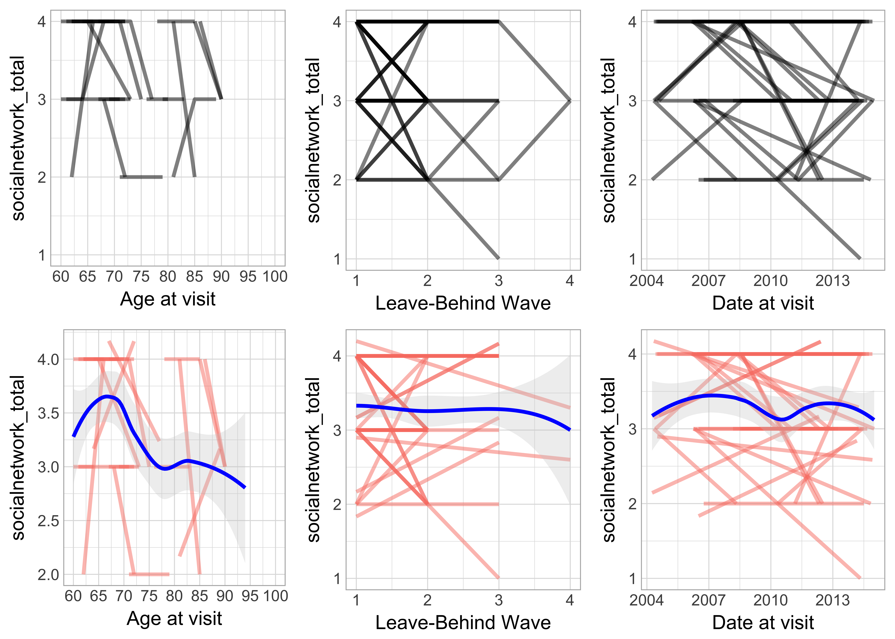

### Close Social Network

```r
# examine the assignment of word lists over time
ds %>% summarize_over_time("year", "close_social_network")
```

```
  year mean    sd count
1 2004 1.62 4.574 20129
2 2006 3.74 5.960 18469
3 2008 3.70 5.967 17217
4 2010 3.33 5.663 22034
5 2012 3.17 5.569 20554
6 2014 3.48 5.701 18748
```

```r
ds %>% summarize_over_time("lb_wave", "close_social_network")
```

```
  lb_wave mean    sd count
1       1 8.98 6.174 21260
2       2 8.88 6.207 13513
3       3 8.89 6.034  5697
4       4 8.85 6.071   868
5       5 5.00    NA     1
```

```r
set.seed(42)
# ids_1000 <- sample(unique(ds$id), 

d <- ds %>% 
  mutate(
    age_at_visit  = intage_r,
    date_at_visit = interview_date
  ) %>% 
  select(
    id, year,  lb_wave, age_at_visit, date_at_visit, close_social_network
  ) %>% 
  filter(id %in% sample(unique(id),100)) 

# assemble various single graphs in a integrated information display
d %>% complex_line(
  variable_name  = "close_social_network", 
  line_size = 1, 
  line_alpha = .5 
)
```

```
Warning in simpleLoess(y, x, w, span, degree = degree, parametric = parametric, : pseudoinverse used at 0.985
```

```
Warning in simpleLoess(y, x, w, span, degree = degree, parametric = parametric, : neighborhood radius 1.015
```

```
Warning in simpleLoess(y, x, w, span, degree = degree, parametric = parametric, : reciprocal condition number 0
```

```
Warning in simpleLoess(y, x, w, span, degree = degree, parametric = parametric, : There are other near singularities as
well. 1
```

```
Warning in predLoess(object$y, object$x, newx = if (is.null(newdata)) object$x else if (is.data.frame(newdata))
as.matrix(model.frame(delete.response(terms(object)), : pseudoinverse used at 0.985
```

```
Warning in predLoess(object$y, object$x, newx = if (is.null(newdata)) object$x else if (is.data.frame(newdata))
as.matrix(model.frame(delete.response(terms(object)), : neighborhood radius 1.015
```

```
Warning in predLoess(object$y, object$x, newx = if (is.null(newdata)) object$x else if (is.data.frame(newdata))
as.matrix(model.frame(delete.response(terms(object)), : reciprocal condition number 0
```

```
Warning in predLoess(object$y, object$x, newx = if (is.null(newdata)) object$x else if (is.data.frame(newdata))
as.matrix(model.frame(delete.response(terms(object)), : There are other near singularities as well. 1
```

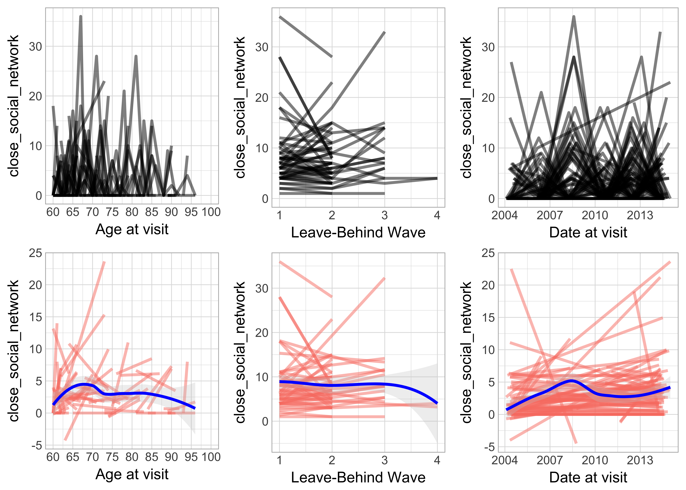

### Social Contact

```r
# examine the assignment of word lists over time
ds %>% summarize_over_time("year", "social_contact_total")
```

```
  year  mean    sd count
1 2004 29.85 9.152  3237
2 2006 29.18 8.645  7690
3 2008 29.48 9.040  7032
4 2010 29.80 9.121  8294
5 2012 29.72 9.484  7375
6 2014 29.20 9.216  7491
```

```r
ds %>% summarize_over_time("lb_wave", "social_contact_total")
```

```
  lb_wave  mean    sd count
1       1 29.43 9.187 21127
2       2 29.65 9.078 13451
3       3 29.45 8.937  5674
4       4 29.65 8.824   866
5       5 36.00    NA     1
```

```r
set.seed(42)
# ids_1000 <- sample(unique(ds$id), 

d <- ds %>% 
  mutate(
    age_at_visit  = intage_r,
    date_at_visit = interview_date
  ) %>% 
  select(
    id, year,  lb_wave, age_at_visit, date_at_visit, social_contact_total
  ) %>% 
  filter(id %in% sample(unique(id),100)) 

# assemble various single graphs in a integrated information display
d %>% complex_line(
  variable_name  = "social_contact_total", 
  line_size = 1, 
  line_alpha = .5 
)
```

```
Warning in simpleLoess(y, x, w, span, degree = degree, parametric = parametric, : pseudoinverse used at 0.985
```

```
Warning in simpleLoess(y, x, w, span, degree = degree, parametric = parametric, : neighborhood radius 1.015
```

```
Warning in simpleLoess(y, x, w, span, degree = degree, parametric = parametric, : reciprocal condition number 0
```

```
Warning in simpleLoess(y, x, w, span, degree = degree, parametric = parametric, : There are other near singularities as
well. 1
```

```
Warning in predLoess(object$y, object$x, newx = if (is.null(newdata)) object$x else if (is.data.frame(newdata))
as.matrix(model.frame(delete.response(terms(object)), : pseudoinverse used at 0.985
```

```
Warning in predLoess(object$y, object$x, newx = if (is.null(newdata)) object$x else if (is.data.frame(newdata))
as.matrix(model.frame(delete.response(terms(object)), : neighborhood radius 1.015
```

```
Warning in predLoess(object$y, object$x, newx = if (is.null(newdata)) object$x else if (is.data.frame(newdata))
as.matrix(model.frame(delete.response(terms(object)), : reciprocal condition number 0
```

```
Warning in predLoess(object$y, object$x, newx = if (is.null(newdata)) object$x else if (is.data.frame(newdata))
as.matrix(model.frame(delete.response(terms(object)), : There are other near singularities as well. 1
```

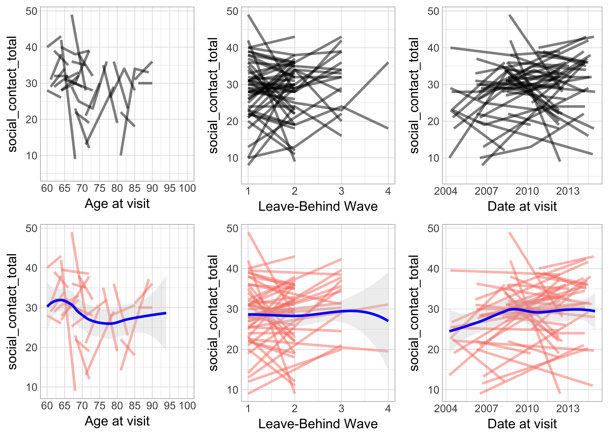

### Activity

```r
# examine the assignment of activity over time
ds %>% summarize_over_time("year", "activity_sum")
```

```
  year  mean     sd count
1 2010 53.43 12.245  7341
2 2012 53.54 12.265  6064
3 2014 53.11 12.323  6511
```

```r
ds %>% summarize_over_time("lb_wave", "activity_sum")
```

```
  lb_wave  mean     sd count
1       1 53.78 12.662  4976
2       2 53.18 12.121  9230
3       3 53.14 12.115  4942
4       4 54.23 12.572   767
5       5 51.00     NA     1
```

```r
set.seed(42)
# ids_1000 <- sample(unique(ds$id), 

d <- ds %>% 
  mutate(
    age_at_visit  = intage_r,
    date_at_visit = interview_date
  ) %>% 
  select(
    id, year,  lb_wave, age_at_visit, date_at_visit, activity_sum
  ) %>% 
  filter(id %in% sample(unique(id),100)) 

# assemble various single graphs in a integrated information display
d %>% complex_line(
  variable_name  = "activity_sum", 
  line_size = 1, 
  line_alpha = .5 
)
```

```
Warning in simpleLoess(y, x, w, span, degree = degree, parametric = parametric, : pseudoinverse used at 0.985
```

```
Warning in simpleLoess(y, x, w, span, degree = degree, parametric = parametric, : neighborhood radius 1.015
```

```
Warning in simpleLoess(y, x, w, span, degree = degree, parametric = parametric, : reciprocal condition number 0
```

```
Warning in simpleLoess(y, x, w, span, degree = degree, parametric = parametric, : There are other near singularities as
well. 1
```

```
Warning in predLoess(object$y, object$x, newx = if (is.null(newdata)) object$x else if (is.data.frame(newdata))
as.matrix(model.frame(delete.response(terms(object)), : pseudoinverse used at 0.985
```

```
Warning in predLoess(object$y, object$x, newx = if (is.null(newdata)) object$x else if (is.data.frame(newdata))
as.matrix(model.frame(delete.response(terms(object)), : neighborhood radius 1.015
```

```
Warning in predLoess(object$y, object$x, newx = if (is.null(newdata)) object$x else if (is.data.frame(newdata))
as.matrix(model.frame(delete.response(terms(object)), : reciprocal condition number 0
```

```
Warning in predLoess(object$y, object$x, newx = if (is.null(newdata)) object$x else if (is.data.frame(newdata))
as.matrix(model.frame(delete.response(terms(object)), : There are other near singularities as well. 1
```

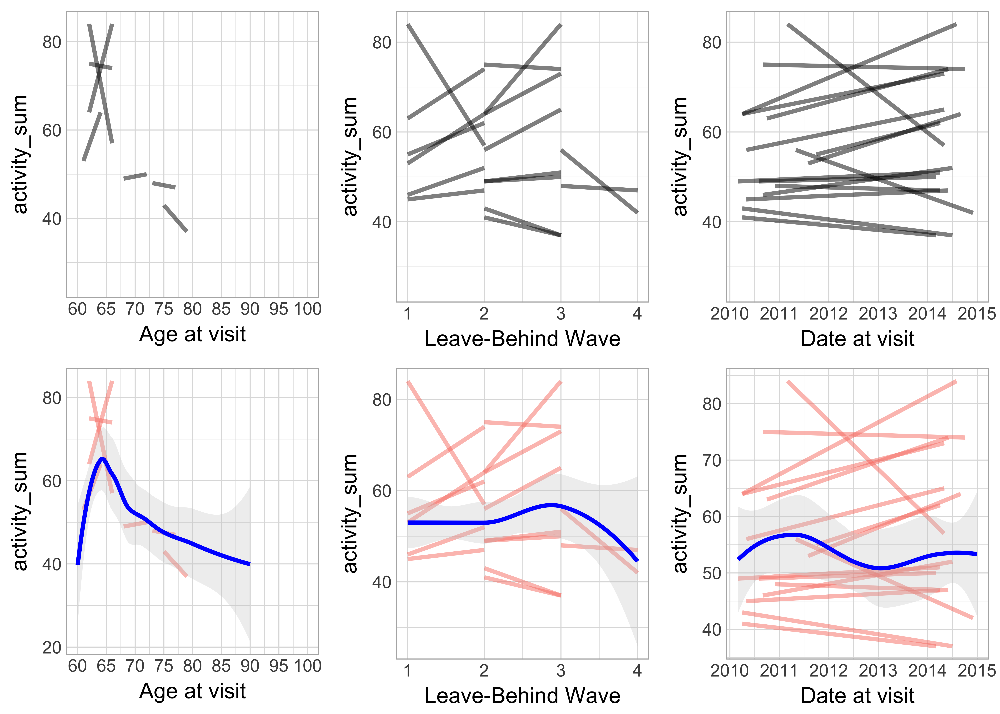

### srmemory

```r
ds %>% over_time("year","srmemory")
```

```
Measure : srmemory
      
       2004 2006 2008 2010 2012 2014 <NA>
  1    960  912  855  961  972  900  .   
  2    4381 4131 3791 4678 4734 4652 .   
  3    7525 7178 6871 8503 8002 7510 .   
  4    4231 3974 3714 5088 4588 3848 .   
  5    1170 991  832  1401 1093 771  .   
  NaN  1838 1262 1140 1385 1147 1050 .   
  <NA> 24   21   14   18   18   17   .   
```

```
  year mean    sd count
1 2004 3.01 0.968 18267
2 2006 3.00 0.956 17186
3 2008 2.99 0.942 16063
4 2010 3.06 0.963 20631
5 2012 3.00 0.952 19389
6 2014 2.94 0.925 17681
```

```r
ds %>% over_time("lb_wave", "srmemory")
```

```
Measure : srmemory
      
       1    2    3    4   5 <NA> 
  1    1004 643  311  41  . 3561 
  2    4722 3361 1481 228 . 16575
  3    8547 5736 2497 390 . 28419
  4    4995 2890 1113 181 1 16263
  5    1348 560  167  14  . 4169 
  NaN  631  312  122  14  . 6743 
  <NA> 13   11   6    .   . 82   
```

```
  lb_wave mean    sd count
1       1 3.05 0.962 20616
2       2 2.95 0.915 13190
3       3 2.88 0.892  5569
4       4 2.88 0.851   854
5       5 4.00    NA     1
```

# Recapitulation
