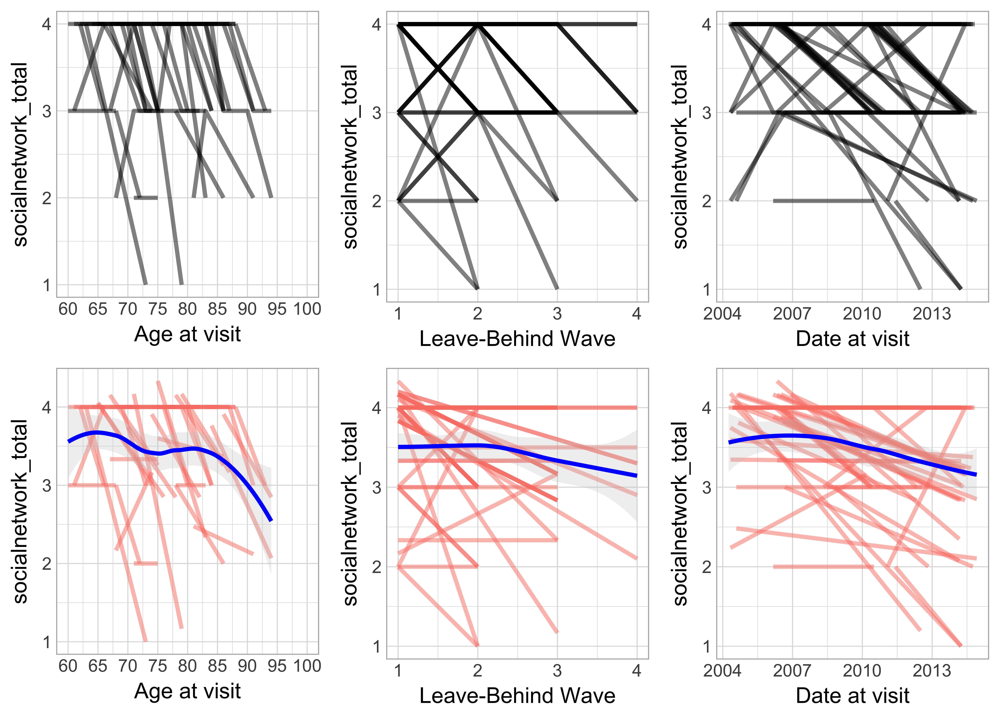

# Review of relevant variables for the sample of caregivers
Date: `r Sys.Date()`  

<!-- These two chunks should be added in the beginning of every .Rmd that you want to source an .R script -->
<!--  The 1st mandatory chunck  -->
<!--  Set the working directory to the repository's base directory -->


<!--  The 2nd mandatory chunck  -->
<!-- Set the report-wide options, and point to the external code file. -->


<!-- Load 'sourced' R files.  Suppress the output when loading packages. --> 

```r
# Attach these packages so their functions don't need to be qualified: http://r-pkgs.had.co.nz/namespace.html#search-path
library(magrittr) # enables piping : %>% 
library(dplyr)
library(TabularManifest)
```


<!-- Load the sources.  Suppress the output when loading sources. --> 

```r
# Call `base::source()` on any repo file that defines functions needed below.  Ideally, no real operations are performed.
source("./scripts/common-functions.R") # used in multiple reports
source("./scripts/graphing/graph-presets.R") # fonts, colors, themes 
source("./scripts/graphing/graph-elemental.R") # graphs to be used in dipslays
source("./scripts/graphing/graph-complex.R") # info displays

# Verify these packages are available on the machine, but their functions need to be qualified: http://r-pkgs.had.co.nz/namespace.html#search-path
requireNamespace("ggplot2") # graphing
# requireNamespace("readr") # data input
requireNamespace("tidyr") # data manipulation
requireNamespace("dplyr") # Avoid attaching dplyr, b/c its function names conflict with a lot of packages (esp base, stats, and plyr).
requireNamespace("testit")# For asserting conditions meet expected patterns.
# requireNamespace("car") # For it's `recode()` function.
```

# Exposition
<!-- Load any Global functions and variables declared in the R file.  Suppress the output. --> 

```r
path_input  <- "./data-unshared/derived/2-dto_c.rds" # product of ./manipulation/2-identify-caregivers.R
# path_output <- ""
```

<!-- Declare any global functions specific to a Rmd output.  Suppress the output. --> 

```r
#Put code in here.  It doesn't call a chunk in the codebehind file.
```


```r
# list static variables
variables_static <- c(
   "id"                        #    
  ,"male"                      # Gender 
  ,"birth_year"                # Birth year from RAND longitudinal file
  ,"birth_month"               # Month of birth
  ,"race"                      # Race
  ,"hispanic"                  # Whether Hispanic
  ,"cohort"                    # Cohort based on birth yr
  ,"edu_years"                 # Years of Education
  ,"highest_degree"            # Highest Degree
) # static

variables_longitudinal <- c(
  "lb_wave"                    # Leave-behind wave
  ,"year"                      # Year
  ,"lb_65_wave"                # Leave-behind wave at age 65 or older
  ,"hrs_tscore" 
  ,"interview_date"            # Interview data year and   month
  ,"responded"                 # 
  ,"proxy"                     #
  ,"hhres"                     #
  ,"countb20r"                 #
  ,"shhidpnr"                  #
  ,"rmaritalst"                #
  ,"intage_r"                  #
  ,"rpartst"                   #
  ,"score_loneliness_3"        #
  ,"score_loneliness_11"       #
  ,"snspouse"                  #
  ,"snchild"                   #
  ,"snfamily"                  #
  ,"snfriends"                 #
  ,"socialnetwork_total"       #
  ,"close_social_network"      #
  ,"social_support_mean"       #
  ,"social_strain_mean"        #
  ,"social_contact_total"      #
  ,"activity_mean"             #
  ,"activity_sum"              #
  ,"srmemory"                  #
  ,"srmemoryp"                 #
  ,"wrectoti"                  #
  ,"wrectotd"                  #
  ,"listassi"
  ,"mentalstatus_tot"          #
  ,"vocab_total"               #
  ,"dep_total"                 #
  ,"healthcond"                #
  ,"exercise"                  #
  ,"memry"
  ,"memryq"
  ,"smemry"
  ,"smemryq"
  ,"memrye"
  ,"smemrye"
  ,"memryf"
  ,"smemryf"
  ,"alzhe"
  ,"salzhe"
  ,"alzheq"
  ,"salzheq"
  ,"alzhee"
  ,"salzhee"
  ,"alzhflag"
  ,"salzhflag"
  ,"demen"
  ,"sdemen"
  ,"demenq"
  ,"sdemenq"
  ,"demene"
  ,"sdemene" 
  ,"demenflag"
  ,"sdemenflag"
  ,"dementia_ever"
  ,"alzheimer_ever"
  ,"memoryproblems_ever" 
  ,"memory_disease_ever" 
  ,"spouse_dementia_ever"
  ,"spouse_alzheimer_ever"
  ,"spouse_memoryproblems_ever"
  ,"spouse_memory_disease_ever"
  , "spouse_memory_disease"
  ,"spouse_memory_disease_pattern"
)  # not static
```
## Data
<!-- Load the datasets.   -->

```r
# load the product of 0-ellis-island.R,  a list object containing data and metadata
dto <- readRDS(path_input)
```

<!-- Inspect the datasets.   -->

```r
# dto %>% glimpse()
class(dto)
```

```
[1] "tbl_df"     "tbl"        "data.frame"
```

```r
#str(dto)
```

<!-- Tweak the datasets.   -->

```r
# rename variables for graphing convenience, Cassandra, please move upstream when stable
ds <- dto %>% 
  dplyr::rename_(
      "id"             = "id"                         
    , "male"           = "male"                      
    , "birth_year"     = "birthyr_rand"              
    , "birth_month"    = "birthmo_rand"              
    , "race"           = "race_rand"                 
    , "hispanic"       = "hispanic_rand"             
    , "cohort"         = "cohort"                    
    , "edu_years"      = "raedyrs"                   
    , "highest_degree" = "raedegrm"                  
  ) 

# subset variables of relevance for this project
ds <- ds %>% 
  dplyr::select_(.dots = c(variables_static, variables_longitudinal)) %>% 
  as.data.frame() %>% 
  dplyr::mutate(
     male         = factor(male, levels = c(1,2), labels = c("Man", "Woman"))
    ,race         = factor(race, levels = c(1, 2, 3), labels = c("White","Black","Other") )
    ,cohort       = factor(cohort, levels = c(0, 1, 2, 3, 4, 5, 6), labels = c("Not in any cohort", "Ahead", "Coda", "Hrs", "WarBabies", "Early BabyBoomers", "Mid BabyBoomers") )
    ,age_at_visit = intage_r
    ,date_at_visit = interview_date
  ) %>% 
  tibble::as_tibble() 
  

ds %>% glimpse(width = 105)
```

```
Observations: 6,954
Variables: 81
$ id                            <dbl> 3020, 3020, 3020, 3020, 3020, 3020, 10281020, 10281020, 102810...
$ male                          <fctr> Woman, Woman, Woman, Woman, Woman, Woman, Man, Man, Man, Man,...
$ birth_year                    <dbl> 1938, 1938, 1938, 1938, 1938, 1938, 1934, 1934, 1934, 1934, 19...
$ birth_month                   <dbl> 9, 9, 9, 9, 9, 9, 8, 8, 8, 8, 8, 8, 1, 1, 1, 1, 1, 1, 6, 6, 6,...
$ race                          <fctr> White, White, White, White, White, White, Black, Black, Black...
$ hispanic                      <dbl> 0, 0, 0, 0, 0, 0, 0, 0, 0, 0, 0, 0, 0, 0, 0, 0, 0, 0, 0, 0, 0,...
$ cohort                        <fctr> Hrs, Hrs, Hrs, Hrs, Hrs, Hrs, Hrs, Hrs, Hrs, Hrs, Hrs, Hrs, H...
$ edu_years                     <dbl> 16, 16, 16, 16, 16, 16, 11, 11, 11, 11, 11, 11, 17, 17, 17, 17...
$ highest_degree                <dbl> 5, 5, 5, 5, 5, 5, 0, 0, 0, 0, 0, 0, 6, 6, 6, 6, 6, 6, 2, 2, 2,...
$ lb_wave                       <int> NA, 1, NA, 2, NA, 3, NA, NA, NA, NA, 1, NA, NA, NA, 1, NA, 2, ...
$ year                          <fctr> 2004, 2006, 2008, 2010, 2012, 2014, 2004, 2006, 2008, 2010, 2...
$ lb_65_wave                    <int> NA, 1, NA, 2, NA, 3, NA, NA, NA, NA, 1, NA, NA, NA, 1, NA, 2, ...
$ hrs_tscore                    <dbl> NA, 1.666667, 1.916667, 2.583333, 1.833333, 1.833333, NA, 1.75...
$ interview_date                <dbl> 2004.500, 2006.167, 2008.083, 2010.667, 2012.500, 2014.333, 20...
$ responded                     <dbl> 1, 1, 1, 1, 1, 1, 1, 1, 0, 0, 1, 1, 1, 1, 1, 1, 1, 1, 1, 1, 1,...
$ proxy                         <dbl> 0, 0, 0, 0, 0, 0, 1, 1, NaN, NaN, 0, 0, 0, 0, 0, 0, 0, 0, 0, 0...
$ hhres                         <dbl> 2, 2, 2, 2, 2, 2, 2, 2, NaN, NaN, 2, 2, 3, 2, 2, 2, 2, 1, 2, 2...
$ countb20r                     <dbl> 2, 2, 2, 2, 2, NA, NaN, NaN, NaN, NaN, 2, NA, 2, 2, 2, 2, 2, N...
$ shhidpnr                      <dbl> 3010, 3010, 3010, 3010, 3010, 0, 10281010, 10281010, NaN, NaN,...
$ rmaritalst                    <dbl> 1, 1, 1, 1, 1, 7, 1, 1, NaN, NaN, 1, 1, 1, 1, 1, 1, 1, 7, 1, 1...
$ intage_r                      <dbl> 65, 67, 69, 72, 73, 75, 69, 71, NaN, NaN, 78, 79, 63, 65, 67, ...
$ rpartst                       <dbl> 0, 0, 0, 0, 0, 0, 0, 0, NaN, NaN, 0, 0, 0, 0, 0, 0, 0, 0, 0, 0...
$ score_loneliness_3            <dbl> NaN, 1.333333, NaN, 1.000000, NaN, 1.666667, NaN, NaN, NA, NA,...
$ score_loneliness_11           <dbl> NA, NA, NA, 1.000000, NA, 1.363636, NA, NA, NA, NA, 1.818182, ...
$ snspouse                      <dbl> NaN, 1, NaN, 1, NaN, 0, NaN, NaN, NA, NA, 0, NaN, NaN, NaN, 1,...
$ snchild                       <dbl> NaN, 1, NaN, 1, NaN, 1, NaN, NaN, NA, NA, NaN, NaN, NaN, NaN, ...
$ snfamily                      <dbl> NaN, 1, NaN, 1, NaN, 1, NaN, NaN, NA, NA, 0, NaN, NaN, NaN, 1,...
$ snfriends                     <dbl> NaN, 1, NaN, 1, NaN, 1, NaN, NaN, NA, NA, 1, NaN, NaN, NaN, 1,...
$ socialnetwork_total           <dbl> NA, 4, NA, 4, NA, 3, NA, NA, NA, NA, 1, NA, NA, NA, 4, NA, 4, ...
$ close_social_network          <dbl> 0, 11, 0, 12, 0, 17, 0, 0, 0, 0, 8, 0, 0, 0, 5, 0, 8, 0, 0, 6,...
$ social_support_mean           <dbl> NaN, 9.000000, NaN, 7.750000, NaN, 9.333333, NaN, NaN, NaN, Na...
$ social_strain_mean            <dbl> NaN, 4.500000, NaN, 5.250000, NaN, 3.750000, NaN, NaN, NaN, Na...
$ social_contact_total          <dbl> NA, 38, NA, 32, NA, 35, NA, NA, NA, NA, 13, NA, NA, NA, 28, NA...
$ activity_mean                 <dbl> NA, NA, NaN, 2.75, NaN, 2.25, NA, NA, NA, NA, 2.00, NaN, NA, N...
$ activity_sum                  <dbl> NA, NA, NaN, 55, NaN, 45, NA, NA, NA, NA, 40, NaN, NA, NA, NA,...
$ srmemory                      <dbl> 2, 2, 3, 3, 3, 3, NaN, NaN, NA, NA, 5, 5, 3, 3, 3, 3, 3, 3, 2,...
$ srmemoryp                     <dbl> 2, 1, 1, 2, 2, 2, NaN, NaN, NA, NA, 3, 3, 2, 2, 2, 2, 2, 2, 2,...
$ wrectoti                      <dbl> 6, 5, 5, 6, 5, 5, NaN, NaN, NA, NA, 1, 1, 7, 6, 5, 6, 5, 6, 6,...
$ wrectotd                      <dbl> 6, 6, 5, 4, 3, 5, NaN, NaN, NA, NA, 0, 0, 6, 5, 4, 5, 5, 4, 4,...
$ listassi                      <dbl> 21, 11, 1, 31, 21, 11, NaN, 31, NA, NA, 21, 31, 11, 31, 1, 21,...
$ mentalstatus_tot              <dbl> 9, 9, 9, 9, 7, 8, NaN, NaN, NA, NA, NA, NA, NaN, 9, 9, 9, 9, 8...
$ vocab_total                   <dbl> NaN, 9, NaN, 7, NaN, NaN, NaN, NaN, NA, NA, NaN, NaN, NaN, 9, ...
$ dep_total                     <dbl> 0, 0, 0, 0, 1, 0, NaN, NaN, NA, NA, 1, 4, 0, 0, 0, 0, 0, 1, 1,...
$ healthcond                    <dbl> 2, 2, 2, 2, 4, 4, 2, 1, NA, NA, 1, 1, 0, 0, 0, 0, 0, 0, 1, 1, ...
$ exercise                      <dbl> 12, 13, 12, 11, 4, 3, 10, 7, NA, NA, 6, 8, 12, 12, 12, 12, 12,...
$ memry                         <dbl> 0, 0, 0, NA, NA, NA, 0, 0, NaN, NA, NA, NA, 0, 0, 0, NA, NA, N...
$ memryq                        <dbl> 2, 2, 2, NA, NA, NA, 2, 2, NaN, NA, NA, NA, 2, 2, 2, NA, NA, N...
$ smemry                        <dbl> 0, 0, 0, NA, NA, NA, 0, 0, NaN, NA, NA, NA, 0, 0, 0, NA, NA, N...
$ smemryq                       <dbl> 2, 2, 2, NA, NA, NA, 2, 2, NaN, NA, NA, NA, 2, 2, 2, NA, NA, N...
$ memrye                        <dbl> 0, 0, 0, NA, NA, NA, 0, 0, NaN, NA, NA, NA, 0, 0, 0, NA, NA, N...
$ smemrye                       <dbl> 0, 0, 0, NA, NA, NA, 0, 0, NaN, NA, NA, NA, 0, 0, 0, NA, NA, N...
$ memryf                        <dbl> 0, 0, NA, NA, NA, NA, 0, 0, NA, NA, NA, NA, 0, 0, NA, NA, NA, ...
$ smemryf                       <dbl> 0, 0, 0, NA, NA, NA, 0, 0, NaN, NA, NA, NA, 0, 0, 0, NA, NA, N...
$ alzhe                         <dbl> NA, NA, NA, 0, 0, 0, NA, NA, NA, NaN, 0, 0, NA, NA, NA, 0, 0, ...
$ salzhe                        <dbl> NA, NA, NA, 1, 1, NaN, NA, NA, NA, NaN, 0, 1, NA, NA, NA, 0, 0...
$ alzheq                        <dbl> NA, NA, NA, 2, 2, 2, NA, NA, NA, NaN, 5, 2, NA, NA, NA, 2, 2, ...
$ salzheq                       <dbl> NA, NA, NA, 2, 3, NaN, NA, NA, NA, NaN, 2, 5, NA, NA, NA, 2, 2...
$ alzhee                        <dbl> NA, NA, NA, 0, 0, 0, NA, NA, NA, NaN, 0, 0, NA, NA, NA, 0, 0, ...
$ salzhee                       <dbl> NA, NA, NA, 1, 1, NaN, NA, NA, NA, NaN, 0, 1, NA, NA, NA, 0, 0...
$ alzhflag                      <dbl> NA, NA, NA, NA, 0, 0, NA, NA, NA, NA, 0, 0, NA, NA, NA, NA, 0,...
$ salzhflag                     <dbl> NA, NA, NA, NA, 0, NaN, NA, NA, NA, NA, 0, 0, NA, NA, NA, NA, ...
$ demen                         <dbl> NA, NA, NA, 0, 0, 0, NA, NA, NA, NaN, 0, 0, NA, NA, NA, 0, 0, ...
$ sdemen                        <dbl> NA, NA, NA, NaN, NaN, NaN, NA, NA, NA, NaN, 0, NaN, NA, NA, NA...
$ demenq                        <dbl> NA, NA, NA, 2, 2, 2, NA, NA, NA, NaN, 5, 2, NA, NA, NA, 2, 2, ...
$ sdemenq                       <dbl> NA, NA, NA, 2, 2, NaN, NA, NA, NA, NaN, 2, 5, NA, NA, NA, 2, 2...
$ demene                        <dbl> NA, NA, NA, 0, 0, 0, NA, NA, NA, NaN, 0, 0, NA, NA, NA, 0, 0, ...
$ sdemene                       <dbl> NA, NA, NA, NaN, NaN, NaN, NA, NA, NA, NaN, 0, NaN, NA, NA, NA...
$ demenflag                     <dbl> NA, NA, NA, NA, 0, 0, NA, NA, NA, NA, 0, 0, NA, NA, NA, NA, 0,...
$ sdemenflag                    <dbl> NA, NA, NA, NA, 0, NaN, NA, NA, NA, NA, 0, 0, NA, NA, NA, NA, ...
$ dementia_ever                 <lgl> FALSE, FALSE, FALSE, FALSE, FALSE, FALSE, FALSE, FALSE, FALSE,...
$ alzheimer_ever                <lgl> FALSE, FALSE, FALSE, FALSE, FALSE, FALSE, FALSE, FALSE, FALSE,...
$ memoryproblems_ever           <lgl> FALSE, FALSE, FALSE, FALSE, FALSE, FALSE, FALSE, FALSE, FALSE,...
$ memory_disease_ever           <lgl> FALSE, FALSE, FALSE, FALSE, FALSE, FALSE, FALSE, FALSE, FALSE,...
$ spouse_dementia_ever          <lgl> NA, NA, NA, NA, NA, NA, FALSE, FALSE, FALSE, FALSE, FALSE, FAL...
$ spouse_alzheimer_ever         <lgl> TRUE, TRUE, TRUE, TRUE, TRUE, TRUE, TRUE, TRUE, TRUE, TRUE, TR...
$ spouse_memoryproblems_ever    <lgl> FALSE, FALSE, FALSE, FALSE, FALSE, FALSE, FALSE, FALSE, FALSE,...
$ spouse_memory_disease_ever    <lgl> TRUE, TRUE, TRUE, TRUE, TRUE, TRUE, TRUE, TRUE, TRUE, TRUE, TR...
$ spouse_memory_disease         <dbl> 0, 0, 0, 1, 1, NA, 0, 0, NA, NA, 0, 1, 0, 0, 0, 0, 1, NA, 0, 0...
$ spouse_memory_disease_pattern <chr> "00011NA", "00011NA", "00011NA", "00011NA", "00011NA", "00011N...
$ age_at_visit                  <dbl> 65, 67, 69, 72, 73, 75, 69, 71, NaN, NaN, 78, 79, 63, 65, 67, ...
$ date_at_visit                 <dbl> 2004.500, 2006.167, 2008.083, 2010.667, 2012.500, 2014.333, 20...
```

```r
ds %>% names_labels()
```

```
                            name                                           label
1                             id           hhidpn: hhold id + person number /num
2                           male                                            <NA>
3                     birth_year                                            <NA>
4                    birth_month                                            <NA>
5                           race                                            <NA>
6                       hispanic                                            <NA>
7                         cohort                                            <NA>
8                      edu_years                                            <NA>
9                 highest_degree                                            <NA>
10                       lb_wave                                            <NA>
11                          year                                            <NA>
12                    lb_65_wave                                            <NA>
13                    hrs_tscore                                            <NA>
14                interview_date                                            <NA>
15                     responded                       inw7: =1 if respondent w7
16                         proxy              r7proxy:w7 whether proxy interview
17                         hhres               h7hhres:w7 number of people in hh
18                     countb20r             r7bwc20: w7 backwards count from 20
19                      shhidpnr                       s7hhidpn:w7 spouse hhidpn
20                    rmaritalst                     r7mstat:w7 r marital status
21                      intage_r         r7agey_e:w7 r age (years) at ivw endmon
22                       rpartst                          r7mpart:w7 r partnered
23            score_loneliness_3                                            <NA>
24           score_loneliness_11                                            <NA>
25                      snspouse                 Q7. LIVE WITH SPOUSE OR PARTNER
26                       snchild                          Q10. HAVE ANY CHILDREN
27                      snfamily            Q14. HAVE ANY OTHER IMMEDIATE FAMILY
28                     snfriends                           Q18. HAVE ANY FRIENDS
29           socialnetwork_total                                            <NA>
30          close_social_network                                            <NA>
31           social_support_mean                                            <NA>
32            social_strain_mean                                            <NA>
33          social_contact_total                                            <NA>
34                 activity_mean                                            <NA>
35                  activity_sum                                            <NA>
36                      srmemory                                     RATE MEMORY
37                     srmemoryp                                RATE MEMORY PAST
38                      wrectoti                         NUMBER GOOD - IMMEDIATE
39                      wrectotd                           NUMBER GOOD - DELAYED
40                      listassi                       D104 WORD LIST ASSIGNMENT
41              mentalstatus_tot                                            <NA>
42                   vocab_total                                            <NA>
43                     dep_total                                            <NA>
44                    healthcond                                            <NA>
45                      exercise                                            <NA>
46                         memry        r7memry:w7 r reports memory prob this wv
47                        memryq       r7memryq:w7 q-wording memory prob this wv
48                        smemry        s7memry:w7 s reports memory prob this wv
49                       smemryq       s7memryq:w7 q-wording memory prob this wv
50                        memrye           r7memrye:w7 r ever had memory problem
51                       smemrye           s7memrye:w7 s ever had memory problem
52                        memryf           r7memryf:w7 flag chg prev memory prob
53                       smemryf           s7memryf:w7 flag chg prev memory prob
54                         alzhe        r10alzhe:w10 r reports alzheimer this wv
55                        salzhe        s10alzhe:w10 s reports alzheimer this wv
56                        alzheq    r10alzheq:w10 q-wording of alzheimer this wv
57                       salzheq    s10alzheq:w10 q-wording of alzheimer this wv
58                        alzhee         r10alzhee:w10 r ever reported alzheimer
59                       salzhee         s10alzhee:w10 s ever reported alzheimer
60                      alzhflag r11alzhef:w11 flag chg prev report of alzheimer
61                     salzhflag s11alzhef:w11 flag chg prev report of alzheimer
62                         demen         r10demen:w10 r reports dementia this wv
63                        sdemen         s10demen:w10 s reports dementia this wv
64                        demenq     r10demenq:w10 q-wording of dementia this wv
65                       sdemenq     s10demenq:w10 q-wording of dementia this wv
66                        demene          r10demene:w10 r ever reported dementia
67                       sdemene          s10demene:w10 s ever reported dementia
68                     demenflag  r11demenf:w11 flag chg prev report of dementia
69                    sdemenflag  s11demenf:w11 flag chg prev report of dementia
70                 dementia_ever                                            <NA>
71                alzheimer_ever                                            <NA>
72           memoryproblems_ever                                            <NA>
73           memory_disease_ever                                            <NA>
74          spouse_dementia_ever                                            <NA>
75         spouse_alzheimer_ever                                            <NA>
76    spouse_memoryproblems_ever                                            <NA>
77    spouse_memory_disease_ever                                            <NA>
78         spouse_memory_disease                                            <NA>
79 spouse_memory_disease_pattern                                            <NA>
80                  age_at_visit         r7agey_e:w7 r age (years) at ivw endmon
81                 date_at_visit                                            <NA>
```


<!-- Basic table view.   -->


<!-- Basic graph view.   -->


```r
#How many individuals whose spouses have been diagnosed with memory disease are there?
ds %>% distinct(id) %>% count() # n = 1159, original n = 37495
```

```
# A tibble: 1 × 1
      n
  <int>
1  1159
```

```r
#When were the spouses diagnosed?
#From 2004 to 2008 the question was whether a doctor had ever diagnosed a "memory problem"
table(ds$smemry, ds$year)
```

```
   
    2004 2006 2008 2010 2012 2014
  0  658  527  362    0    0    0
  1  199  188  415    0    0    0
  4    0    0    3    0    0    0
```

```r
#2010 question was "Has a doctor ever told you that you have Alzheimer's Disease?"
#In follow up waves participants were asked to confirm the diagnosis if given at a previous wave.
table(ds$salzhe, ds$year)
```

```
   
    2004 2006 2008 2010 2012 2014
  0    0    0    0  587  457  323
  1    0    0    0  123  121  116
  3    0    0    0    0    1    0
  4    0    0    0    0    2    5
```

```r
#2010 question was:
#Has a doctor ever told you that you have dementia, senility or any other serious memory impairment?"
table(ds$sdemen, ds$year)
```

```
   
    2004 2006 2008 2010 2012 2014
  0    0    0    0  424  278  134
  1    0    0    0  167  195  197
  3    0    0    0    0    1    2
  4    0    0    0    0    7    5
```

```r
#Display the flag variable patterns
table(ds$smemryf,ds$year)
```

```
   
    2004 2006 2008 2010 2012 2014
  0  967  871  738    0    0    0
  1    7   22   12    0    0    0
  2   36   24   28    0    0    0
  3    0    0    3    0    0    0
```

```r
table(ds$salzhflag, ds$year)
```

```
   
    2004 2006 2008 2010 2012 2014
  0    0    0    0    0  589  447
  1    0    0    0    0    4    3
  2    0    0    0    0    0    1
  3    0    0    0    0    2    5
  6    0    0    0    0    6    0
  8    0    0    0    0    1    0
```

```r
table(ds$sdemenflag, ds$year)
```

```
   
    2004 2006 2008 2010 2012 2014
  0    0    0    0    0  573  431
  1    0    0    0    0    6    6
  2    0    0    0    0    7   12
  3    0    0    0    0    7    5
  6    0    0    0    0    8    0
  8    0    0    0    0    1    2
```

```r
table(ds$spouse_memory_disease, ds$year)
```

```
   
    2004 2006 2008 2010 2012 2014
  0  658  527  362  426  275  134
  1  199  188  418  290  326  321
```

```r
#Display patterns of spouses diagnosis of memory problems with frequency below
table(ds$spouse_memory_disease_pattern)
```

```

      000000       000001      00000NA       000010       000011      00001NA      0000NA0      0000NA1     0000NANA 
          42          510            6           18          330          198            6           30           30 
      000100       000101      00010NA       000110       000111      00011NA      0001NA0     0001NANA      000NA01 
          24            6           24            6          156          192           12          228           18 
     000NA11     000NA1NA     000NANA1    000NANANA       001000       001001      00100NA       001010       001011 
          12           12            6           18          102           12           12            6           12 
     00101NA      0010NA0     0010NANA      00110NA       001110       001111      00111NA     0011NANA      001NA00 
          36           12           48            6           18           72          102          114            6 
    001NA0NA      001NA11     001NA1NA     001NANA1    001NANANA      00NA001      00NA011     00NA01NA     00NA11NA 
           6            6           12            6          300            6            6            6            6 
   00NA1NANA     00NANA01    00NANA1NA    00NANANA1   00NANANANA       010000       010001      01000NA    010NANANA 
          24           12            6            6           48           18            6            6            6 
      011000       011001      01100NA     0110NANA       011100       011110       011111      01111NA     0111NANA 
          96           18           18           24            6            6           54           42           72 
    011NA0NA      011NA11    011NANANA      01NA000     01NA11NA     01NANA00   01NANANANA     0NA001NA      0NA0110 
           6            6          156           12            6           12          306           18            6 
    0NA011NA    0NA01NANA     0NA100NA   0NA1NANANA     0NANA011     0NANA100     0NANA111   0NANA1NANA    0NANANA01 
           6            6           12           12            6            6           12           18            6 
   0NANANA10   0NANANANA1  0NANANANANA       100000     1000NANA       100111       101111   10NANANANA       111000 
           6            6           60            6           12            6            6           30            6 
      111011     1111NANA    111NANANA   11NANANANA      1NA0000     1NA001NA      1NA0111      1NA1000     1NA100NA 
           6            6           18           66            6            6            6          174           42 
     1NA1011    1NA10NANA      1NA1100      1NA1101      1NA1111     1NA111NA    1NA11NANA     1NA1NA00   1NA1NANANA 
          12           36            6            6           30           30           54            6          114 
    1NANA000     1NANA111    1NANANA00  1NANANANANA      NA00000      NA00001     NA0000NA      NA00011    NA000NANA 
          12            6            6          480           12           24            6           18           18 
     NA00111     NA0011NA    NA001NANA    NA00NA1NA      NA01000     NA0100NA     NA0111NA    NA011NANA   NA01NANANA 
          12           12            6            6            6           12            6           12           42 
  NA0NA1NANA    NA0NANA11  NA0NANANANA      NA11000     NA1101NA      NA11111     NA1111NA    NA111NANA   NA11NANANA 
           6            6            6            6            6            6            6            6           30 
  NA1NANA0NA  NA1NANANANA     NANA0000    NANA001NA   NANA00NANA    NANA011NA   NANA01NANA   NANA0NA0NA     NANA1000 
           6           84            6            6            6           24           12            6           90 
   NANA100NA     NANA1010     NANA1011    NANA10NA1   NANA10NANA     NANA1111    NANA111NA   NANA11NANA  NANA1NANANA 
          30            6            6            6           48           54           12           18          132 
   NANANA001   NANANA00NA    NANANA011   NANANA01NA   NANANA0NA1  NANANA0NANA    NANANA100    NANANA101   NANANA10NA 
         114           12           90            6           36            6           12            6            6 
   NANANA110    NANANA111   NANANA11NA  NANANA1NANA   NANANANA00   NANANANA01   NANANANA11  NANANANA1NA  NANANANANA0 
           6           78           30           24            6            6           30           42           12 
 NANANANANA1 NANANANANANA 
          36          432 
```

```r
length(unique(ds$spouse_memory_disease_pattern))
```

```
[1] 173
```

```r
unique(ds$spouse_memory_disease_pattern)
```

```
  [1] "00011NA"      "00NANA01"     "00001NA"      "000000"       "000111"       "000001"       "1NANANANANA" 
  [8] "NANANANANANA" "00NA11NA"     "001000"       "0000NANA"     "NANA1000"     "NANANA001"    "1NA111NA"    
 [15] "000011"       "NANA1NANANA"  "00111NA"      "NANA1111"     "00NANANANA"   "000100"       "001NANANA"   
 [22] "00100NA"      "NA1NANA0NA"   "0010NANA"     "0011NANA"     "NA0111NA"     "00010NA"      "011111"      
 [29] "NA0000NA"     "1NA1000"      "NA0011NA"     "011NANANA"    "01NANA00"     "NANA10NANA"   "00NANA1NA"   
 [36] "NANA100NA"    "001NA0NA"     "0NANANANANA"  "NANANANA1NA"  "011110"       "00NA1NANA"    "010000"      
 [43] "1NA100NA"     "0111NANA"     "0001NANA"     "NA011NANA"    "NA111NANA"    "01NANANANA"   "NANANA0NA1"  
 [50] "NANA011NA"    "NA00NA1NA"    "00101NA"      "101111"       "0000NA1"      "NA11NANANA"   "NANANA011"   
 [57] "001001"       "10NANANANA"   "0000NA0"      "NANANANA00"   "NANANANANA0"  "111011"       "0NANANA10"   
 [64] "NA00001"      "NA00111"      "NANA111NA"    "NANA10NA1"    "01111NA"      "NA00011"      "0NANA1NANA"  
 [71] "NA0100NA"     "000NA1NA"     "01100NA"      "000NANANA"    "11NANANANA"   "001NA11"      "0110NANA"    
 [78] "00NANANA1"    "NA01NANANA"   "1NA11NANA"    "1NA0111"      "1NA1NANANA"   "00000NA"      "NA000NANA"   
 [85] "NA001NANA"    "NANANANA11"   "1NA1011"      "001111"       "000101"       "1NA1111"      "NANA0NA0NA"  
 [92] "001011"       "0NA1NANANA"   "011000"       "000010"       "NANA00NANA"   "1NANA000"     "001110"      
 [99] "NA1NANANANA"  "NANANA11NA"   "NANA1010"     "000NA01"      "001NA00"      "1111NANA"     "NANANA1NANA" 
[106] "NANANANANA1"  "NANANANA01"   "NANA001NA"    "011001"       "111NANANA"    "NANANA00NA"   "011100"      
[113] "0NA0110"      "0NA01NANA"    "NANA01NANA"   "0NA001NA"     "1NA1100"      "1000NANA"     "0NANANANA1"  
[120] "NANANA0NANA"  "00NA001"      "0NA100NA"     "NA1101NA"     "01NA11NA"     "00NA01NA"     "01000NA"     
[127] "010001"       "NA00000"      "100111"       "001010"       "0010NA0"      "NANA1011"     "000110"      
[134] "1NA1101"      "010NANANA"    "1NA10NANA"    "0NANANA01"    "NA0NA1NANA"   "1NANANA00"    "00110NA"     
[141] "NANA11NANA"   "NA0NANANANA"  "00NA011"      "0NANA011"     "001NA1NA"     "NANA0000"     "000NANA1"    
[148] "NA1111NA"     "0NA011NA"     "1NA001NA"     "0001NA0"      "0NANA111"     "0NANA100"     "1NANA111"    
[155] "001NANA1"     "NA0NANA11"    "011NA0NA"     "011NA11"      "000NA11"      "01NA000"      "NA01000"     
[162] "NA11000"      "1NA0000"      "100000"       "1NA1NA00"     "111000"       "NA11111"      "NANANA110"   
[169] "NANANA111"    "NANANA100"    "NANANA01NA"   "NANANA101"    "NANANA10NA"  
```

```r
# some of the spouse memory disease patterns are suspect or look like they should not have been included.
spouse_memory_disease_patterns_to_examine <- c(
"000000"
,"NANANANANANA"
,"001000"
,"0000NANA"
,"NANA1000"
,"NANA1NANANA"
,"00NANANANA"
,"000100"
,"001NANANA"
,"00100NA"
,"NA1NANA0NA"
,"0010NANA"
,"00010NA"     
,"NA0000NA"
,"01NANA00"
,"NANA10NANA"
,"NANA100NA"   
,"001NA0NA"
,"0NANANANANA"
,"NANANANA1NA"
,"011110"
,"010000"
,"1NA100NA" 
,"00101NA"
,"101111" 
,"001001"
,"10NANANANA"
,"0000NA0"
,"NANANANA00"
,"NANANANANA0"
,"111011"
,"0NANANA10"   
,"NANA10NA1"
,"NA00011"
,"NA0100NA"
,"01100NA"
,"000NANANA"
,"0110NANA"
,"1NA0111"     
,"00000NA"
,"NA000NANA"
,"1NA1011"
,"000101"
,"NANA0NA0NA"
,"001011"
,"011000"
,"000010"
,"NANA00NANA"
,"1NANA000"
,"001110"
,"NANA1010"
,"001NA00"
,"011001"
,"NANANA00NA"
,"011100"
,"0NA0110"
,"1NA1100"     
,"1000NANA"
,"NANANA0NANA"
,"0NA100NA"
,"NA1101NA"
,"01000NA"     
,"010001"
,"NA00000"
,"100111"
,"001010"
,"0010NA0"
,"NANA1011"
,"000110"
,"1NA1101"
,"010NANANA"   
,"1NA10NANA"
,"1NANANA00"
,"00110NA"
,"NA0NANANANA" 
,"NANA0000"
,"1NA001NA"
,"0001NA0"
,"0NANA100"    
,"011NA0NA"
,"01NA000"
,"NA01000"
,"NA11000"     
,"1NA0000"
,"100000"
,"1NA1NA00"
,"111000"
,"NANANA110"
,"NANANA100"
,"NANANA101"
,"NANANA10NA"
)

d <- ds %>% 
 select(
   id, year,shhidpnr, age_at_visit, date_at_visit, spouse_memory_disease
   ,smemry, smemryq, smemrye, smemryf, salzhe, salzheq, salzhee, salzhflag
   ,sdemen, sdemenq,sdemene,sdemenflag
   ,spouse_dementia_ever
   ,spouse_alzheimer_ever
   ,spouse_memoryproblems_ever
   ,spouse_memory_disease_ever
   ,spouse_memory_disease
   ,spouse_memory_disease_pattern
  ) %>% 
   filter(spouse_memory_disease_pattern %in% spouse_memory_disease_patterns_to_examine) 

#Number of individuals with a suspect pattern of reported spouse memory disease
length(unique(d$id))
```

```
[1] 388
```

```r
length(unique(d$shhidpnr))
```

```
[1] 407
```

```r
# Exclude those with spouses who likely do not have dementia or AD
ds <- ds %>% dplyr::filter(!spouse_memory_disease_pattern %in% spouse_memory_disease_patterns_to_examine)

#Number of individuals once suspect patterns are excluded
length(unique(ds$id))
```

```
[1] 771
```

```r
length(unique(ds$shhidpnr))
```

```
[1] 782
```

```r
#Excluding those whose spouses likely do not have dementia (i.e., suspect memory disease patterns) what
# is the frequency of each pattern of diagnosis for the spouse?
table(ds$spouse_memory_disease_pattern)
```

```

     000001      000011     00001NA     0000NA1      000111     00011NA    0001NANA     000NA01     000NA11    000NA1NA 
        510         330         198          30         156         192         228          18          12          12 
   000NANA1      001111     00111NA    0011NANA     001NA11    001NA1NA    001NANA1     00NA001     00NA011    00NA01NA 
          6          72         102         114           6          12           6           6           6           6 
   00NA11NA   00NA1NANA    00NANA01   00NANA1NA   00NANANA1      011111     01111NA    0111NANA     011NA11   011NANANA 
          6          24          12           6           6          54          42          72           6         156 
   01NA11NA  01NANANANA    0NA001NA    0NA011NA   0NA01NANA  0NA1NANANA    0NANA011    0NANA111  0NANA1NANA   0NANANA01 
          6         306          18           6           6          12           6          12          18           6 
 0NANANANA1    1111NANA   111NANANA  11NANANANA     1NA1000     1NA1111    1NA111NA   1NA11NANA  1NA1NANANA    1NANA111 
          6           6          18          66         174          30          30          54         114           6 
1NANANANANA     NA00001     NA00111    NA0011NA   NA001NANA   NA00NA1NA    NA0111NA   NA011NANA  NA01NANANA  NA0NA1NANA 
        480          24          12          12           6           6           6          12          42           6 
  NA0NANA11     NA11111    NA1111NA   NA111NANA  NA11NANANA NA1NANANANA   NANA001NA   NANA011NA  NANA01NANA    NANA1111 
          6           6           6           6          30          84           6          24          12          54 
  NANA111NA  NANA11NANA   NANANA001   NANANA011  NANANA01NA  NANANA0NA1   NANANA111  NANANA11NA NANANA1NANA  NANANANA01 
         12          18         114          90           6          36          78          30          24           6 
 NANANANA11 NANANANANA1 
         30          36 
```

```r
#Display the flag variable patterns
table(ds$smemryf,ds$year)
```

```
   
    2004 2006 2008 2010 2012 2014
  0  655  614  513    0    0    0
  1    2    1    1    0    0    0
  2    2    2    2    0    0    0
  3    0    0    1    0    0    0
```

```r
table(ds$salzhflag, ds$year)
```

```
   
    2004 2006 2008 2010 2012 2014
  0    0    0    0    0  423  322
  1    0    0    0    0    1    2
  3    0    0    0    0    1    4
  6    0    0    0    0    5    0
  8    0    0    0    0    1    0
```

```r
table(ds$sdemenflag, ds$year)
```

```
   
    2004 2006 2008 2010 2012 2014
  0    0    0    0    0  416  321
  2    0    0    0    0    1    0
  3    0    0    0    0    5    5
  6    0    0    0    0    8    0
  8    0    0    0    0    1    2
```

```r
#Are there any individuals where the spouse has changed?
test <- ds %>% 
  dplyr::group_by(id) %>% 
  dplyr::mutate(
    firstspouse = dplyr::first(shhidpnr),
    flag = ifelse(all(shhidpnr== firstspouse | shhidpnr==0, na.rm = T), 0, 1)
  ) 
test %>% 
 select(id, year,shhidpnr,flag, spouse_memory_disease_pattern) %>% 
  dplyr::filter(flag==1)
```

```
Source: local data frame [114 x 5]
Groups: id [19]

         id   year shhidpnr  flag spouse_memory_disease_pattern
      <dbl> <fctr>    <dbl> <dbl>                         <chr>
1  16935010   2004        0     1                      NA0011NA
2  16935010   2006 16935011     1                      NA0011NA
3  16935010   2008 16935011     1                      NA0011NA
4  16935010   2010 16935011     1                      NA0011NA
5  16935010   2012 16935011     1                      NA0011NA
6  16935010   2014        0     1                      NA0011NA
7  18212010   2004        0     1                      NANA1111
8  18212010   2006        0     1                      NANA1111
9  18212010   2008 18212011     1                      NANA1111
10 18212010   2010 18212011     1                      NANA1111
# ... with 104 more rows
```

```r
#What does data look like for variables that do not change with time?
ds %>% select_(.dots = variables_static) 
```

```
# A tibble: 4,626 × 9
         id   male birth_year birth_month   race hispanic cohort edu_years highest_degree
      <dbl> <fctr>      <dbl>       <dbl> <fctr>    <dbl> <fctr>     <dbl>          <dbl>
1      3020  Woman       1938           9  White        0    Hrs        16              5
2      3020  Woman       1938           9  White        0    Hrs        16              5
3      3020  Woman       1938           9  White        0    Hrs        16              5
4      3020  Woman       1938           9  White        0    Hrs        16              5
5      3020  Woman       1938           9  White        0    Hrs        16              5
6      3020  Woman       1938           9  White        0    Hrs        16              5
7  10281020    Man       1934           8  Black        0    Hrs        11              0
8  10281020    Man       1934           8  Black        0    Hrs        11              0
9  10281020    Man       1934           8  Black        0    Hrs        11              0
10 10281020    Man       1934           8  Black        0    Hrs        11              0
# ... with 4,616 more rows
```

```r
#How many distinct values are there for each static variable?
set.seed(42)
ds %>%
  select_(.dots = variables_static) %>% 
  # filter(id %in% sample(unique(id),100)) %>%
  summarize_all(n_distinct)  %>% 
  t()
```

```
               [,1]
id              771
male              2
birth_year       61
birth_month      12
race              4
hispanic          2
cohort            7
edu_years        19
highest_degree    8
```

```r
#How many distinct values are there for variables that change over time?
ds %>%
  select_(.dots = variables_longitudinal) %>% 
  summarize_all(n_distinct)  %>% 
  t()
```

```
                              [,1]
lb_wave                          5
year                             6
lb_65_wave                       5
hrs_tscore                      45
interview_date                  84
responded                        2
proxy                            3
hhres                           10
countb20r                        5
shhidpnr                       782
rmaritalst                       8
intage_r                        68
rpartst                          3
score_loneliness_3              11
score_loneliness_11             45
snspouse                         4
snchild                          4
snfamily                         4
snfriends                        4
socialnetwork_total              6
close_social_network            37
social_support_mean             47
social_strain_mean             159
social_contact_total            51
activity_mean                   70
activity_sum                    70
srmemory                         7
srmemoryp                        5
wrectoti                        13
wrectotd                        13
listassi                         6
mentalstatus_tot                13
vocab_total                     14
dep_total                       12
healthcond                      10
exercise                        16
memry                            6
memryq                           9
smemry                           5
smemryq                         10
memrye                           4
smemrye                          4
memryf                           5
smemryf                          6
alzhe                            5
salzhe                           6
alzheq                           9
salzheq                          9
alzhee                           4
salzhee                          4
alzhflag                         6
salzhflag                        7
demen                            5
sdemen                           6
demenq                           9
sdemenq                          9
demene                           4
sdemene                          4
demenflag                        8
sdemenflag                       7
dementia_ever                    3
alzheimer_ever                   3
memoryproblems_ever              3
memory_disease_ever              3
spouse_dementia_ever             3
spouse_alzheimer_ever            3
spouse_memoryproblems_ever       3
spouse_memory_disease_ever       1
spouse_memory_disease            3
spouse_memory_disease_pattern   82
```

# Development
This section will contain a close up examination of relevant variables, one by one.

## Static
This section focuses on variables with values that do not change with time.

### id

```r
# How many respondents are in the sample?
ds %>% distinct(id) %>% count()
```

```
# A tibble: 1 × 1
      n
  <int>
1   771
```

```r
ds %>% group_by(id) %>% summarize(n=n())
```

```
# A tibble: 771 × 2
         id     n
      <dbl> <int>
1      3020     6
2  10281020     6
3  10397010     6
4  10989020     6
5  11071020     6
6  11379020     6
7  11626011     6
8  11671040     6
9  12276030     6
10 12292010     6
# ... with 761 more rows
```

### male

```r
# what is the gender composion of the sample?
ds %>% group_by(male) %>% summarize(n=n())
```

```
# A tibble: 2 × 2
    male     n
  <fctr> <int>
1    Man  1890
2  Woman  2736
```

```r
ds %>% histogram_discrete("male")
```


```r
# what is gender composition over time?
ds %>% count_over_time("year","male")
```


```r
ds %>% count_over_time("lb_wave","male")
```

```
Warning: Removed 2 rows containing missing values (position_stack).
```

```
Warning: Removed 2 rows containing missing values (geom_text).
```


### race

```r
# what is the race compositon of the sample
ds %>% group_by(male) %>% summarize(n=n()) %>% neat("pandoc")
```


male        n
------  -----
Man      1890
Woman    2736

```r
ds %>% histogram_discrete("race")
```


```r
# what is race composition over time?
ds %>% count_over_time("year","race")
```


```r
ds %>% count_over_time("lb_wave","race")
```

```
Warning: Removed 4 rows containing missing values (position_stack).
```

```
Warning: Removed 4 rows containing missing values (geom_text).
```


```r
# there may not be enough sample size if split by race
ds %>% 
  dplyr::filter(lb_wave == 4) %>% 
  group_by(race) %>% 
  distinct(id ) %>% count()
```

```
# A tibble: 3 × 2
    race     n
  <fctr> <int>
1  White    35
2  Black     3
3  Other     3
```

## Dynamic
### lb Wave


### Mental Status

```r
# examine mental status over time
ds %>% over_time("year", "mentalstatus_tot")
```

```
Measure : mentalstatus_tot
      
       2004 2006 2008 2010 2012 2014 <NA>
  0    .    .    .    .    .    1    .   
  1    .    .    1    .    .    1    .   
  2    .    1    1    3    2    1    .   
  3    2    2    3    3    4    4    .   
  4    1    3    3    5    5    5    .   
  5    2    5    7    6    13   8    .   
  6    17   15   13   28   29   15   .   
  7    45   47   45   67   61   72   .   
  8    131  125  121  184  138  121  .   
  9    318  304  300  207  184  160  .   
  NaN  162  156  126  141  162  146  .   
  <NA> 93   113  151  127  173  237  .   
```

```
  year mean    sd count
1 2004 8.42 0.905   516
2 2006 8.37 1.021   502
3 2008 8.34 1.113   494
4 2010 8.03 1.183   503
5 2012 7.94 1.294   436
6 2014 7.93 1.336   388
```

```r
ds %>% over_time("lb_wave", "mentalstatus_tot")
```

```
Measure : mentalstatus_tot
      
       1   2   3  4  <NA>
  0    .   .   .  .  1   
  1    .   .   1  .  1   
  2    .   1   .  .  7   
  3    1   2   .  .  15  
  4    4   1   2  .  15  
  5    3   4   1  1  32  
  6    14  18  3  1  81  
  7    37  47  29 5  219 
  8    139 95  60 7  519 
  9    299 207 84 19 864 
  NaN  129 78  31 8  647 
  <NA> 4   1   .  .  889 
```

```
  lb_wave mean    sd count
1       1 8.41 0.925   497
2       2 8.25 1.086   375
3       3 8.17 1.082   180
4       4 8.27 1.039    33
```

```r
set.seed(42)
# ids_1000 <- sample(unique(ds$id), 

d <- ds %>% 
  mutate(
    age_at_visit  = intage_r,
    date_at_visit = interview_date
  ) %>% 
  select(
    id, year,  lb_wave, age_at_visit, date_at_visit, mentalstatus_tot
  ) %>% 
  filter(id %in% sample(unique(id),100)) 

# assemble various single graphs in a integrated information display
d %>% complex_line(
  variable_name  = "mentalstatus_tot", 
  line_size = 1, 
  line_alpha = .5 
)
```

```
Warning in simpleLoess(y, x, w, span, degree = degree, parametric = parametric, : pseudoinverse used at 0.985
```

```
Warning in simpleLoess(y, x, w, span, degree = degree, parametric = parametric, : neighborhood radius 1.015
```

```
Warning in simpleLoess(y, x, w, span, degree = degree, parametric = parametric, : reciprocal condition number 0
```

```
Warning in simpleLoess(y, x, w, span, degree = degree, parametric = parametric, : There are other near singularities as
well. 1
```

```
Warning in predLoess(object$y, object$x, newx = if (is.null(newdata)) object$x else if (is.data.frame(newdata))
as.matrix(model.frame(delete.response(terms(object)), : pseudoinverse used at 0.985
```

```
Warning in predLoess(object$y, object$x, newx = if (is.null(newdata)) object$x else if (is.data.frame(newdata))
as.matrix(model.frame(delete.response(terms(object)), : neighborhood radius 1.015
```

```
Warning in predLoess(object$y, object$x, newx = if (is.null(newdata)) object$x else if (is.data.frame(newdata))
as.matrix(model.frame(delete.response(terms(object)), : reciprocal condition number 0
```

```
Warning in predLoess(object$y, object$x, newx = if (is.null(newdata)) object$x else if (is.data.frame(newdata))
as.matrix(model.frame(delete.response(terms(object)), : There are other near singularities as well. 1
```


### Word List Recall 

```r
# examine the assignment of word lists over time
ds %>% over_time("year", "listassi")
```

```
Measure : listassi
      
       2004 2006 2008 2010 2012 2014 <NA>
  1    171  180  136  157  126  160  .   
  11   141  187  166  125  135  138  .   
  21   167  160  135  108  169  111  .   
  31   151  133  152  189  119  68   .   
  NaN  50   .    34   67   53   58   .   
  <NA> 91   111  148  125  169  236  .   
```

```
  year  mean     sd count
1 2004 15.73 11.285   630
2 2006 14.73 10.882   660
3 2008 16.14 11.090   589
4 2010 16.68 12.013   579
5 2012 16.12 10.698   549
6 2014 12.82 10.523   477
```

```r
ds %>% over_time("lb_wave", "listassi")
```

```
Measure : listassi
      
       1   2   3  4  <NA>
  1    149 129 63 18 571 
  11   154 108 43 11 576 
  21   161 102 50 7  530 
  31   149 106 49 4  504 
  NaN  17  9   6  1  229 
  <NA> .   .   .  .  880 
```

```
  lb_wave  mean     sd count
1       1 16.06 11.065   613
2       2 15.16 11.411   445
3       3 15.15 11.584   205
4       4 10.25 10.225    40
```

```r
set.seed(42)
# ids_1000 <- sample(unique(ds$id), 

d <- ds %>% 
  mutate(
    age_at_visit  = intage_r,
    date_at_visit = interview_date
  ) %>% 
  select(
    id, year,  lb_wave, age_at_visit, date_at_visit, wrectoti, wrectotd, listassi
  ) %>% 
  filter(id %in% sample(unique(id),100)) 

# A single, elemental graph
d %>% elemental_line(
  variable_name  = "wrectoti", 
  time_metric    = "age_at_visit", 
  color_name     = "black", 
  line_alpha     = .5, 
  line_size      = 1,
  smoothed       = T
)
```


```r
# assemble various single graphs in a integrated information display
d %>% complex_line(
  variable_name  = "wrectoti", 
  line_size = 1, 
  line_alpha = .5 
)
```

```
Warning in simpleLoess(y, x, w, span, degree = degree, parametric = parametric, : pseudoinverse used at 0.985
```

```
Warning in simpleLoess(y, x, w, span, degree = degree, parametric = parametric, : neighborhood radius 1.015
```

```
Warning in simpleLoess(y, x, w, span, degree = degree, parametric = parametric, : reciprocal condition number 1.7177e-31
```

```
Warning in simpleLoess(y, x, w, span, degree = degree, parametric = parametric, : There are other near singularities as
well. 1
```

```
Warning in predLoess(object$y, object$x, newx = if (is.null(newdata)) object$x else if (is.data.frame(newdata))
as.matrix(model.frame(delete.response(terms(object)), : pseudoinverse used at 0.985
```

```
Warning in predLoess(object$y, object$x, newx = if (is.null(newdata)) object$x else if (is.data.frame(newdata))
as.matrix(model.frame(delete.response(terms(object)), : neighborhood radius 1.015
```

```
Warning in predLoess(object$y, object$x, newx = if (is.null(newdata)) object$x else if (is.data.frame(newdata))
as.matrix(model.frame(delete.response(terms(object)), : reciprocal condition number 1.7177e-31
```

```
Warning in predLoess(object$y, object$x, newx = if (is.null(newdata)) object$x else if (is.data.frame(newdata))
as.matrix(model.frame(delete.response(terms(object)), : There are other near singularities as well. 1
```


```r
# assemble various single graphs in a integrated information display
d %>% complex_line(
  variable_name  = "wrectotd", 
  line_size = 1, 
  line_alpha = .5 
)
```

```
Warning in simpleLoess(y, x, w, span, degree = degree, parametric = parametric, : pseudoinverse used at 0.985
```

```
Warning in simpleLoess(y, x, w, span, degree = degree, parametric = parametric, : neighborhood radius 1.015
```

```
Warning in simpleLoess(y, x, w, span, degree = degree, parametric = parametric, : reciprocal condition number 1.7177e-31
```

```
Warning in simpleLoess(y, x, w, span, degree = degree, parametric = parametric, : There are other near singularities as
well. 1
```

```
Warning in predLoess(object$y, object$x, newx = if (is.null(newdata)) object$x else if (is.data.frame(newdata))
as.matrix(model.frame(delete.response(terms(object)), : pseudoinverse used at 0.985
```

```
Warning in predLoess(object$y, object$x, newx = if (is.null(newdata)) object$x else if (is.data.frame(newdata))
as.matrix(model.frame(delete.response(terms(object)), : neighborhood radius 1.015
```

```
Warning in predLoess(object$y, object$x, newx = if (is.null(newdata)) object$x else if (is.data.frame(newdata))
as.matrix(model.frame(delete.response(terms(object)), : reciprocal condition number 1.7177e-31
```

```
Warning in predLoess(object$y, object$x, newx = if (is.null(newdata)) object$x else if (is.data.frame(newdata))
as.matrix(model.frame(delete.response(terms(object)), : There are other near singularities as well. 1
```


### Social Support


### Social Strain

```r
ds %>% summarize_over_time("year", "social_strain_mean")
```

```
  year mean    sd count
1 2006 5.53 1.433   277
2 2008 5.46 1.645   256
3 2010 5.43 1.752   255
4 2012 5.29 1.715   211
5 2014 5.12 1.598   209
```

```r
ds %>% summarize_over_time("lb_wave", "social_strain_mean")
```

```
  lb_wave mean    sd count
1       1 5.55 1.606   504
2       2 5.37 1.669   453
3       3 5.09 1.563   210
4       4 4.98 1.612    41
```

```r
set.seed(42)
# ids_1000 <- sample(unique(ds$id), 

d <- ds %>% 
  mutate(
    age_at_visit  = intage_r,
    date_at_visit = interview_date
  ) %>% 
  select(
    id, year,  lb_wave, age_at_visit, date_at_visit, social_strain_mean
  ) %>% 
  filter(id %in% sample(unique(id),100)) 

# A single, elemental graph
d %>% elemental_line(
  variable_name  = "social_strain_mean", 
  time_metric    = "age_at_visit", 
  color_name     = "black", 
  line_alpha     = .5, 
  line_size      = 1,
  smoothed       = T
)
```


```r
# assemble various sinle graphs in a integrated information display
d %>% complex_line(
  variable_name  = "social_strain_mean", 
  line_size = 1, 
  line_alpha = .5 
)
```

```
Warning in simpleLoess(y, x, w, span, degree = degree, parametric = parametric, : pseudoinverse used at 0.985
```

```
Warning in simpleLoess(y, x, w, span, degree = degree, parametric = parametric, : neighborhood radius 1.015
```

```
Warning in simpleLoess(y, x, w, span, degree = degree, parametric = parametric, : reciprocal condition number 6.1317e-31
```

```
Warning in simpleLoess(y, x, w, span, degree = degree, parametric = parametric, : There are other near singularities as
well. 1
```

```
Warning in predLoess(object$y, object$x, newx = if (is.null(newdata)) object$x else if (is.data.frame(newdata))
as.matrix(model.frame(delete.response(terms(object)), : pseudoinverse used at 0.985
```

```
Warning in predLoess(object$y, object$x, newx = if (is.null(newdata)) object$x else if (is.data.frame(newdata))
as.matrix(model.frame(delete.response(terms(object)), : neighborhood radius 1.015
```

```
Warning in predLoess(object$y, object$x, newx = if (is.null(newdata)) object$x else if (is.data.frame(newdata))
as.matrix(model.frame(delete.response(terms(object)), : reciprocal condition number 6.1317e-31
```

```
Warning in predLoess(object$y, object$x, newx = if (is.null(newdata)) object$x else if (is.data.frame(newdata))
as.matrix(model.frame(delete.response(terms(object)), : There are other near singularities as well. 1
```


### Loneliness Three Item Short

```r
ds %>% summarize_over_time("year", "score_loneliness_3")
```

```
  year mean    sd count
1 2004 1.42 0.494   117
2 2006 1.44 0.489   275
3 2008 1.55 0.556   253
4 2010 1.51 0.589   253
5 2012 1.56 0.548   211
6 2014 1.61 0.593   206
```

```r
ds %>% summarize_over_time("lb_wave", "score_loneliness_3")
```

```
  lb_wave mean    sd count
1       1 1.51 0.543   617
2       2 1.54 0.566   449
3       3 1.52 0.558   208
4       4 1.44 0.482    41
```

```r
set.seed(42)
# ids_1000 <- sample(unique(ds$id), 

d <- ds %>% 
  mutate(
    age_at_visit  = intage_r,
    date_at_visit = interview_date
  ) %>% 
  select(
    id, year,  lb_wave, age_at_visit, date_at_visit, score_loneliness_3
  ) %>% 
  filter(id %in% sample(unique(id),100)) 

# A single, elemental graph
d %>% elemental_line(
  variable_name  = "score_loneliness_3", 
  time_metric    = "age_at_visit", 
  color_name     = "black", 
  line_alpha     = .5, 
  line_size      = 1,
  smoothed       = T
)
```


```r
# assemble various sinle graphs in a integrated information display
d %>% complex_line(
  variable_name  = "score_loneliness_3", 
  line_size = 1, 
  line_alpha = .5 
)
```

```
Warning in simpleLoess(y, x, w, span, degree = degree, parametric = parametric, : pseudoinverse used at 0.985
```

```
Warning in simpleLoess(y, x, w, span, degree = degree, parametric = parametric, : neighborhood radius 1.015
```

```
Warning in simpleLoess(y, x, w, span, degree = degree, parametric = parametric, : reciprocal condition number 6.9377e-31
```

```
Warning in simpleLoess(y, x, w, span, degree = degree, parametric = parametric, : There are other near singularities as
well. 1
```

```
Warning in predLoess(object$y, object$x, newx = if (is.null(newdata)) object$x else if (is.data.frame(newdata))
as.matrix(model.frame(delete.response(terms(object)), : pseudoinverse used at 0.985
```

```
Warning in predLoess(object$y, object$x, newx = if (is.null(newdata)) object$x else if (is.data.frame(newdata))
as.matrix(model.frame(delete.response(terms(object)), : neighborhood radius 1.015
```

```
Warning in predLoess(object$y, object$x, newx = if (is.null(newdata)) object$x else if (is.data.frame(newdata))
as.matrix(model.frame(delete.response(terms(object)), : reciprocal condition number 6.9377e-31
```

```
Warning in predLoess(object$y, object$x, newx = if (is.null(newdata)) object$x else if (is.data.frame(newdata))
as.matrix(model.frame(delete.response(terms(object)), : There are other near singularities as well. 1
```


### Loneliness Full Scale

```r
# examine the assignment of word lists over time
ds %>% summarize_over_time("year", "score_loneliness_11")
```

```
  year mean    sd count
1 2008 1.56 0.425   254
2 2010 1.52 0.409   253
3 2012 1.58 0.404   210
4 2014 1.60 0.441   206
```

```r
ds %>% summarize_over_time("lb_wave", "score_loneliness_11")
```

```
  lb_wave mean    sd count
1       1 1.61 0.448   285
2       2 1.56 0.408   389
3       3 1.51 0.409   208
4       4 1.49 0.361    41
```

```r
set.seed(42)
# ids_1000 <- sample(unique(ds$id), 

d <- ds %>% 
  mutate(
    age_at_visit  = intage_r,
    date_at_visit = interview_date
  ) %>% 
  select(
    id, year,  lb_wave, age_at_visit, date_at_visit, score_loneliness_11
  ) %>% 
  filter(id %in% sample(unique(id),100)) 

# assemble various sinle graphs in a integrated information display
d %>% complex_line(
  variable_name  = "score_loneliness_11", 
  line_size = 1, 
  line_alpha = .5 
)
```

```
Warning in simpleLoess(y, x, w, span, degree = degree, parametric = parametric, : pseudoinverse used at 0.985
```

```
Warning in simpleLoess(y, x, w, span, degree = degree, parametric = parametric, : neighborhood radius 2.015
```

```
Warning in simpleLoess(y, x, w, span, degree = degree, parametric = parametric, : reciprocal condition number 6.2287e-16
```

```
Warning in simpleLoess(y, x, w, span, degree = degree, parametric = parametric, : There are other near singularities as
well. 1
```

```
Warning in predLoess(object$y, object$x, newx = if (is.null(newdata)) object$x else if (is.data.frame(newdata))
as.matrix(model.frame(delete.response(terms(object)), : pseudoinverse used at 0.985
```

```
Warning in predLoess(object$y, object$x, newx = if (is.null(newdata)) object$x else if (is.data.frame(newdata))
as.matrix(model.frame(delete.response(terms(object)), : neighborhood radius 2.015
```

```
Warning in predLoess(object$y, object$x, newx = if (is.null(newdata)) object$x else if (is.data.frame(newdata))
as.matrix(model.frame(delete.response(terms(object)), : reciprocal condition number 6.2287e-16
```

```
Warning in predLoess(object$y, object$x, newx = if (is.null(newdata)) object$x else if (is.data.frame(newdata))
as.matrix(model.frame(delete.response(terms(object)), : There are other near singularities as well. 1
```


### Social Network 

```r
ds %>% summarize_over_time("year", "socialnetwork_total")
```

```
  year mean    sd count
1 2004 3.61 0.698   122
2 2006 3.70 0.553   278
3 2008 3.55 0.679   256
4 2010 3.45 0.719   255
5 2012 3.21 0.916   210
6 2014 3.10 0.827   209
```

```r
ds %>% summarize_over_time("lb_wave", "socialnetwork_total")
```

```
  lb_wave mean    sd count
1       1 3.57 0.701   628
2       2 3.39 0.810   451
3       3 3.22 0.778   210
4       4 3.22 0.652    41
```

```r
set.seed(42)
# ids_1000 <- sample(unique(ds$id), 

d <- ds %>% 
  mutate(
    age_at_visit  = intage_r,
    date_at_visit = interview_date
  ) %>% 
  select(
    id, year,  lb_wave, age_at_visit, date_at_visit, socialnetwork_total
  ) %>% 
  filter(id %in% sample(unique(id),100)) 

# assemble various sinle graphs in a integrated information display
d %>% complex_line(
  variable_name  = "socialnetwork_total", 
  line_size = 1, 
  line_alpha = .5 
)
```

```
Warning in simpleLoess(y, x, w, span, degree = degree, parametric = parametric, : pseudoinverse used at 0.985
```

```
Warning in simpleLoess(y, x, w, span, degree = degree, parametric = parametric, : neighborhood radius 1.015
```

```
Warning in simpleLoess(y, x, w, span, degree = degree, parametric = parametric, : reciprocal condition number 1.4683e-30
```

```
Warning in simpleLoess(y, x, w, span, degree = degree, parametric = parametric, : There are other near singularities as
well. 1
```

```
Warning in predLoess(object$y, object$x, newx = if (is.null(newdata)) object$x else if (is.data.frame(newdata))
as.matrix(model.frame(delete.response(terms(object)), : pseudoinverse used at 0.985
```

```
Warning in predLoess(object$y, object$x, newx = if (is.null(newdata)) object$x else if (is.data.frame(newdata))
as.matrix(model.frame(delete.response(terms(object)), : neighborhood radius 1.015
```

```
Warning in predLoess(object$y, object$x, newx = if (is.null(newdata)) object$x else if (is.data.frame(newdata))
as.matrix(model.frame(delete.response(terms(object)), : reciprocal condition number 1.4683e-30
```

```
Warning in predLoess(object$y, object$x, newx = if (is.null(newdata)) object$x else if (is.data.frame(newdata))
as.matrix(model.frame(delete.response(terms(object)), : There are other near singularities as well. 1
```



### Close Social Network

```r
# examine the assignment of word lists over time
ds %>% summarize_over_time("year", "close_social_network")
```

```
  year mean    sd count
1 2004 1.67 4.665   771
2 2006 3.44 5.778   771
3 2008 3.32 6.049   771
4 2010 2.88 5.127   771
5 2012 2.56 5.316   771
6 2014 2.41 4.798   771
```

```r
ds %>% summarize_over_time("lb_wave", "close_social_network")
```

```
  lb_wave mean    sd count
1       1 9.56 6.131   630
2       2 9.24 6.164   454
3       3 9.19 5.309   211
4       4 9.71 5.711    41
```

```r
set.seed(42)
# ids_1000 <- sample(unique(ds$id), 

d <- ds %>% 
  mutate(
    age_at_visit  = intage_r,
    date_at_visit = interview_date
  ) %>% 
  select(
    id, year,  lb_wave, age_at_visit, date_at_visit, close_social_network
  ) %>% 
  filter(id %in% sample(unique(id),100)) 

# assemble various single graphs in a integrated information display
d %>% complex_line(
  variable_name  = "close_social_network", 
  line_size = 1, 
  line_alpha = .5 
)
```

```
Warning in simpleLoess(y, x, w, span, degree = degree, parametric = parametric, : pseudoinverse used at 0.985
```

```
Warning in simpleLoess(y, x, w, span, degree = degree, parametric = parametric, : neighborhood radius 1.015
```

```
Warning in simpleLoess(y, x, w, span, degree = degree, parametric = parametric, : reciprocal condition number 1.4683e-30
```

```
Warning in simpleLoess(y, x, w, span, degree = degree, parametric = parametric, : There are other near singularities as
well. 1
```

```
Warning in predLoess(object$y, object$x, newx = if (is.null(newdata)) object$x else if (is.data.frame(newdata))
as.matrix(model.frame(delete.response(terms(object)), : pseudoinverse used at 0.985
```

```
Warning in predLoess(object$y, object$x, newx = if (is.null(newdata)) object$x else if (is.data.frame(newdata))
as.matrix(model.frame(delete.response(terms(object)), : neighborhood radius 1.015
```

```
Warning in predLoess(object$y, object$x, newx = if (is.null(newdata)) object$x else if (is.data.frame(newdata))
as.matrix(model.frame(delete.response(terms(object)), : reciprocal condition number 1.4683e-30
```

```
Warning in predLoess(object$y, object$x, newx = if (is.null(newdata)) object$x else if (is.data.frame(newdata))
as.matrix(model.frame(delete.response(terms(object)), : There are other near singularities as well. 1
```


### Activity

```r
# examine the assignment of activity over time
ds %>% summarize_over_time("year", "activity_sum")
```

```
  year  mean     sd count
1 2010 54.26 12.290   225
2 2012 54.17 12.408   167
3 2014 53.52 12.588   174
```

```r
ds %>% summarize_over_time("lb_wave", "activity_sum")
```

```
  lb_wave  mean     sd count
1       1 52.35 11.975    66
2       2 53.88 12.507   288
3       3 54.66 12.323   178
4       4 54.91 12.880    34
```

```r
set.seed(42)
# ids_1000 <- sample(unique(ds$id), 

d <- ds %>% 
  mutate(
    age_at_visit  = intage_r,
    date_at_visit = interview_date
  ) %>% 
  select(
    id, year,  lb_wave, age_at_visit, date_at_visit, activity_sum
  ) %>% 
  filter(id %in% sample(unique(id),100)) 

# assemble various single graphs in a integrated information display
d %>% complex_line(
  variable_name  = "activity_sum", 
  line_size = 1, 
  line_alpha = .5 
)
```

```
Warning in simpleLoess(y, x, w, span, degree = degree, parametric = parametric, : pseudoinverse used at 0.985
```

```
Warning in simpleLoess(y, x, w, span, degree = degree, parametric = parametric, : neighborhood radius 2.015
```

```
Warning in simpleLoess(y, x, w, span, degree = degree, parametric = parametric, : reciprocal condition number 4.3812e-16
```

```
Warning in simpleLoess(y, x, w, span, degree = degree, parametric = parametric, : There are other near singularities as
well. 4.0602
```

```
Warning in predLoess(object$y, object$x, newx = if (is.null(newdata)) object$x else if (is.data.frame(newdata))
as.matrix(model.frame(delete.response(terms(object)), : pseudoinverse used at 0.985
```

```
Warning in predLoess(object$y, object$x, newx = if (is.null(newdata)) object$x else if (is.data.frame(newdata))
as.matrix(model.frame(delete.response(terms(object)), : neighborhood radius 2.015
```

```
Warning in predLoess(object$y, object$x, newx = if (is.null(newdata)) object$x else if (is.data.frame(newdata))
as.matrix(model.frame(delete.response(terms(object)), : reciprocal condition number 4.3812e-16
```

```
Warning in predLoess(object$y, object$x, newx = if (is.null(newdata)) object$x else if (is.data.frame(newdata))
as.matrix(model.frame(delete.response(terms(object)), : There are other near singularities as well. 4.0602
```


### srmemory

```r
ds %>% over_time("year","srmemory")
```

```
Measure : srmemory
      
       2004 2006 2008 2010 2012 2014 <NA>
  1    25   32   32   32   33   24   .   
  2    145  143  123  139  150  124  .   
  3    288  276  275  263  225  217  .   
  4    138  137  133  121  110  97   .   
  5    34   32   26   26   28   15   .   
  NaN  50   39   34   65   54   58   .   
  <NA> 91   112  148  125  171  236  .   
```

```
  year mean    sd count
1 2004 3.02 0.908   630
2 2006 2.99 0.930   620
3 2008 3.00 0.911   589
4 2010 2.95 0.920   581
5 2012 2.91 0.957   546
6 2014 2.91 0.885   477
```

```r
ds %>% over_time("lb_wave", "srmemory")
```

```
Measure : srmemory
      
       1   2   3  4  <NA>
  1    30  21  10 .  117 
  2    135 114 55 12 508 
  3    280 200 92 22 950 
  4    137 87  41 6  465 
  5    29  23  7  .  102 
  NaN  19  9   6  1  265 
  <NA> .   .   .  .  883 
```

```
  lb_wave mean    sd count
1       1 3.00 0.913   611
2       2 2.95 0.920   445
3       3 2.90 0.891   205
4       4 2.85 0.662    40
```

# Recapitulation
